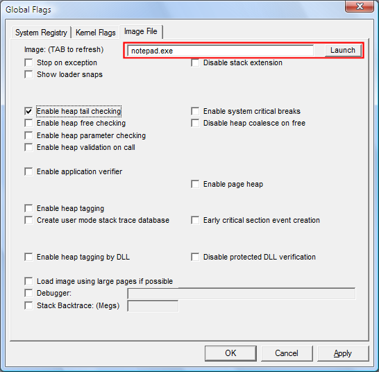

# Launching a Program with Flags

## 

This feature runs a program once with the specified flags. These settings affect only the instance of the program launched. They are not saved in the registry.

**To launch a program with flags**

1.  Click the **Image File** tab.

2.  In the **Image** box, type the name of an executable file or DLL, including the file name extension, and any commands for the program, and then press the TAB key.

    This activates the **Launch** button and the check boxes on the **Image File** tab.

3.  Set or clear a flag by selecting or clearing the check box associated with the flag.

4.  Click the **Launch** button.

    The following screen shot shows the **Launch** button on the **Image File** tab in Windows Vista.

    

**Note**   Flags set in the registry do not affect the instance of the program that is launched.
Flags set in the dialog box are used for the launched instance even when they are not image file flags.

 

 

 

