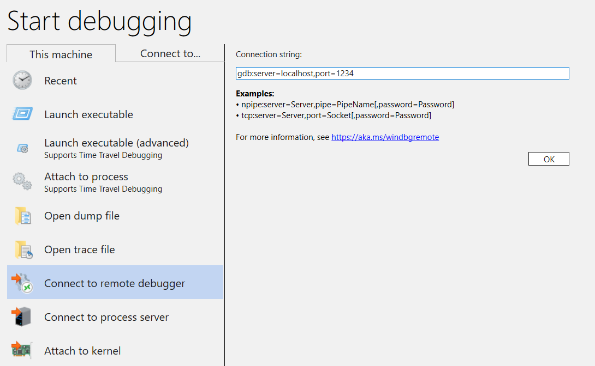
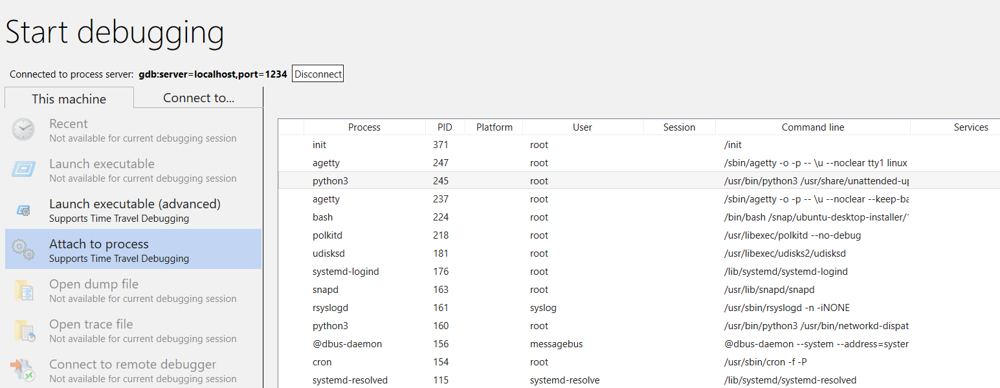
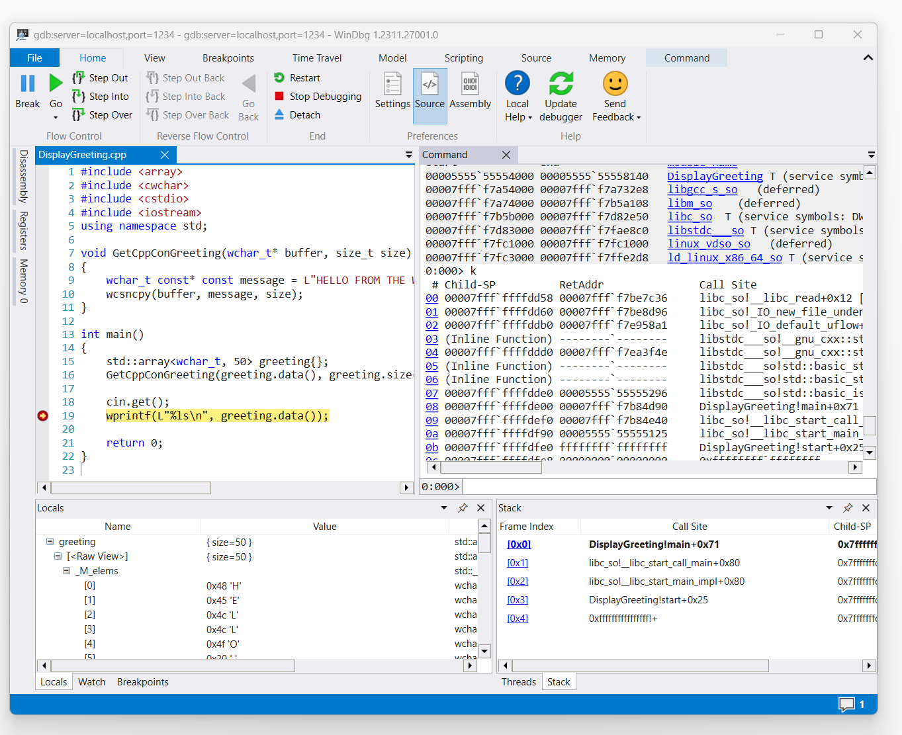

# Linux live remote process debugging

This article describes how to establish a live WinDbg connection to Linux. Live remote process debugging on Linux requires WinDbg version 1.2402.24001.0  or above.

The GNU Debugger - GDBServer, is used on Linux to support the WinDbg connection. For more information about GDBServer, see [https://en.wikipedia.org/wiki/Gdbserver](https://en.wikipedia.org/wiki/Gdbserver). One place to view the documentation for remote gdb debugging is here - https://sourceware.org/gdb/current/onlinedocs/gdb#Remote-Debugging

The examples here use the Windows Subsystem for Linux (WSL), but other Linux implementations can also be used.

## WinDbg types of remote process debugging

There are two primary methods of performing remote debugging with WinDbg - **A process server** or a **KD connection server**. Process servers are used for user-mode debugging; KD connection servers are used for kernel-mode debugging. See [Process Servers (User Mode)](process-servers--user-mode-.md) and [KD Connection Servers (Kernel Mode)](kd-connection-servers--kernel-mode-.md) for general information about these WinDbg connection types.

There are two ways to start debugging Linux user mode processes. You can either start gdbserver on a particular process or you can start gdbserver as a *process server* which can list and attach to existing processes. This is much like the DbgSrv (dbgsrv.exe) process server on Windows. For more information, see [Activating a Process Server](activating-a-process-server.md).

## User mode Linux process debugging

It is possible to connect to a specific single user mode process, or in multi-mode, to see all of the process in a list and select one to connect to. Both methods are described in this topic. Both methods share the same connection string syntax, described next.

### Format for gdbserver connection string

The format used to connect to gdbserver is "protocol:arguments" where arguments is a comma separated list of "argument=value". For a user mode gdbserver connection, the protocol is gdb and the set of arguments is as follows.

`server=<address>` - Mandatory: indicates the IP address of the gdbserver to connect to.

`port=<port>` - Mandatory: indicates the port number of the gdbserver to connect to.

`threadEvents=<true|false>` - Optional: indicates whether or not thread events for this version of gdbserver work correctly in stop mode.

There is an issue in the current gdbserver releases, where enabling thread events with a server in stop mode (which WinDbg uses) will cause gdbserver to crash. If this value is false (the default value), thread start and stop events will be synthesized but may appear significantly later than the actual time of thread creation/destruction. When a fix for this is available in gdbserver, the actual events can be enabled via this option.

## Connecting to a Single User Mode Process

This section describes how to identify and connect to a single user mode process in Linux, using WinDbg.

### WSL (Windows Subsystem for Linux)

The examples here use WSL (Windows Subsystem for Linux), but other Linux implementations can be used. For information about setting up and using WSL, see:

- [How to install Linux on Windows with WSL](/windows/wsl/install)
- [Set up a WSL development environment](/windows/wsl/setup/environment)
- [Accessing network applications with WSL](/windows/wsl/networking)
- [Intune settings for WSL](/windows/wsl/intune)

### Select the desired process

List processes in Linux using the `ps -A` command to determine the running process to connect to.

```dbgcmd
user1@USER1:/mnt/c/Users/USER1$ ps -A
    PID TTY          TIME CMD
    458 pts/1    00:00:00 bash
    460 ?        00:00:00 rtkit-daemon
    470 ?        00:00:00 dbus-daemon
    482 ?        00:00:19 python3
   1076 ?        00:00:00 packagekitd
   1196 pts/0    00:00:00 ps
```

In this example walkthrough, we will connect to python3.

### Locate the target system IP address

If connecting to a remote linux target, use a command such as `ip route show`to determine the external IP address.

```linux
user1@USER1:/mnt/c/Users/USER1$ ip route show
default via 192.168.1.1 dev enp3s0 proto dhcp metric 100
172.25.144.0/24 dev enp3s0 proto kernel scope link src 192.168.1.107 metric 100
```

In this walkthrough, we will connect to WSL running on the same PC, and will use the IP address of *localhost*.

### Attach GDBServer to the selected process

On the WSL linux console, enter `gdbserver localhost:1234 python3` to start the gdbserver on port 1234, and attach it to the python3 process.

```linux
USER1@USER1:/mnt/c/Users/USER1$ gdbserver localhost:1234 python3
Process python3 created; pid = 1211
Listening on port 1234
```

For some linux environments the command may need to be run as an administrator, for example using sudo - `sudo gdbserver localhost:1234 python3`. Use caution with enabling debugger administrator root level access and only use this when it is required.

### Create the process server connection in WinDbg

Open WinDbg, and select "File / Connect to Remote Debugger" and enter a protocol string for the connection. For this example, we will use: `gdb:server=localhost,port=1234`.



Once you click the OK button, the debugger should connect to the gdbserver and you should be at the initial process start break.

Once you are at the initial breakpoint, you can hit 'g' several times. You will get module load messages (and sxe style "break on module load" events should work properly).

Note that it may take a moment to get to that point, as debug symbols are loaded into cache. In addition to looking for symbols and binaries via the symbol server or your local search path, the GDBServer integration has the capability of pulling these files from the remote filesystem if they cannot be found via symsrv or locally. This is typically a much slower operation than getting symbols from symsrv or a local search path but it makes the overall experience a better one by locating appropriate symbols.

Use the k stacks command to list the stack. It shows python3 modules, so this confirms that we are debugging python3 on Linux using WinDbg.

```dbgcmd
0:000> k
 # Child-SP          RetAddr               Call Site
00 00007fff`ffffce10 00007fff`f786d515     libc_so!_select+0xbd
01 00007fff`ffffce80 00005555`55601ce8     readline_cpython_310_x86_64_linux_gnu!PyInit_readline+0xac5
02 00007fff`ffffcf60 00005555`556f06a1     python3!PyOS_Readline+0x109
03 00007fff`ffffcfa0 00005555`556eee7e     python3!PyFrame_LocalsToFast+0x62a1
04 00007fff`ffffd000 00005555`556edcf0     python3!PyFrame_LocalsToFast+0x4a7e
05 00007fff`ffffdb80 00005555`557a18e9     python3!PyFrame_LocalsToFast+0x38f0
06 00007fff`ffffdc00 00005555`557a1470     python3!PyCodec_LookupError+0xb09
07 00007fff`ffffdc50 00005555`557b89dc     python3!PyCodec_LookupError+0x690
08 00007fff`ffffdc70 00005555`5560b42f     python3!PyUnicode_Tailmatch+0xc6c
09 00007fff`ffffdcb0 00005555`5560b012     python3!PyRun_InteractiveLoopObject+0x4e0
0a 00007fff`ffffdd50 00005555`557b7678     python3!PyRun_InteractiveLoopObject+0xc3
0b 00007fff`ffffdda0 00005555`555f55c8     python3!PyRun_AnyFileObject+0x68
0c 00007fff`ffffddd0 00005555`555ea6e8     python3!PyRun_AnyFileExFlags+0x4f
0d 00007fff`ffffde00 00005555`55780cad     python3!Py_str_to_int+0x2342a
0e 00007fff`ffffdef0 00007fff`f7c7cd90     python3!Py_BytesMain+0x2d
0f 00007fff`ffffdf20 00007fff`f7c7ce40     libc_so!_libc_init_first+0x90
10 00007fff`ffffdfc0 00005555`55780ba5     libc_so!_libc_start_main+0x80
11 00007fff`ffffe010 ffffffff`ffffffff     python3!start+0x25
12 00007fff`ffffe018 00000000`00000000     0xffffffff`ffffffff
```

At this point, you should be able to do nearly everything that can be done using WinDbg attached to a remote Windows debugger over a remote process server. You can step, source level debug, set breakpoints, inspect locals, etc..

Once you are done debugging, use CTRL+D to exit the gbdserver window in WSL.

## Connecting to a Process Server

In addition to connecting to a single process via a user mode GDBServer, you can set up one as a process server and list and attach to existing processes on the system. To do this, gdbserver is started with the "--multi" command line argument - `gdbserver --multi localhost:1234`

```dbgcmd
user1@USER1:/mnt/c/Users/USER1$ sudo gdbserver --multi localhost:1234
Listening on port 1234
```

To connect to the process server, select "File / Connect to process server" in WinDbg and enter the same protocol string as you did with the single process gdbserver example above:

`gdb:server=localhost,port=1234`

Once you click the "OK" button, you should be connected to the gdbserver as a process server. As with dbgsrv, you can either spawn a new process or you can list the existing processes and attach to one.

In this example, use the "Attach to process" option.



Note that you will see many of the same things that are visible for Windows processes (including the PID, user, and command line). Some of the columns in the "attach to process" dialog are not relevant to Linux and will not contain data.

### Ending the session

Use CTRL+D to exit the gbdserver window in WSL and select stop debugging in WinDbg. To end the session, in some cases you may need to exit the debugger.

### Reconnecting to process server

WinDbg recognizes a "process server" versus a "single target" via whether the gdbserver is attached to a process or not. If you attach to some process, leave it frozen, close the debugger, and try to reconnect to the process server, in all likelihood, we will not recognize it as a process server. In this situation, restart the target gdbserver and reconnect the debugger.

## Linux WinDbg functionality

While much of the functionality of the debugger will work as expected" in debugging core dumps (e.g.: stack walking, symbols, type information, local variables, disassembly, etc...), it is important to note that the entire debugging toolchain has not yet been made aware of ELF, DWARF, and the resulting differences from Windows semantics. Some commands in the debugger may currently result in unexpected output. For example, `lm` will still display incorrect information for an ELF module as it expects and manually parses PE headers.

## Linux Kernel Mode via EXDI

The Windows debugger supports kernel debugging using EXDI. This allows debugging a wide variety of hardware and operating systems. For general information on setting up configuring and troubleshooting EXDI connections, see [Configuring the EXDI Debugger Transport](configuring-the-exdi-debugger-transport.md).

For information on how to set up QEMU Kernel-Mode Debugging using EXDI, see [Setting Up QEMU Kernel-Mode Debugging Using EXDI](setting-up-qemu-kernel-mode-debugging-using-exdi.md).

## Linux Symbols and Sources

This section describes the basic use and availability of Linux symbols. For more detailed information, see [Linux symbols and sources](linux-dwarf-symbols.md) and [Source Code Extended Access](source-code-extended-access.md).

### DebugInfoD symbol servers

Starting WinDbg version 1.2104, the source path command ([.srcpath, .lsrcpath (Set Source Path)](../debuggercmds/-srcpath---lsrcpath--set-source-path-.md)) supports file retrieval from [DebugInfoD servers](https://sourceware.org/elfutils/Debuginfod.html) through the `DebugInfoD*` tag.

The `DebugInfoD*` tag can point to one or more DebugInfoD servers with each server URL formatted as `https://domain.com` and separated by `*`. The servers will be searched in the same order as listed in the source path and the files will be retrieved from the first matching URL. For more information, see [Source Code Extended Access](source-code-extended-access.md).

For example you can use [.sympath (Set Symbol Path)](../debuggercmds/-sympath--set-symbol-path-.md) command to set a DebugInfoD path like this.

`.sympath+ DebugInfoD*https://debuginfod.elfutils.org`

For general information on setting the symbols path, see [Using Symbols](using-symbols.md).

To display information on symbols being loaded, use `!sym noisy`. For more information, see [!sym](../debuggercmds/-sym.md).

Also supported is the automatic download of sources from DebugInfoD servers which support returning that artifact type. You can, in essence do:

`.srcpath+ DebugInfoD*https://debuginfod.elfutils.org`

For more information on working with DWARF symbols and the Linux symbol utilities, such as `!sourcemap` and `!diesym`, see [Linux symbols and sources](linux-dwarf-symbols.md).

## C++ app walkthrough

1. Use a text editor (like nano or vi) to create your C++ file. For example:

`nano DisplayGreeting.cpp`

2. In the text editor, write your C++ program. Here’s a simple program that displays greetings, that needs to be debugged:

```cpp
#include <array>
#include <cwchar>
#include <cstdio>
#include <iostream>
using namespace std;

void GetCppConGreeting(wchar_t* buffer, size_t size)
{
    wchar_t const* const message = L"HELLO FROM THE WINDBG TEAM. GOOD LUCK IN ALL OF YOUR TIME TRAVEL DEBUGGING!";
    wcsncpy(buffer, message, size);
}

int main()
{
    std::array<wchar_t, 50> greeting{};
    GetCppConGreeting(greeting.data(), greeting.size());

    cin.get();
    wprintf(L"%ls\n", greeting.data());

    return 0;
}
```

3. Save (CTRL-O) and exit (CTRL-X) the nano editor.

4. Compile the C++ file using g++. The -o option is used to specify the output file name, and the -g option generates a symbol file:

`g++ DisplayGreeting.cpp -g -o DisplayGreeting`

5. If there are no errors in your code, the g++ command will create an executable file named DisplayGreeting in your directory.

6. You can run the program using the following command:

`./DisplayGreeting`

7. Pressing the return key displays the message in the app. Looking at the output, it looks like the Greeting is being truncated, and "????" is being displayed instead.

`HELLO FROM THE WINDBG TEAM. GOOD LUCK IN ALL OF YO????`

### Debugging DisplayGreeting

1. Once the code  is ready to run, we can start the app using the gdbserver.

`gdbserver localhost:1234 DisplayGreeting`

2. Open WinDbg, and select "File / Connect to Remote Debugger" and enter a protocol string for the connection. For this example, we will use: `gdb:server=localhost,port=1234`.

3. Once connected the output should indicate that it is listening on port 1234 and that remote debugging connection is established.

```dbgcmd
Bob@Bob6:/mnt/c/Users/bob$ gdbserver localhost:1234 DisplayGreeting
Process /mnt/c/Users/bob/DisplayGreeting created; pid = 725
Listening on port 1234
Remote debugging from host 127.0.0.1, port 47700
```  

As mentioned previously, for some Linux environments the command may need to be run as an administrator, typically using sudo. Use caution with enabling debugger administrator root level access and only use this when it is required.

### Add the source and symbol paths to the debugger session

To set breakpoints and view the source code and variables, set the symbols and source path.
For general information on setting the symbols path, see [Using Symbols](using-symbols.md).

Use `.sympath` to add the symbol path to the debugger session. In this example, the code is running in this location in the WSL Linux Ubuntu, for a user named Bob.

`\\wsl$\Ubuntu\mnt\c\Users\Bob\`

In WSL this directory maps to the Windows OS location of: `C:\Users\Bob\`

So these two commands are used.

`.sympath C:\Users\Bob\`

`.srcpath C:\Users\Bob\`

For more information about the WSL file system, see [File Permissions for WSL](/windows/wsl/file-permissions).

1. To benefit from additional Linux OS symbols, add the DebugInfoD symbols using the .sympath location, like this.

`.sympath+ DebugInfoD*https://debuginfod.elfutils.org`

2. Also supported is the automatic download of sources from DebugInfoD servers which support returning that artifact type. To take advantage of this, add the elfutils server using .srcpath.

`.srcpath+ DebugInfoD*https://debuginfod.elfutils.org`

### Set a breakpoint

Set a breakpoint in the main of the DisplayGreeting app.

```dbgcmd
0:000> bp DisplayGreeting!main
0:000> bl
     0 e Disable Clear  00005555`55555225  [/mnt/c/Users/bob/DisplayGreeting.cpp @ 14]     0001 (0001)  0:**** DisplayGreeting!main
```

Use the Go command or menu option to restart code execution.

### Loading source code

Use the .reload command to reload the symbols.

Use the `lm` command to confirm that we are running the DisplayGreeting app.

```dbgcmd
0:000> lm
start             end                 module name
00005555`55554000 00005555`55558140   DisplayGreeting T (service symbols: DWARF Private Symbols)        c:\users\bob\DisplayGreeting
00007fff`f7a54000 00007fff`f7a732e8   libgcc_s_so   (deferred)             
00007fff`f7a74000 00007fff`f7b5a108   libm_so    (deferred)             
00007fff`f7b5b000 00007fff`f7d82e50   libc_so  T (service symbols: DWARF Private Symbols)        C:\ProgramData\Dbg\sym\_.debug\elf-buildid-sym-a43bfc8428df6623cd498c9c0caeb91aec9be4f9\_.debug
00007fff`f7d83000 00007fff`f7fae8c0   libstdc___so   (deferred)             
00007fff`f7fc1000 00007fff`f7fc1000   linux_vdso_so   (deferred)             
00007fff`f7fc3000 00007fff`f7ffe2d8   ld_linux_x86_64_so T (service symbols: DWARF Private Symbols)        C:\ProgramData\Dbg\sym\_.debug\elf-buildid-sym-9718d3757f00d2366056830aae09698dbd35e32c\_.debug
```

Once the command triggers access to the display greeting code, it will be displayed in WinDbg.



Use the 'k' command to list the stack.

```dbgcmd
0:000> k
 # Child-SP          RetAddr               Call Site
00 00007fff`ffffde00 00007fff`f7b84d90     DisplayGreeting!main+0x1f [/mnt/c/Users/BOB/DisplayGreeting.cpp @ 15] 
01 00007fff`ffffdef0 00007fff`f7b84e40     libc_so!__libc_start_call_main+0x80 [./csu/../sysdeps/x86/libc-start.c @ 58] 
02 00007fff`ffffdf90 00005555`55555125     libc_so!__libc_start_main_impl+0x80 [./csu/../sysdeps/nptl/libc_start_call_main.h @ 379] 
03 00007fff`ffffdfe0 ffffffff`ffffffff     DisplayGreeting!start+0x25
04 00007fff`ffffdfe8 00000000`00000000     0xffffffff`ffffffff```
```

Use the dx command to view the local variable *greeting*. Take note that it's size is 50.

```dbgcmd
0:000> dx greeting
greeting                 : { size=50 } [Type: std::array<wchar_t, 50>]
    [<Raw View>]     [Type: std::array<wchar_t, 50>]
```

Look through the code and note that the 50, may not be a sufficient size for the greeting message.

`wchar_t const* const message = L"HELLO FROM THE WINDBG TEAM. GOOD LUCK IN ALL OF YOUR TIME TRAVEL`

Confirm this by expanding the locals variable for the greeting and seeing that the greeting is truncated.

## Troubleshooting the gdbserver connection

Use the `--debug` option to display additional information on the gdbserver console to gather more information on the connection status. For example to start a process server use this command.

`gdbserver --debug --multi localhost:1234`

## See also

[Linux symbols and sources](linux-dwarf-symbols.md)

[Source Code Extended Access](source-code-extended-access.md)

[ELFUTILS debuginfod](https://sourceware.org/elfutils/Debuginfod.html)

[Choosing the Best Remote Debugging Method](choosing-the-best-remote-debugging-method.md)
