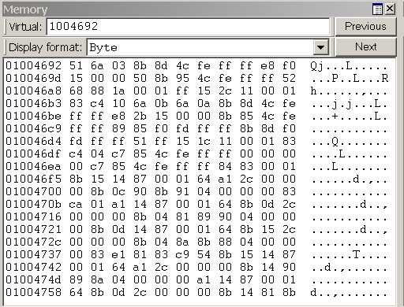

# Viewing and Editing Memory in WinDbg

In WinDbg, you can view and edit memory by entering commands or by using a Memory window.

## Debugger Command Window

You can view memory by entering one of the [**Display Memory**](d--da--db--dc--dd--dd--df--dp--dq--du--dw--dw--dyb--dyd--display-memor.md) commands in the Debugger Command window. You can edit memory by entering one of the [**Enter Values**](e--ea--eb--ed--ed--ef--ep--eq--eu--ew--eza--ezu--enter-values-.md) commands in the Debugger Command window. For more information, see [Accessing Memory by Virtual Address](accessing-memory-by-virtual-address.md) and [Accessing Memory by Physical Address](accessing-memory-by-physical-address.md).

## Opening a Memory Window

To open a Memory window, choose **Memory** from the **View** menu. (You can also press ALT+5 or click the **Memory** button () on the toolbar. ALT+SHIFT+5 closes the active Memory window.)

The following screen shot shows an example of a Memory window.

## Using a Memory Window

The Memory window displays data in several columns. The column on the left side of the window shows the beginning address of each line. The remaining columns display the requested information, from left to right. If you select **Bytes** in the **Display format** menu, the ASCII characters that correspond to these bytes are displayed in the right side of the window.

**Note**   By default, the Memory window displays virtual memory. This type of memory is the only type of memory that is available in user mode. In kernel mode, you can use the **Memory Options** dialog box to display physical memory and other data spaces. The **Memory Options** dialog box is described later in this topic.

 

In the Memory window, you can do the following:

-   To write to memory, click inside the Memory window and type new data. You can edit only hexadecimal data—you cannot directly edit ASCII and Unicode characters. Changes take effect as soon as you type new information.

-   To see other sections of memory, use the **Previous** and **Next** buttons on the Memory window toolbar, or press the PAGE UP or PAGE DOWN keys. These buttons and keys display the immediately preceding or following sections of memory. If you request an invalid page, an error message appears.

-   To navigate within the window, use the RIGHT ARROW, LEFT ARROW, UP ARROW, and DOWN ARROW keys. If you use these keys to move off of the page, a new page is displayed. Before you use these keys, you should resize the Memory window so that it does not have scroll bars. This sizing enables you to distinguish between the actual page edge and the window cutoff.

-   To change the memory location that is being viewed, enter a new address into the address box at the top of the Memory window. Note that the Memory window refreshes its display while you enter an address, so you could get error messages before you have completed typing the address.
    **Note**   The address that you enter into the box is interpreted in the current radix. If the current radix is not 16, you should prefix a hexadecimal address with **0x**. To change the default radix, use the [**n (Set Number Base)**](n--set-number-base-.md) command in the Debugger Command window. The display within the Memory window itself is not affected by the current radix.

     

-   To change the data type that the window uses to display memory, use the **Display format** menu in the Memory window toolbar. Supported data types include short words, double words, and quad-words; short, long, and quad integers and unsigned integers; 10-byte, 16-byte, 32-byte, and 64-byte real numbers; ASCII characters; Unicode characters; and hexadecimal bytes. The display of hexadecimal bytes includes ASCII characters as well.

The Memory window has a toolbar that contains two buttons, a menu, and a box and has a shortcut menu with additional commands. To access the menu, right-click the title bar or click the icon near the upper-right corner of the window (). The toolbar and shortcut menu contain the following choices:

-   (Toolbar only) The address box enables you to specify a new address or offset. The exact meaning of this box depends on the memory type you are viewing. For example, if you are viewing virtual memory, the box enables you to specify a new virtual address or offset.

-   (Toolbar only) **Display format** enables you to select a new display format.

-   (Toolbar and menu) **Previous** (on the toolbar) and **Previous page** (on the shortcut menu) cause the previous section of memory to be displayed.

-   (Toolbar and menu) **Next** (on the toolbar) and **Next page** (on the shortcut menu) cause the next section of memory to be displayed.

-   (Menu only) **Toolbar** turns the toolbar on and off.

-   (Menu only) **Auto-fit columns** ensures that the number of columns displayed in the Memory window fits the width of the Memory window.

-   (Menu only) **Dock** or **Undock** causes the window to enter or leave the docked state.

-   (Menu only) **Move to new dock** closes the Memory window and opens it in a new dock.

-   (Menu only) **Set as tab-dock target for window type** sets the selected Memory window as the tab-dock target for other Memory windows. All Memory windows that are opened after one is chosen as the tab-dock target are automatically grouped with that window in a tabbed collection.

-   (Menu only) **Always floating** causes the window to remain undocked even if it is dragged to a docking location.

-   (Menu only) **Move with frame** causes the window to move when the WinDbg frame is moved, even if the window is undocked. For more information about docked, tabbed, and floating windows, see [Positioning the Windows](positioning-the-windows.md).

-   (Menu only) **Properties** opens the **Memory Options** dialog box, which is described in the following section within this topic.

-   (Menu only) **Help** opens this topic in the Debugging Tools for Windows documentation.

-   (Menu only) **Close** closes this window.

### Memory Options Dialog Box

When you click **Properties** on the shortcut menu, the **Memory Options** dialog box appears.

In kernel mode, there are six memory types available as tabs in this dialog box: **Virtual Memory**, **Physical Memory**, **Bus Data**, **Control Data**, **I/O** (I/O port information), and **MSR** (model-specific register information). Click the tab that corresponds to the information that you want to access.

In user mode, only the **Virtual Memory** tab is available.

Each tab enables you to specify the memory that you want to display:

- In the **Virtual Memory** tab, in the **Offset** box, specify the address or offset of the beginning of the memory range that you want to view.

- In the **Physical Memory** tab, in the **Offset** box, specify the physical address of the beginning of the memory range that you want to view. The Memory window can display only described, cacheable physical memory. If you want to display physical memory that has other attributes, use the [**d\* (Display Memory)**](d--da--db--dc--dd--dd--df--dp--dq--du--dw--dw--dyb--dyd--display-memor.md) command or the [**!d\\***](-db---dc---dd---dp---dq---du---dw.md) extension.

- In the **Bus Data** tab, in the **Bus Data Type** menu, specify the bus data type. Then, use the **Bus number**, **Slot number**, and **Offset** boxes to specify the bus data that you want to view.

- In the **Control Data** tab, use the **Processor** and **Offset** text boxes to specify the control data that you want to view.

- In the **I/O** tab, in the **Interface Type** menu, specify the I/O interface type. Use the **Bus number**, **Address space**, and **Offset** boxes to specify the data that you want to view.

- In the **MSR** tab, in the **MSR** box, specify the model-specific register that you want to view.

Each tab also includes a **Display format** menu. This menu has the same effect as the **Display format** menu in the Memory window.

Click **OK** in the **Memory Options** dialog box to cause your changes to take effect.

## Additional Information

For more information about memory manipulation and a description of other memory-related commands, see [Reading and Writing Memory](reading-and-writing-memory.md).

 

 

