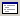
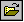

# Opening a Window

## 

When WinDbg begins a debugging session, the [Debugger Command window](debugger-command-window.md) automatically opens. The [Disassembly window](disassembly-window.md) also automatically opens, unless you deselect [Automatically Open Disassembly](window---automatically-open-disassembly.md) on the **Window** menu.

Whenever WinDbg discovers a source file that corresponds to the current program counter, WinDbg opens a [Source window](source-window.md) for that file. For other ways to open Source windows, see [Source Path](source-path.md).

You can use the following menu commands, toolbar buttons, and shortcut keys to switch to these windows. That is, if a window is not open, it opens. If a window is open but inactive, it becomes active. If a window is docked and there is a floating window in front of it, the docked window becomes active but the floating window stays in front of the docked window.

<table>
<colgroup>
<col width="25%" />
<col width="25%" />
<col width="25%" />
<col width="25%" />
</colgroup>
<thead>
<tr class="header">
<th align="left">Window</th>
<th align="left">Menu command</th>
<th align="left">Button</th>
<th align="left">Shortcut keys</th>
</tr>
</thead>
<tbody>
<tr class="odd">
<td align="left">
<a href="debugger-command-window.md" data-raw-source="[Debugger Command window](debugger-command-window.md)">Debugger Command window</a>
</td>
<td align="left">
<strong>View | Command</strong>
</td>
<td align="left"></td>
<td align="left">
ALT+1
</td>
</tr>
<tr class="even">
<td align="left">
Watch window
</td>
<td align="left">
<strong>View | Watch</strong>
</td>
<td align="left"></td>
<td align="left">
ALT+2
</td>
</tr>
<tr class="odd">
<td align="left">
<a href="locals-window.md" data-raw-source="[Locals window](locals-window.md)">Locals window</a>
</td>
<td align="left">
<strong>View | Locals</strong>
</td>
<td align="left"></td>
<td align="left">
ALT+3
</td>
</tr>
<tr class="even">
<td align="left">
<a href="registers-window.md" data-raw-source="[Registers window](registers-window.md)">Registers window</a>
</td>
<td align="left">
<strong>View | Registers</strong>
</td>
<td align="left"></td>
<td align="left">
ALT+4
</td>
</tr>
<tr class="odd">
<td align="left">
<a href="memory-window.md" data-raw-source="[Memory window](memory-window.md)">Memory window</a>
</td>
<td align="left">
<strong>View | Memory</strong>
</td>
<td align="left"></td>
<td align="left">
ALT+5
</td>
</tr>
<tr class="even">
<td align="left">
<a href="calls-window.md" data-raw-source="[Calls window](calls-window.md)">Calls window</a>
</td>
<td align="left">
<strong>View | Call Stack</strong>
</td>
<td align="left"></td>
<td align="left">
ALT+6
</td>
</tr>
<tr class="odd">
<td align="left">
<a href="disassembly-window.md" data-raw-source="[Disassembly window](disassembly-window.md)">Disassembly window</a>
</td>
<td align="left">
<strong>View | Disassembly</strong>
</td>
<td align="left"></td>
<td align="left">
ALT+7
</td>
</tr>
<tr class="even">
<td align="left">
Scratch Pad window
</td>
<td align="left">
<strong>View | Scratch Pad</strong>
</td>
<td align="left"></td>
<td align="left">
ALT+8
</td>
</tr>
<tr class="odd">
<td align="left">
<a href="processes-and-threads-window.md" data-raw-source="[Processes and Threads window](processes-and-threads-window.md)">Processes and Threads window</a>
</td>
<td align="left">
<strong>View | Processes and Threads</strong>
</td>
<td align="left"></td>
<td align="left">
ALT+9
</td>
</tr>
<tr class="even">
<td align="left">
<a href="source-window.md" data-raw-source="[Source window](source-window.md)">Source window</a>
</td>
<td align="left">
Click <a href="file---open-source-file.md" data-raw-source="[File | Open Source File](file---open-source-file.md)">File | Open Source File</a> and then select a source file.
</td>
<td align="left"></td>
<td align="left">
CTRL+O
</td>
</tr>
</tbody>
</table>

 

You can also activate a window by selecting it from the [list of open windows](list-of-open-windows.md) at the bottom of the **Window** menu.

 

 

