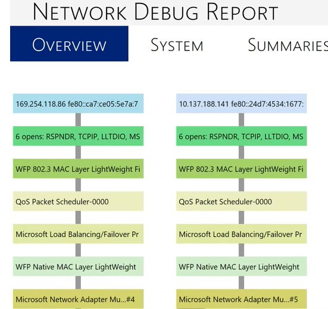

# Overview of NDIS Debugging

The two primary tools for debugging a network driver are debug tracing and the Network Driver Interface Specification (NDIS) extensions. For more information on debug tracing, see [Enabling NDIS Debug Tracing](enabling-ndis-debug-tracing.md). For more information on the NDIS debugging extensions, see [NDIS Extensions](ndis-extensions--ndiskd-dll-.md), which provides a complete list of the extension commands found in the extension module Ndiskd.dll.

Use the [ndiskd.netreport](-ndiskd-netreport.md) command to generate a visual report showing the current adapters and protocols.



Then the [ndiskd.netadapter](-ndiskd-netadapter.md) kernel debugger command is a good place to start to investigate the current set of the drivers.

```dbgconsole
1: kd> !ndiskd.netadapter
    Driver             NetAdapter          Name
    ffffdf8015a98380   ffffdf8015aa11a0    Microsoft ISATAP Adapter #2
    ffffdf801418d650   ffffdf80140c71a0    Microsoft Kernel Debug Network Adapter
```

An additional tool for debugging a network driver is the collection of regular debugging extensions, which are useful for obtaining debugging information. For example, entering [!stacks 2 ndis!](-stacks.md) displays all threads in the stack beginning with **ndis!**. This information can be useful for debugging hangs and stalls. For general information about getting started with the WinDbg, see [Getting started with Windows Debugging](getting-started-with-windows-debugging.md).

## Driver Verifier

Another useful tool for testing an NDIS driver is NDIS Verifier. For more information, see [Rules for NDIS Drivers](../devtest/sdv-rules-for-ndis-drivers.md) and [Static Driver Verifier](../devtest/static-driver-verifier.md).

## NDIS Debugging Resources

Episode 175 of the Defrag Tools show covers NDIS debugging - [Defrag Tools #175 - Debugging the Network Stack](https://channel9.msdn.com/Shows/Defrag-Tools/Defrag-Tools-175-Debugging-the-Network-Stack).

The NDIS team blog archives are available at [The NDIS blog](/archive/blogs/ndis/).

## NDIS Bug checks

There is also a NDIS-specific bug check code, bug check 0x7C (BUGCODE\_NDIS\_DRIVER). For a complete list of its parameters, see [Bug Check 0x7C](bug-check-0x7c--bugcode-ndis-driver.md).

A common NDIS misbehavior related bug check is [Bug Check 0xD1: DRIVER_IRQL_NOT_LESS_OR_EQUAL](bug-check-0xd1--driver-irql-not-less-or-equal.md) which can be caused by the driver code itself. This is most likely a bug or memory corruption that eventually manifests itself as a bad pointer.

Another common issue is [Bug Check 0x9F: DRIVER_POWER_STATE_FAILURE](bug-check-0x9f--driver-power-state-failure.md).

First step with all bug checks is to locate a good dump file, load it in the Windows debugger and use the [!analyze](-analyze.md) command. For more information, see [Using the !analyze Extension](using-the--analyze-extension.md).
