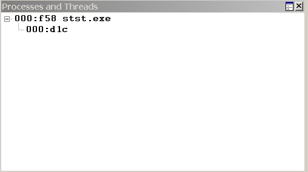

# Controlling Processes and Threads in WinDbg

## 

In WinDbg, the Processes and Threads window displays information about the systems, processes, and threads that are being debugged. This window also enables you to select a new system, process, and thread to be active.

### Opening the Processes and Threads Window

To open the Processes and Threads window, choose **Processes and Threads** from the **View** menu. (You can also press ALT+9 or click the **Processes and Threads** button () on the toolbar. ALT+SHIFT+9 closes the Processes and Threads window.)

The following screen shot shows an example of a Processes and Threads window.

The Processes and Threads window displays a list of all processes that are currently being debugged. The threads in the process appear under each process. If the debugger is attached to multiple systems, the systems are shown at the top level of the tree, with the processes subordinate to them, and the threads subordinate to the processes.

Each system listing includes the server name and the protocol details. The system that the debugger is running on is identified as **&lt;Local&gt;**.

Each process listing includes the internal decimal process index that the debugger uses, the hexadecimal process ID, and the name of the application that is associated with the process.

Each thread listing includes the internal decimal thread index that the debugger uses and the hexadecimal thread ID.

### Using the Processes and Threads Window

In the Processes and Threads window, the current or active system, process, and thread appear in bold type. To make a new system, process, or thread active, click its line in the window.

The Processes and Threads window has a shortcut menu with additional commands. To access the menu, right-click the title bar or click the icon near the upper-right corner of the window (). The following list describes some of the menu commands:

-   **Move to new dock** closes the Processes and Threads window and opens it in a new dock.

-   **Always floating** causes the window to remain undocked even if it is dragged to a docking location.

-   **Move with frame** causes the window to move when the WinDbg frame is moved, even if the window is undocked.

### Additional Information

For other methods of displaying or controlling systems, see [Debugging Multiple Targets](debugging-multiple-targets.md). For other methods of displaying or controlling processes and threads, see [Controlling Processes and Threads](controlling-processes-and-threads.md).

 

 

