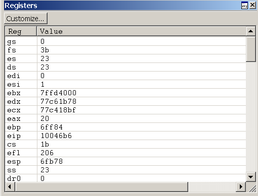

# Viewing and Editing Registers in WinDbg

Registers are small volatile memory units that are located on the CPU. Many registers are dedicated to specific uses, and other registers are available for user-mode applications to use. The x86-based and x64-based processors have different collections of registers available. For more information about the registers on each processor, see [Processor Architecture](processor-architecture.md).

In WinDbg, you can view and edit registers by entering commands, by using the Registers window, or by using the Watch Window.

## Commands

You can view and edit registers by entering the [**r (Registers)**](r--registers-.md) command in the Debugger Command window. You can customize the display by using several options or by using the [**rm (Register Mask)**](rm--register-mask-.md) command.

Registers are also automatically displayed every time that the target stops. If you are stepping through your code with the [**p (Step)**](p--step-.md) or [**t (Trace)**](t--trace-.md) commands, you see a register display at every step. To stop this display, use the **r** option when you use these commands.

On an x86-based processor, the **r** option also controls several one-bit registers known as flags. To change these flags, you use a slightly different syntax than when changing regular registers. For more information about these flags and an explanation of this syntax, see [x86 Flags](x86-architecture.md#x86-flags).

## The Registers Window

### Opening the Registers Window

To open or switch to the Registers window, choose **Registers** from the **View** menu. (You can also press ALT+4 or click the **Registers** button () on the toolbar. ALT+SHIFT+4 closes the Registers window.)

The following screen shot shows an example of a Registers window.

The Registers window contains two columns. The **Reg** column lists all of the registers for the target processor. The **Value** column displays the current value of each register. This window also contains a **Customize** button on the toolbar that opens the **Customize Register List** dialog box.

### Using the Registers Window

In the Registers window, you can do the following:

-   The **Value** column displays the current value of each register. The value of the most recently changed register is displayed in red text.
    -   To enter a new value, double-click a **Value** cell, and then type a new value or edit the old value. (The cut, copy, and paste commands are available to use for editing.)
    -   To save the new value, press ENTER.
    -   To discard the new value, press ESC.
    -   If you type an invalid value, the old value will reappear when you press ENTER.
-   Register values are displayed in the current radix, and you must type new values in the same radix. To change the current radix, use the [**n (Set Number Base)**](n--set-number-base-.md) command in the Debugger Command window.

-   In user mode, the Registers window displays the registers that are associated with the current thread. For more information about the current thread, see [Controlling Processes and Threads](controlling-processes-and-threads.md).

-   In kernel mode, the Registers window displays the registers that are associated with the current [register context](changing-contexts.md#register-context). You can set the register context to match a specific thread, context record, or trap frame. Only the most important registers for the specified register context are actually displayed; you cannot change their values.

The Registers window has a toolbar that contains a **Customize** button and has a shortcut menu with additional commands. To access the menu, right-click the title bar or click the icon near the upper-right corner of the window (). The toolbar and menu contain the following button and commands:

-   (Toolbar and menu) **Customize** opens the **Customize Register List** dialog box, which is described in the following section within this topic.

-   (Menu only) **Toolbar** turns the toolbar on and off.

-   (Menu only) **Dock** or **Undock** causes the window to enter or leave the docked state.

-   (Menu only) **Move to new dock** closes the Registers window and opens it in a new dock.

-   (Menu only) **Set as tab-dock target for window type** is unavailable for the Registers window. This option is only available for Source or Memory windows.

-   (Menu only) **Always floating** causes the window to remain undocked even if it is dragged to a docking location.

-   (Menu only) **Move with frame** causes the window to move when the WinDbg frame is moved, even if the window is undocked. For more information about docked, tabbed, and floating windows, see [Positioning the Windows](positioning-the-windows.md).

-   (Menu only) **Help** opens this topic in the Debugging Tools for Windows documentation.

-   (Menu only) **Close** closes this window.

### Customize Register List Dialog Box

To change the list of registers that are displayed, click the **Customize** button. The **Customize Register List** dialog box will appear.

In this dialog box, you can edit the list of registers to change the order in which registers are displayed. (You cannot actually delete a register from the list; if you do, it will reappear at the end.) There must be a space between register names.

If you select the **Display modified register values first** check box, the register whose values have been changed most recently appears at the top.

If you select the **Do not display subregisters** check box, subregisters are not displayed. For example, **eax** will be displayed, but not **ax**, **ah**, or **al**.

Click **OK** to save your changes or **Cancel** to discard your changes.

If you are debugging a multi-processor computer with more than one kind of processor, WinDbg stores the customization settings for each processor type separately. This separation enables you to customize the display of each processor's registers simultaneously.

## The Watch Window

In WinDbg, you can use the Watch window to display registers. You cannot use the Watch window to alter the values of registers.

To open the Watch window, choose **Watch** from the **View** menu. You can also press ALT+2 or click the **Watch** button on the toolbar: . ALT+SHIFT+2 closes the Watch window.

The following screen shot shows an example of a Watch window.

## Additional Information

For more information about the register context and other context settings, see [Changing Contexts](changing-contexts.md).

 

 

