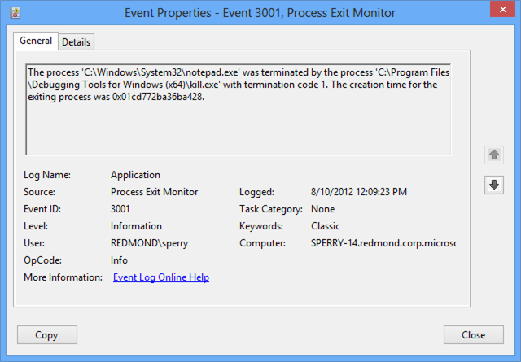

# Monitoring Silent Process Exit

Beginning with Windows 7, you can use the **Silent Process Exit** tab in GFlags to enter the name of a process that you want to monitor for silent exit.

In the context of this monitoring feature, we use the term *silent exit* to mean that the monitored process terminates in one of the following ways.

Self termination  
The monitored process terminates itself by calling **ExitProcess**.

Cross-process termination  
A second process terminates the monitored process by calling **TerminateProcess**.

The monitoring feature does not detect normal process termination that happens when the last thread of the process exits. The monitoring feature does not detect process termination that is initiated by kernel-mode code.

To register a process for silent exit monitoring, open the **Silent Process Exit** tab in GFlags. Enter the process name as the **Image** and press the **Tab** key. Check the **Enable Silent Process Exit Monitoring** box, and click **Apply**. This sets the FLG\_MONITOR\_SILENT\_PROCESS\_EXIT flag in the following registry entry.

**HKLM\\SOFTWARE\\Microsoft\\Windows NT\\CurrentVersion\\Image File Execution Options\\*ProcessName*\\GlobalFlag**

For more information about this flag, see [Enable silent process exit monitoring](enable-silent-process-exit-monitoring.md).

For more information about using the **Silent Process Exit** tab in GFlags, see [Configuring Silent Process Exit Monitoring](setting-and-clearing-flags-for-silent-process-exit.md).

In the **Silent Process Exit** tab of GFlags, you can configure the actions that will take place when a monitored process exits silently. You can configure notification, event logging, and creation of dump files. You can specify a process that will be launched when silent exit is detected, and you can specify a list of modules that the monitor will ignore. Several of these settings are available both globally and for individual applications. Global settings apply to all processes that you register for silent exit monitoring. Application settings apply to an individual process and override global settings.

Global settings are stored in the registry under the following key.

**HKEY\_LOCAL\_MACHINE\\SOFTWARE\\Microsoft\\Windows NT\\CurrentVersion\\SilentProcessExit**

Application settings are stored in the registry under the following key.

**HKEY\_LOCAL\_MACHINE\\SOFTWARE\\Microsoft\\Windows NT\\CurrentVersion\\SilentProcessExit\\*ProcessName***

## Reporting Mode

The **Reporting Mode** setting is available as an application setting, but not as a global setting. You can use the following check boxes to set the reporting mode.

**Launch monitor process**
**Enable dump collection**
**Enable notification**
The **ReportingMode** registry entry is a bitwise OR of the following flags.

| Flag                   | Value | Meaning                                                                                                                                                                                            |
|------------------------|-------|----------------------------------------------------------------------------------------------------------------------------------------------------------------------------------------------------|
| LAUNCH\_MONITORPROCESS | 0x1   | When silent exit is detected, the monitor process (specified in the **Monitor Process** box) is launched.                                                                                          |
| LOCAL\_DUMP            | 0x2   | When silent exit is detected, a dump file is created for the monitored process. In the case of cross-process termination, a dump file is also created for the process that caused the termination. |
| NOTIFICATION           | 0x4   | When silent exit is detected, a pop-up notification is displayed.                                                                                                                                  |

 

## Ignore Self Exits

The **Ignore Self Exits** setting is available as an application setting, but not as a global setting. You can use the **Ignore Self Exits** check box to specify whether self exits are ignored.

The **IgnoreSelfExits** registry entry has one of the following values.

| Value | Meaning                                                                    |
|-------|----------------------------------------------------------------------------|
| 0x0   | Detect and respond to both self termination and cross-process termination. |
| 0x1   | Ignore self termination. Detect and respond to cross-process termination.  |

 

## Monitor Process

You can specify a monitor process by entering a process name, along with command line parameters, in the **Monitor Process** text box. You can use the following variables in your command line.

| Varaible | Meaning                                                                                                                                                                                                      |
|----------|--------------------------------------------------------------------------------------------------------------------------------------------------------------------------------------------------------------|
| %e       | ID of the exiting process. This is the monitored process that exited silently.                                                                                                                               |
| %i       | ID of the initiating process. In the case of self termination, this is the same as the exiting process. In the case of cross-process termination, this is the ID of the process that caused the termination. |
| %t       | ID of the initiating thread. This is the thread that caused the termination.                                                                                                                                  |
| %c       | The status code passed to **ExitThread** or **TerminateThread** .                                                                                                                                            |

 

For example, the following value for **Monitor Process** specifies that on silent exit, WinDbg is launched and attached to the exiting process.

**windbg -p %e**

The **Monitor Process** command line is stored in the **MonitorProcess** registry entry.

## Dump Folder Location

You can use the **Dump folder location** text box to specify a location for the dump files that are written when a silent exit is detected.

The string that you enter for **Dump folder location** is stored in the **LocalDumpFolder** registry entry.

If you do not specify a dump folder location, dump files are written to the default location, which is %TEMP%\\Silent Process Exit.

## Dump Folder Size

You can use the **Dump folder size** text box to specify the maximum number of dump files that can be written to the dump folder. Enter this value as a decimal integer.

The value that you enter for **Dump folder size** is stored in the **MaximumNumberOfDumpFiles** registry entry.

By default, there is no limit to the number of dump files that can be written.

## Dump Type

You can use the **Dump Type** drop-down list to specify the type of dump file (Micro, Mini, Heap, or Custom) that is written when a silent exit is detected.

The dump type is stored in the **DumpType** registry entry, which is a bitwise OR of the members of the **MINIDUMP\_TYPE** enumeration. This enumeration is defined in dbghelp.h, which is included in the Debugging Tools for Windows package.

For example, suppose you chose a dump type of **Micro**, and you see that the **DumpType** registry entry has a value of 0x88. The value 0x88 is a bitwise OR of the following two **MINIDUMP\_TYPE** enumeration values.

|                           |            |
|---------------------------|------------|
| MiniDumpFilterModulePaths | 0x00000080 |
| MiniDumpFilterMemory      | 0x00000008 |

 

If you choose a dump type of **Custom**, enter your own bitwise OR of **MINIDUMP\_TYPE** enumeration values in the **Custom Dump Type** box. Enter this value as a decimal integer.

## Module Ignore List

You can use the **Module Ignore List** box to specify a list of modules that will be ignored when a silent exit is detected. If the monitored process is terminated by one of the modules in this list, the silent exit is ignored.

The list of modules that you enter in the **Module Ignore List** box is stored in the **ModuleIgnoreList** registry entry.

## Reading Process Exit Reports in Event Viewer

When a monitored process exits silently, the monitor creates an entry in Event Viewer. To open Event Viewer, enter the command **eventvwr.msc**. Navigate to **Windows Logs &gt; Application**. Look for log entries that have a **Source** of Process Exit Monitor.

 

 

