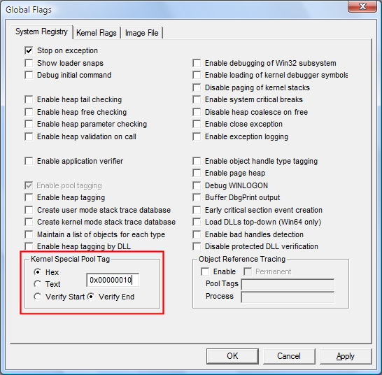

# Requesting Special Pool by Allocation Size

## 

You can request special pool for allocations within a specified size range.

In Windows Vista and later versions of Windows, you can also use the command line to request special pool by pool tag. For information, see [**GFlags Commands**](gflags-commands.md).

**Note**   This method is rarely useful for diagnosing driver errors, because it affects all kernel pool requests of the specified size, regardless of which driver or kernel module requested the allocation.

 

### To request special pool by allocation size

1.  Select the **System Registry** tab or the **Kernel Flags** tab.

    On Windows Vista and later versions of Windows, this option is available on both tabs. On earlier versions of Windows, it is available only on the **System Registry** tab.

2.  In the **Kernel Special Pool Tag** section, click **Hex**, and then type a number in hexadecimal format that represents a range of sizes. All allocations within this size range will be allocated from special pool. This number must be less than PAGE\_SIZE.

3.  Click **Apply**.

    The following screen shot shows an allocation size entered as a hexadecimal value.

    

 

 

