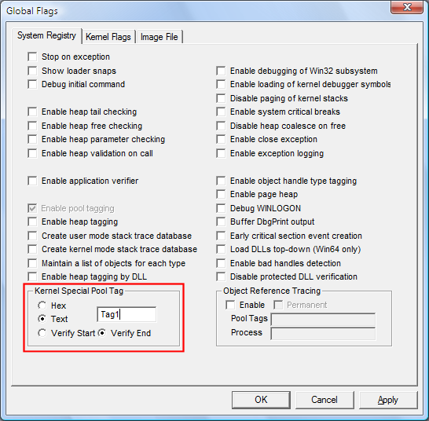
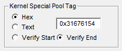

# Requesting Special Pool by Pool Tag

## 

You can request special pool for all allocations that use a specified pool tag. Only one pool tag on the system can be associated with kernel special pool requests at one time.

In Windows Vista and later versions of Windows, you can also use the command line to request special pool by pool tag. For information, see [**GFlags Commands**](gflags-commands.md).

**To request special pool by pool tag**

1. Select the **System Registry** tab or the **Kernel Flags** tab.

   On Windows Vista and later versions of Windows, this option is available on both tabs. On earlier versions of Windows, it is available only on the **System Registry** tab.

2. In the **Kernel Special Pool Tag** section, click **Text**, and then type a four-character pattern for the tag.

   The tag can include the **?** (single character) and **\\*** (multiple characters) wildcard characters. For example, Fat\* or Av?4.

3. The following screen shot shows a tag entered as text on the System Registry tab.

   

4. Click **Apply**.

   When you click **Apply**, GFlags changes the selection from **Text** to **Hex** and displays the ASCII characters as hexadecimal values in reverse (lower endian) order. For example, if you type **Tag1**, GFlags displays the tag as **0x31676154** (1gaT). This is the way that it is stored in the registry and displayed by the debugger and other tools.

   The following illustration shows the effect of clicking **Apply**.

   

### Remarks

To use this feature effectively, make sure that your driver or other kernel-mode program uses a unique pool tag. If you suspect that your driver is consuming all of the special pool, consider using multiple pool tags in your code. You can then test your driver several times, assigning special pool to one pool tag in each test.

Also, select a pool tag with a hexadecimal value that is greater than the page size of the system. For kernel mode code, if you enter a pool tag that has a value less than PAGE\_SIZE, Gflags requests special pool for all allocations whose size is within the corresponding range and requests special pool for allocations with an equivalent pool tag. For example, if you select a size of **30**, special pool will be used for all allocations between 17 and 32 bytes in size, and for allocations with the pool tag 0x0030.

 

 

