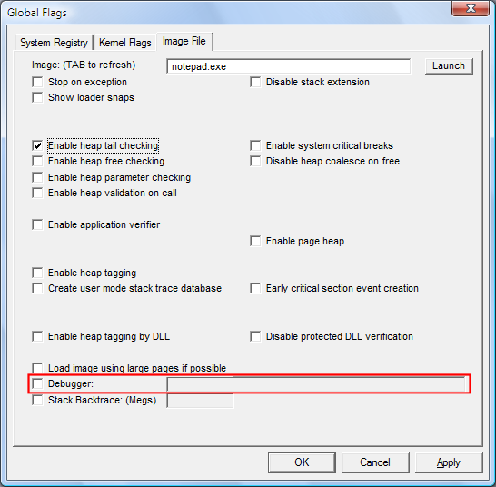

# Running a Program in a Debugger

## 

This feature configures the program so that it always runs in a debugger with the specified options. This setting is saved in the registry. It affects all new instances of the program and remains effective until you change it.

**To run a program in a debugger**

1.  Click the **Image File** tab.

2.  In the **Image** box, type the name of an executable file or DLL, including the file name extension,and then press the TAB key.

    This activates the check boxes on the **Image File** tab.

3.  Click the **Debugger** check box to select it.

    The following screen shot shows the **Debugger** check box on the **Image File** tab in Windows Vista.

    

4.  In the **Debugger** box, type the command to run the debugger, including the path (optional) and name of the debugger and parameters. For example, **ntsd -d -g -G -x** or **c:\\debuggers\\cdb.exe -g -G**.

5.  Click **Apply**.

 

 

