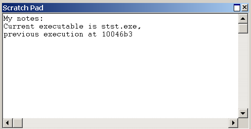

# Using the Scratch Pad

## 

The Scratch Pad window is a clipboard on which you can type and save text.

### Opening the Scratch Pad Window

To open or switch to the Scratch Pad window, in the WinDbg window, on the **View** menu, click **Scratch Pad**. (You can also press ALT+8 or click the **Scratch Pad (Alt+8)** button () on the toolbar.)

The following screen shot shows an example of a Scratch Pad window.

### Using the Scratch Pad Window

In the Scratch Pad window, you can do the following:

-   To type in the Scratch Pad window, click in the window where you want to add text and begin typing. You can also use standard copy-and-paste features. The contents of the Scratch Pad window do not affect the operation of the debugger. This window exists solely to help with text editing.

-   If you close the Scratch Pad window, your text is preserved and is available when you reopen the window. You can also save text from the Scratch Pad window by associating it with a file.

The Scratch Pad window has a shortcut menu with additional commands. To access the menu, right-click the title bar or click the icon near the upper-right corner of the window (). This menu contains the following commands:

-   (Menu only) **Associate with file** opens a dialog box through which you can select a text file. After the file is selected, the current text in the Scratch Pad is cleared and replaced with the text in the selected file. While Scratch Pad is associated with this file, all new text typed into Scratch Pad is saved to the file. Association with the file can be ended either by selecting the **End file association** short-cut menu option or by closing and reopening Scratch Pad.

-   (Menu only) **End file association** ends Scratch Pad's association with a specified text file. All text in Scratch Pad prior to selecting this option is saved in the file. All text typed in Scratch Pad after the association is ended is no longer saved in the text file.

-   **Dock** or **Undock** causes the window to enter or leave the docked state.

-   (Menu only) **Move to new dock** closes Scratch Pad and opens it in a new dock.

-   (Menu only) **Set as tab-dock target for window type** is unavailable for Scratch Pad. This option is only available for [Source](source-window.md) or [Memory](memory-window.md) windows.

-   **Always floating** causes the window to remain undocked even if it is dragged to a docking location.

-   **Move with frame** causes the window to move when the WinDbg frame is moved, even if the window is undocked. For more information about docked, tabbed, and floating windows, see [Positioning the Windows](positioning-the-windows.md).

-   **Help** opens this topic in the Debugging Tools for Windows documentation.

-   **Close** closes this window.

### Additional Information

For more information about docked, tabbed, and floating windows, see [Positioning the Windows](positioning-the-windows.md). For more information about all techniques that you can use to control debugging information windows, see [Using Debugging Information Windows](using-debugging-information-windows.md).

 

 

