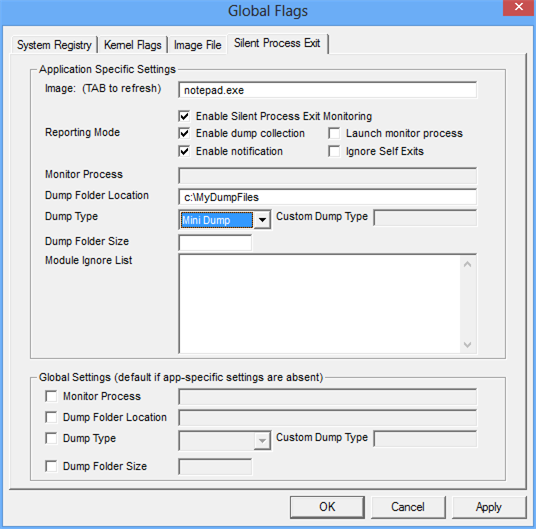

# Configuring Silent Process Exit Monitoring

Beginning in Windows 7, you can use the **Silent Process Exit** tab to enable and configure monitoring of silent exit for a process.

## 

Settings that you specify in the **Silent Process Exit** tab are saved in the registry and remain effective until you change them.

**To enable and configure silent process exit monitoring**

1.  Click the **Silent Process Exit** tab.

    The following screen shot shows the **Silent Process Exit** tab in Windows 8.

    

2.  In the **Image** box, type the name of an executable file, including the file name extension, and then press the TAB key.

    This activates the check boxes on the **Silent Process Exit** tab.

3.  Specify your preferences by selecting or clearing check boxes and by entering values in text boxes.

4.  When you specified all of your preferences, click **Apply**.

## Related topics

[Monitoring Silent Process Exit](registry-entries-for-silent-process-exit.md)

[Enable silent process exit monitoring](enable-silent-process-exit-monitoring.md)

 

 

