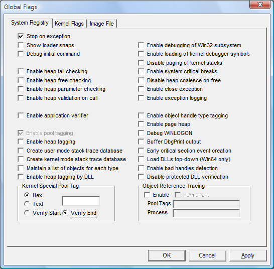

# Setting and Clearing System-wide Flags

## 

System-wide registry settings affect all processes running on Windows. They are saved in the registry and remain effective until you change them.

**To set and clear system-wide registry flags**

1.  Click the **System Registry** tab.

    The following screen shot shows the System Registry tab in Windows Vista.

2.  Set or clear a flag by selecting or clearing the check box associated with the flag.

3.  When you have selected or cleared all of the flags that you want, click **Apply**.

4.  Restart Windows to make the changes effective.

 

 

