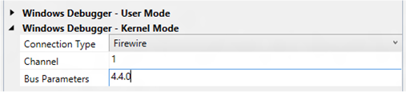

# Setting Up Kernel-Mode Debugging over a 1394 Cable in Visual Studio


> [!IMPORTANT]
> This feature is not available in Windows 10, version 1507 and later versions of the WDK.
>

You can use Microsoft Visual Studio to set up and perform kernel-mode debugging over a 1394 (Firewire) cable. To use Visual Studio for kernel-mode debugging, you must have the Windows Driver Kit (WDK) integrated with Visual Studio. For information about how to install the integrated environment, see [Windows Driver Development](https://go.microsoft.com/fwlink/p?linkid=301383).

As an alternative to using Visual Studio to set up 1394 debugging, you can do the setup manually. For more information, see [Setting Up Kernel-Mode Debugging over a 1394 Cable Manually](setting-up-a-1394-cable-connection.md).

The computer that runs the debugger is called the *host computer*, and the computer that is being debugged is called the *target computer*. The host and target computers must each have a 1394 adapter.

## <span id="Configuring_the_host_and_target_computers"></span><span id="configuring_the_host_and_target_computers"></span><span id="CONFIGURING_THE_HOST_AND_TARGET_COMPUTERS"></span>Configuring the host and target computers


1.  Connect a 1394 cable to the 1394 controllers that you have chosen for debugging on the host and target computers.
2.  Begin configuring your host and target computers as described in [Provision a computer for driver deployment and testing (WDK 8.1)](https://msdn.microsoft.com/library/windows/hardware/dn745909).
3.  On the host computer, in Visual Studio, when you get to the Computer Configuration dialog, select **Provision computer and choose debugger settings**.
4.  For **Connection Type**, choose **Firewire**.

    

    For **Channel**, enter a decimal number of your choice from 1 through 62.

    **Note**  Do not set the channel to 0 when you first set up debugging. Because the default channel value is 0, the software assumes there is no change and does not update the settings. If you must use channel 0, first use an alternate channel (1 through 62) and then switch to channel 0.

    If you have more than one 1394 controller on the target computer, enter a **Bus Parameters** value of *b*.*d*.*f*, where *b*, *d*, and *f* are the bus, device, and function numbers for the 1394 controller that you intend to use for debugging on the target computer. The bus, device, and function numbers must be in decimal format (example: 4.4.0).

5.  The configuration process takes several minutes and might automatically reboot the target computer once or twice. When the process is complete, click **Finish**.

## <span id="Verifying_dbgsettings_on_the_Target_Computer"></span><span id="verifying_dbgsettings_on_the_target_computer"></span><span id="VERIFYING_DBGSETTINGS_ON_THE_TARGET_COMPUTER"></span>Verifying dbgsettings on the Target Computer

> [!IMPORTANT]
> Before using BCDEdit to change boot information you may need to temporarily suspend Windows security features such as BitLocker and Secure Boot on the test PC.
> Re-enable these security features when testing is complete and appropriately manage the test PC, when the security features are disabled.

On the target computer, open a Command Prompt window as Administrator, and enter this command:

**bcdedit /dbgsettings**

**bcdedit /enum**

```console
...
debugtype               1394
debugport               1
baudrate                115200
channel                 1
...
busparams               4.0.0
...
```

Verify that *debugtype* is 1394 and *channel* is the channel number you specified in Visual Studio on the host computer. You can ignore the values of *debugport* and *baudrate*; they do not apply to debugging over 1394.

If you entered **Bus Parameters** in Visual Studio, verify that *busparams* matches the bus parameters you specified.

If you do not see the value you entered for **Bus Parameters**, enter this command:

**bcdedit /set "{dbgsettings}" busparams** <em>b</em>**.**<em>d</em>**.**<em>f</em>

where *b*, *d*, and *f* are the bus, device, and function numbers of the 1394 controller on the target computer that you have chosen to use for debugging.

For example:

**bcdedit /set "{dbgsettings}" busparams 4.4.0**

## <span id="Starting_a_Debugging_Session_for_the_First_Time"></span><span id="starting_a_debugging_session_for_the_first_time"></span><span id="STARTING_A_DEBUGGING_SESSION_FOR_THE_FIRST_TIME"></span>Starting a Debugging Session for the First Time


1.  On the host computer, open Visual Studio as Administrator.
2.  On the **Tools** menu, choose **Attach to Process**.
3.  For **Transport**, choose **Windows Kernel Mode Debugger**.
4.  For **Qualifier**, select the name of the target computer that you previously configured.
5.  Click **Attach**.

At this point, the 1394 debug driver gets installed on the host computer. This is why it is important to run Visual Studio as Administrator. After the 1394 debug driver is installed, you do not need to run as Administrator for subsequent debugging sessions.

## <span id="starting_the_debugging_session"></span><span id="STARTING_THE_DEBUGGING_SESSION"></span>Starting a Debugging Session


1.  On the host computer, in Visual Studio, on the **Tools** menu, choose **Attach to Process**.
2.  For **Transport**, choose **Windows Kernel Mode Debugger**.
3.  For **Qualifier**, select the name of the target computer that you previously configured.
4.  Click **Attach**.

## <span id="troubleshooting_tips_for_debugging_over_a_1394_cable"></span><span id="TROUBLESHOOTING_TIPS_FOR_DEBUGGING_OVER_A_1394_CABLE"></span>Troubleshooting Tips for Debugging over a 1394 Cable


Most 1394 debugging problems are caused by using multiple 1394 controllers in either the host or target computer. Using multiple 1394 controllers in the host computer is not supported. The 1394 debug driver, which runs on the host, can communicate only with the first 1394 controller enumerated in the registry. If you have a 1394 controller built into the motherboard and a separate 1394 card, either remove the card or disable (by using Device Manager) the built-in controller.

The target computer can have multiple 1394 controllers, although this is not recommended. If your target computer has a 1394 controller on the motherboard, use that controller for debugging, if possible. If there is an additional 1394 card, you should remove the card and use the onboard controller. Another solution is to disable the onboard 1394 controller in the BIOS settings of the computer.

If you decide to have multiple 1394 controllers enabled on the target computer, you must specify bus parameters so that the debugger knows which controller to claim for debugging. To specify the bus parameters, Open Device Manager, and locate the 1394 controller that you want to use for debugging. Open the property page for the controller, and make a note of the bus number, device number, and function number. In an elevated Command Prompt Window, enter the following command, where *b*, *d*, and *f* are the bus, device and function numbers in decimal format:

**bcdedit /set "{dbgsettings}" busparams** <em>b</em>**.**<em>d</em>**.**<em>f</em>

Reboot the target computer.

## <span id="related_topics"></span>Related topics


[Setting Up Kernel-Mode Debugging in Visual Studio](setting-up-kernel-mode-debugging-in-visual-studio.md)

 

 


