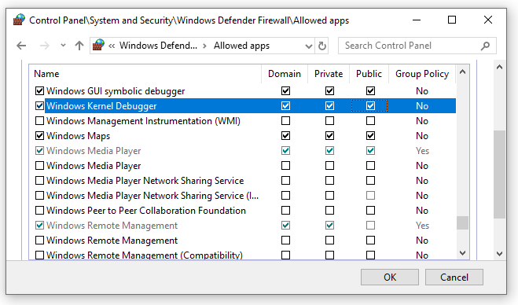

# Setting Up KDNET Network Kernel Debugging Automatically

Debugging Tools for Windows supports kernel debugging over a network. This topic describes how to set up network debugging automatically using the kdnet.exe setup tool.

The computer that runs the debugger is called the *host computer*, and the computer being debugged is called the *target computer*. The host computer must be running Windows 7 or later, and the target computer must be running Windows 8 or later.


## <span id="Determining_the_IP_Address_of_the_Host_Computer"></span><span id="determining_the_ip_address_of_the_host_computer"></span><span id="DETERMINING_THE_IP_ADDRESS_OF_THE_HOST_COMPUTER"></span>Determining the IP Address of the Host Computer

1. Confirm that the target and host PCs are connected to a network hub or switch using an appropriate network cable. 

2. On the host computer, open a Command Prompt window and enter *IPConfig* to display the IP configuration. 

3. In the command output, locate the IPv4 address of the Ethernet adapter.

    ```console
    ...

    Ethernet adapter Ethernet:
    ...

    IPv4 Address. . . . . . . . . . . : <YourHostIPAddress>
    ...

    ```
4. Make a note of the IPv4 address of the network adapter that you intend to use for debugging.

 

## <span id="Setting_Up_the_Target_Computer"></span><span id="setting_up_the_target_computer"></span><span id="SETTING_UP_THE_TARGET_COMPUTER"></span>Setting Up the Host and Target Computers

Use the kdnet.exe utility to automatically configure the  debugger settings on the target PC,  by following these steps.

1. Confirm that the Windows Debugging Tools are installed on the host system. For information on downloading and installing the debugger tools, see [Download Debugging Tools for Windows](debugger-download-tools.md). 

2. Locate the *kdnet.exe* and *VerifiedNICList.xml* files. By default, they are located here.

   ```console
   C:\Program Files (x86)\Windows Kits\10\Debuggers\x64
   ```

   > [!NOTE]
   > These directions assumes that both PCs are running a 64 bit version of Windows on both the target and host. 
   > If that is not the case, the best approach is to run the same "bitness" of tools on the host that the target is running. 
   For example, if the target is running 32-bit Windows, run a 32 version of the debugger on the host. 
   > For more information, see [Choosing the 32-Bit or 64-Bit Debugging Tools](choosing-a-32-bit-or-64-bit-debugger-package.md).
   > 

3. On the host computer, copy the two files to a network share or thumb drive, so that they will be available on the target computer.

4. On the target computer, create a C:\KDNET directory and copy the *kdnet.exe* and *VerifiedNICList.xml* files to that directory.

   > [!IMPORTANT]
   > Before using kdnet to change boot information you may need to temporarily suspend Windows security features such as BitLocker and Secure Boot on the test PC.
   > Re-enable these security features when testing is complete and appropriately manage the test PC, when the security features are disabled.


5. On the target computer, open a Command Prompt window as Administrator. Enter this command to verify that the target computer has a supported network adapter.

   ```console
   C:\KDNET>kdnet
   Network debugging is supported on the following NICs:
   busparams=1.0.0, Broadcom NetXtreme Gigabit Ethernet, Plugged in.  
   This Microsoft hypervisor supports using KDNET in guest VMs.
   ```

6. As the output from kdnet indicates that network adapter on the target is supported, we can proceed.

7. Type this command to set the IP address of the host system and generated a unique connection key. Use the IP address or the name of the host system. Pick a unique port address for each target/host pair that you work with, with in the recommended range of 50000-50039.

   ```console
   C:\>kdnet <HostComputerIPAddress> <YourDebugPort> 
   
   Enabling network debugging on Intel(R) 82577LM Gigabit Network Connection.
   Key=2steg4fzbj2sz.23418vzkd4ko3.1g34ou07z4pev.1sp3yo9yz874p
   ```

8. Copy the returned key into a notepad .txt file.


## <span id="Using_WinDbg"></span><span id="using_windbg"></span><span id="USING_WINDBG"></span> Using WinDbg

On the host computer, open WinDbg. On the **File** menu, choose **Kernel Debug**. In the Kernel Debugging dialog box, open the **Net** tab. Paste in your port number and key that you saved to in the notepad .txt file earlier. Click **OK**.

You can also start a WinDbg session by opening a Command Prompt window and entering the following command, where <YourPort> is the port you selected above, and <YourKey> is the key that was returned by kdnet above. Paste in the key in that you saved to in the notepad .txt file earlier.

   ```console
  windbg -k net:port=<YourDebugPort>,key=<YourKey> 
   ```

If you are prompted about allowing WinDbg to access the port through the firewall, allow WinDbg to access the port for **all three** of the different network types.


## <span id="Restarting_Target"></span><span id="restarting_target"></span><span id="RESTARTING_TARGET"></span> Restarting the Target PC

Once the debugger is connected, reboot the target computer. One way to do restart the PC, is to use this command from an administrator's command prompt.

   ```console
   shutdown -r -t 0 
   ```

## <span id="troubleshooting_tips"></span><span id="TROUBLESHOOTING_TIPS"></span>Troubleshooting Tips

**Debugging application must be allowed through firewall**

The  debugger  must have access through the firewall. Use Control Panel to allow access through the firewall. 

1. Open **Control Panel &gt; System and Security** and click **Allow an app through Windows Firewall**. 

2. In the list of applications, locate *Windows GUI Symbolic Debugger* and *Windows Kernel Debugger*. 

3. Use the check boxes to allow those two applications **all three** of the different network types through the firewall. 

4. Scroll down and click **OK**, to save the firewall changes. Restart the debugger.

    

**Use Ping to test connectivity**

If the debugger times out and does not connect, use the ping command on the target PC to verify connectivity. 

   ```console
   C:\>Ping <HostComputerIPAddress> 
   ```

**Choosing a Port for Network Debugging**

If the debugger times out and does not connect, it could be because the default port number of 50000 is already in use or it is blocked. 

You can choose any port number from 49152 through 65535. The recommended range is between 50000 and 50039. The port that you choose will be opened for exclusive access by the debugger running on the host computer. 

**Note**  The range of port numbers that can be used for network debugging might be limited by your company's network policy. To determine whether your company's policy limits the range of ports that can be used for network debugging, check with your network administrators.

**Supported Network Adapters**

If "Network debugging is not supported on any of the NICs in this machine" is displayed when you run kdnet.exe, it means that the network adapter is not supported. 

The host computer can use any network adapter, but the target computer must use a network adapter that is supported by Debugging Tools for Windows. For a list of supported network adapters, see [Supported Ethernet NICs for Network Kernel Debugging in Windows 10](supported-ethernet-nics-for-network-kernel-debugging-in-windows-10.md) and [Supported Ethernet NICs for Network Kernel Debugging in Windows 8.1](supported-ethernet-nics-for-network-kernel-debugging-in-windows-8-1.md).


## <span id="related_topics"></span>Related topics

[Supported Ethernet NICs for Network Kernel Debugging in Windows 10](supported-ethernet-nics-for-network-kernel-debugging-in-windows-10.md)
 

[Supported Ethernet NICs for Network Kernel Debugging in Windows 8.1](supported-ethernet-nics-for-network-kernel-debugging-in-windows-8-1.md)


[Setting Up KDNET Network Kernel Debugging Manually](setting-up-a-network-debugging-connection.md)


 


