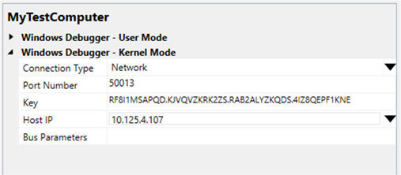

# Setting Up Kernel-Mode Debugging over a Network Cable in Visual Studio

> [!IMPORTANT]
> This feature is not available in Windows 10, version 1507 and later versions of the WDK.
>

You can use Microsoft Visual Studio to set up and perform kernel-mode debugging over an Ethernet network. To use Visual Studio for kernel-mode debugging, you must have the Windows Driver Kit (WDK) integrated with Visual Studio. For information about how to install the integrated environment, see [Windows Driver Development](https://go.microsoft.com/fwlink/p?linkid=301383).

As an alternative to using Visual Studio to set up Ethernet debugging, you can do the setup automatically. For more information, see [Setting Up KDNET Network Kernel Debugging Automatically](setting-up-a-network-debugging-connection-automatically.md).

Debugging over an Ethernet network has the following advantages compared to debugging over other types of cable:

-   The host and target computers can be anywhere on the local network.
-   It is easy to debug many target computers from one host computer.
-   Network cable is inexpensive and readily available.
-   Given any two computers, it is likely that they will both have Ethernet adapters. It is less likely that they will both have serial ports or both have 1394 ports.

The computer that runs the debugger is called the *host computer*, and the computer that is being debugged is called the *target computer*. The host computer must be running Windows XP or later, and the target computer must be running Windows 8 or later.

## <span id="Supported_network_adapters"></span><span id="supported_network_adapters"></span><span id="SUPPORTED_NETWORK_ADAPTERS"></span>Supported network adapters


The host computer can use any wired or wireless network adapter, but the target computer must use a network adapter that is supported by Debugging Tools for Windows. For a list of supported network adapters, see [Supported Ethernet NICs for Network Kernel Debugging in Windows 8.1](supported-ethernet-nics-for-network-kernel-debugging-in-windows-8-1.md) and [Supported Ethernet NICs for Network Kernel Debugging in Windows 10](supported-ethernet-nics-for-network-kernel-debugging-in-windows-10.md).

## <span id="Configuring_the_host_and_target_computer"></span><span id="configuring_the_host_and_target_computer"></span><span id="CONFIGURING_THE_HOST_AND_TARGET_COMPUTER"></span>Configuring the host and target computer


1.  Connect the network adapter of the target computer to a network hub or switch using and appropriate network cable. Connect the network adapter of the host computer to a network hub or switch using a standard cable or a wireless connection.
2.  Begin configuring your host and target computers as described in [Provision a computer for driver deployment and testing (WDK 8.1)](https://msdn.microsoft.com/library/windows/hardware/dn745909).
3.  On the host computer, in Visual Studio, when you come to the Computer Configuration dialog box, select **Provision computer and choose debugger settings**.
4.  For **Connection Type**, choose **Network**.

    

    For **Port Number**, accept the default value or fill in a value of your choice. You can choose any number from 49152 through 65535. The port that you choose will be opened for exclusive access by the debugger running on the host computer. Take care to choose a port number that is not used by any other applications that run on the host computer.

    **Note**  The range of port numbers that can be used for network debugging might be limited by your company's network policy. There is no way to tell from the host computer what the limitations are. To determine whether your company's policy limits the range of ports that can be used for network debugging, check with your network administrators.

    For **Key**, we strongly recommend that you use the automatically generated default value. However, you can enter your own key if you prefer. For more information, see [Creating your own key](#creating-your-own-key) later in this topic. For **Host IP**, accept the default value. This is the IP address of your host computer.

    If your target computer has only one network adapter, you can leave **Bus Parameters** empty. If there is more than one network adapter on the target computer, use Device Manager on the target computer to determine the PCI bus, device, and function numbers for the adapter you want to use for debugging. For **Bus Parameters**, enter *b*.*d*.*f* where *b*, *d*, and *f* are the bus number, device number, and function number of the adapter.

5.  The configuration process takes several minutes and might automatically reboot the target computer once or twice. When the process is complete, click **Finish**.

**Caution**  If your target computer is in a docking station, and you have network debugging enabled for a network adapter that is part of the docking station, do not remove the computer from the docking station. If you need to remove the target computer from the docking station, disable kernel debugging first. To disable kernel debugging on the target computer, open a Command Prompt window as Administrator and enter the command **bcdedit /debug off**. Reboot the target computer.

 

**Note**  If you intend to install the Hyper-V role on the target computer, see [Setting Up Network Debugging of a Virtual Machine Host](setting-up-network-debugging-of-a-virtual-machine-host.md).

 

## <span id="Verifying_dbgsettings_on_the_Target_Computer"></span><span id="verifying_dbgsettings_on_the_target_computer"></span><span id="VERIFYING_DBGSETTINGS_ON_THE_TARGET_COMPUTER"></span>Verifying dbgsettings on the Target Computer

> [!IMPORTANT]
> Before using BCDEdit to change boot information you may need to temporarily suspend Windows security features such as BitLocker and Secure Boot on the test PC.
> Re-enable these security features when testing is complete and appropriately manage the test PC, when the security features are disabled.

On the target computer, open a Command Prompt window as Administrator, and enter these commands:

**bcdedit /dbgsettings**

**bcdedit /enum**

```console
...
key                     RF8...KNE
debugtype               NET
hostip                  10.125.5.10
port                    50001
dhcp                    Yes
...
busparams               0.29.7
...
```

Verify that *debugtype* is NET and *port* is the port number you specified in Visual Studio on the host computer. Also verify that *key* is the key that was automatically generated (or you specified) in Visual Studio.

If you entered **Bus Parameters** in Visual Studio, verify that *busparams* matches the bus parameters you specified.

If you do not see the value you entered for **Bus Parameters**, enter this command:

**bcdedit /set "{dbgsettings}" busparams** <em>b</em>**.**<em>d</em>**.**<em>f</em>

where *b*, *d*, and *f* are the bus, device, and function numbers of the network adapter on the target computer that you have chosen to use for debugging.

For example:

**bcdedit /set "{dbgsettings}" busparams 0.29.7**

## <span id="Starting_the_Debugging_Session"></span><span id="starting_the_debugging_session"></span><span id="STARTING_THE_DEBUGGING_SESSION"></span>Starting the Debugging Session


1.  On the host computer, in Visual Studio, on the **Tools** menu, choose **Attach to Process**.
2.  For **Transport**, choose **Windows Kernel Mode Debugger**.
3.  For **Qualifier**, select the name of the target computer that you previously configured.
4.  Click **Attach**.

## <span id="Allowing_the_debugger_through_the_firewall"></span><span id="allowing_the_debugger_through_the_firewall"></span><span id="ALLOWING_THE_DEBUGGER_THROUGH_THE_FIREWALL"></span>Allowing the debugger through the firewall


When you first attempt to establish a network debugging connection, you might be prompted to allow the debugging application (Microsoft Visual Studio) through the firewall. Client versions of Windows display the prompt, but Server versions of Windows do not display the prompt. Respond to the prompt by checking the boxes for all three network types: domain, private, and public. If you do not get the prompt, or if you did not check the boxes when the prompt was available, you must use Control Panel to allow access through the firewall. Open **Control Panel &gt; System and Security**, and click **Allow an app through Windows Firewall**. In the list of applications, use the check boxes to allow Visual Studio through the firewall. Restart Visual Studio.

## <span id="creating-your-own-key"></span><span id="CREATING-YOUR-OWN-KEY"></span>Creating Your Own Key


To keep the target computer secure, packets that travel between the host and target computers must be encrypted. We strongly recommend that you use an automatically generated encryption key (provided by the Visual Studio configuration wizard) when you configure the target computer). However, you can choose to create your own key. Network debugging uses a 256-bit key that is specified as four 64-bit values, in base 36, separated by periods. Each 64-bit value is specified by using up to 13 characters. Valid characters are the letters a through z and the digits 0 through 9. Special characters are not allowed. The following list gives examples of valid (although not strong) keys:

-   1.2.3.4
-   abc.123.def.456
-   dont.use.previous.keys

## <span id="troubleshooting_tips_for_debugging_over_a_network_cable"></span><span id="TROUBLESHOOTING_TIPS_FOR_DEBUGGING_OVER_A_NETWORK_CABLE"></span>Troubleshooting Tips for Debugging over a Network Cable


### <span id="Debugging_application_must_be_allowed_through_firewall"></span><span id="debugging_application_must_be_allowed_through_firewall"></span><span id="DEBUGGING_APPLICATION_MUST_BE_ALLOWED_THROUGH_FIREWALL"></span>Debugging application must be allowed through firewall

Your debugger (WinDbg or KD) must have access through the firewall. You can use Control Panel to allow access through the firewall. Open **Control Panel &gt; System and Security**, and click **Allow an app through Windows Firewall**. In the list of applications, use the check boxes to allow Visual Studio through the firewall. Restart Visual Studio.

### <span id="Port_number_must_be_in_range_allowed_by_network_policy"></span><span id="port_number_must_be_in_range_allowed_by_network_policy"></span><span id="PORT_NUMBER_MUST_BE_IN_RANGE_ALLOWED_BY_NETWORK_POLICY"></span>Port number must be in range allowed by network policy

The range of port numbers that can be used for network debugging might be limited by your company's network policy. To determine whether your company's policy limits the range of ports that can be used for network debugging, check with your network administrator.

Use the following procedure if you need to change the port number.

1.  On the host computer, in Visual Studio, on the **Driver** menu, choose **Test &gt; Configure Computers**.
2.  Select the name of your test computer, and click **Next**.
3.  Select **Provision computer and choose debugger settings**. Click **Next**.
4.  For **Port Number**, enter a number that is in the range allowed by your network administrator. Click **Next**.
5.  The reconfiguration process takes a few minutes and automatically reboots the target computer. When the process is complete, click **Next** and **Finish**.

### <span id="Specify_busparams_if_target_computer_has_multiple_network_adapters"></span><span id="specify_busparams_if_target_computer_has_multiple_network_adapters"></span><span id="SPECIFY_BUSPARAMS_IF_TARGET_COMPUTER_HAS_MULTIPLE_NETWORK_ADAPTERS"></span>Specify busparams if target computer has multiple network adapters

If your target computer has more than one network adapter, you must specify the bus, device, and function numbers of the network adapter that you intend to use for debugging. To specify the bus parameters, open Device Manager, and locate the network adapter that you want to use for debugging. Open the property page for the network adapter, and make a note of the bus number, device number, and function number. In an elevated Command Prompt Window, enter the following command, where *b*, *d*, and *f* are the bus, device and function numbers in decimal format:

**bcdedit -set "{dbgsettings}" busparams** <em>b</em>**.**<em>d</em>**.**<em>f</em>

Reboot the target computer.

## <span id="related_topics"></span>Related topics


[Setting Up Kernel-Mode Debugging in Visual Studio](setting-up-kernel-mode-debugging-in-visual-studio.md)

[Supported Ethernet NICs for Network Kernel Debugging in Windows 10](supported-ethernet-nics-for-network-kernel-debugging-in-windows-10.md)

[Supported Ethernet NICs for Network Kernel Debugging in Windows 8.1](supported-ethernet-nics-for-network-kernel-debugging-in-windows-8-1.md)

[Supported Ethernet NICs for Network Kernel Debugging in Windows 8](supported-ethernet-nics-for-network-kernel-debugging-in-windows-8.md)

 

 


