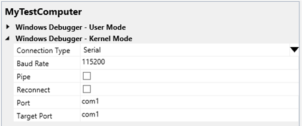

# Setting Up Kernel-Mode Debugging over a Serial Cable in Visual Studio

> [!IMPORTANT]
> This feature is not available in Windows 10, version 1507 and later versions of the WDK.
>

You can use Microsoft Visual Studio to set up and perform kernel-mode debugging over a null-modem cable. Null-modem cables are serial cables that have been configured to send data between two serial ports. They are available at most computer stores. Do not confuse null-modem cables with standard serial cables. Standard serial cables do not connect serial ports to each other. For information about how null-modem cables are wired, see [Null-Modem Cable Wiring](#null-modem-cable-wiring).

To use Visual Studio for kernel-mode debugging, you must have the Windows Driver Kit (WDK) integrated with Visual Studio. For information about how to install the integrated environment, see [Windows Driver Development](https://go.microsoft.com/fwlink/p?linkid=301383).

As an alternative to using Visual Studio to set up serial debugging, you can do the setup manually. For more information, see [Setting Up Kernel-Mode Debugging over a Serial Cable Manually](setting-up-a-null-modem-cable-connection.md).

The computer that runs the debugger is called the *host computer*, and the computer being debugged is called the *target computer*.

## Configuring the host and target computers

1.  Begin configuring your host and target computer as described in [Provision a computer for driver deployment and testing (WDK 8.1)](https://msdn.microsoft.com/library/windows/hardware/dn745909).
2.  On the host computer, in Visual Studio, when you come to the Computer Configuration dialog box, select **Provision computer and choose debugger settings**.
3.  For **Connection Type**, choose **Serial**.

    

    For **Baud Rate**, accept the default value or enter the baud rate you want to use. For **Port**, enter the name of the COM port that you want to use for debugging on the host computer. For **Target Port**, enter the name of the COM port that you want to use for debugging on the target computer.

4.  The configuration process takes several minutes and might automatically reboot the target computer once or twice. When the process is complete, click **Finish**.

## Starting the Debugging Session

1.  Connect the null-modem cable to the COM ports that you have chosen for debugging on the host and target computers.
2.  On the host computer, in Visual Studio, on the **Tools** menu, choose **Attach to Process**.
3.  For **Transport**, choose **Windows Kernel Mode Debugger**.
4.  For **Qualifier**, select the name of the target computer that you previously configured.
5.  Click **Attach**.

## Troubleshooting Tips for Debugging over a Serial Cable

### Specify correct COM ports and baud rate

Determine the numbers of the COM ports you are using for debugging on the host and target computers. For example, suppose you have your null-modem cable connected to COM1 on the host computer and COM2 on the target computer. Also suppose you have chosen a baud rate of 115200.

1.  On the host computer, in Visual Studio, on the **Driver** menu, choose **Test &gt; Configure Computers**.
2.  Select the name of your test computer, and click **Next**.
3.  Select **Provision computer and choose debugger settings**. Click **Next**.
4.  If you are using COM1 on the host computer, for **Port**, enter com1. If you are using COM2 on the target computer, for **Target Port**, enter com2.
5.  If you have chosen to use a baud rate of 115200, for **Baud Rate**, enter 115200.

You can double check the COM port and baud rate settings on the target computer by opening a Command Prompt window as Administrator, and entering **bcdedit /dbgsettings**. If you are using COM2 on the target computer and a baud rate of 115200, the output of **bcdedit** should show `debugport 2` and `baudrate 115200`.

## Null Modem Cable Wiring

The following tables show how null-modem cables are wired.

### 9-pin connector

| Connector 1 | Connector 2 | Signals        |
|-------------|-------------|----------------|
| 2           | 3           | Tx - Rx        |
| 3           | 2           | Rx - Tx        |
| 7           | 8           | RTS - CTS      |
| 8           | 7           | CTS - RTS      |
| 4           | 1+6         | DTR - (CD+DSR) |
| 1+6         | 4           | (CD+DSR) - DTR |
| 5           | 5           | Signal ground  |

 

### 25-pin connector

| Connector 1 | Connector 2 | Signals       |
|-------------|-------------|---------------|
| 2           | 3           | Tx - Rx       |
| 3           | 2           | Rx - Tx       |
| 4           | 5           | RTS - CTS     |
| 5           | 4           | CTS - RTS     |
| 6           | 20          | DSR - DTR     |
| 20          | 6           | DTR - DSR     |
| 7           | 7           | Signal ground |

 

### Signal Abbreviations

| Abbreviation | Signal              |
|--------------|---------------------|
| Tx           | Transmit data       |
| Rx           | Receive data        |
| RTS          | Request to send     |
| CTS          | Clear to send       |
| DTR          | Data terminal ready |
| DSR          | Data set ready      |
| CD           | Carrier detect      |

 

## Related topics

[Setting Up Kernel-Mode Debugging in Visual Studio](setting-up-kernel-mode-debugging-in-visual-studio.md)

 

 

