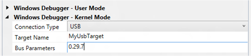

# Setting Up Kernel-Mode Debugging over a USB 2.0 Cable in Visual Studio

> [!IMPORTANT]
> This feature is not available in Windows 10, version 1507 and later versions of the WDK.
>

You can use Microsoft Visual Studio to set up and perform kernel-mode debugging over a USB 2.0 cable. To use Visual Studio for kernel-mode debugging, you must have the Windows Driver Kit (WDK) integrated with Visual Studio. For information about how to install the integrated environment, see [Windows Driver Development](https://go.microsoft.com/fwlink/p?linkid=301383).

As an alternative to using Visual Studio to set up USB 2.0 debugging, you can do the setup manually. For more information, see [Setting Up Kernel-Mode Debugging over a USB 2.0 Cable Manually](setting-up-a-usb-2-0-debug-cable-connection.md).

The computer that runs the debugger is called the *host computer*, and the computer that is being debugged is called the *target computer*.

Debugging over a USB 2.0 connection requires the following hardware:

-   A Universal Serial Bus (USB) 2.0 debug cable. This cable is not a standard USB 2.0 cable, because it has an extra hardware component that makes it compatible with the USB2 Debug Device Functional Specification. You can find these cables by doing an Internet search for "USB 2.0 debug cable".

-   On the host computer, an EHCI (USB 2.0) host controller

-   On the target computer, an EHCI (USB 2.0) host controller that supports debugging

## <span id="Identifying_a_Debug_Port_on_the_Target_Computer"></span><span id="identifying_a_debug_port_on_the_target_computer"></span><span id="IDENTIFYING_A_DEBUG_PORT_ON_THE_TARGET_COMPUTER"></span>Identifying a Debug Port on the Target Computer


1.  On the target computer, launch the UsbView tool. The UsbView tool is included in Debugging Tools for Windows.
2.  In UsbView, locate all of the host controllers that are compatible with the EHCI specification. For example, you could look for controllers that are listed as Enhanced.
3.  In UsbView, expand the nodes of the EHCI host controllers. Look for an indication that a host controller supports debugging, and look for the number of the debug port. For example, UsbView displays this output for an EHCI host controller that supports debugging on port 1.

    ```console
    Xxx xxx xxx USB2 Enhanced Host Controller - 293A
    ...
    Debug Port Number:  1
    Bus.Device.Function (in decimal): 0.29.7
    ```

    **Note**  Many EHCI host controllers support debugging on port 1, but some EHCI host controllers support debugging on port 2.

     

4.  Make a note of the bus, device, and function numbers for the EHCI controller that you intend to use for debugging. UsbView displays these number. In the preceding example, the bus number is 0, the device number is 29, and the function number is 7.

5.  After you have identified the EHCI controller and the port number that supports debugging, the next step is to locate the physical USB connector that is associated with the correct port number. To find the physical connector, plug any USB 2.0 device into any USB connector on the target computer. Refresh UsbView to see where your device is located. If UsbView shows your device connected to the EHCI host controller and port that you identified as the debug port, then you have found a physical USB connector that you can use for debugging. It could be that there is no external physical USB connector that is associated with a debug port on an EHCI controller. In that case, you can look for a physical USB connector inside the computer. Perform the same steps to determine whether the internal USB connector is suitable for kernel debugging. If you cannot find a physical USB connector (either external or internal) that is associated with a debug port, then you cannot use the computer as a target for debugging over a USB 2.0 cable.

    **Note**  See [this remark](setting-up-a-usb-2-0-debug-cable-connection.md#what-if-usbview-shows-a-debug-capable-port) for an exception.

     

## <span id="Connecting_the_USB_debug_cable"></span><span id="connecting_the_usb_debug_cable"></span><span id="CONNECTING_THE_USB_DEBUG_CABLE"></span>Connecting the USB debug cable


1.  Verify that the host computer is not configured to be the target of USB debugging. (If necessary, open a Command Prompt window as Administrator, enter **bcdedit /debug off**, and reboot.)
2.  On the host computer, use UsbView to find the EHCI host controllers and ports that support debugging. If possible, plug one end of the USB 2.0 debug cable into an EHCI port (on the host computer) that does not support debugging. Otherwise, plug the cable into any EHCI port on the host computer.
3.  Plug the other end of the USB 2.0 debug cable into the connector that you identified previously on the target computer.

## <span id="Configuring_the_host_and_target_computers"></span><span id="configuring_the_host_and_target_computers"></span><span id="CONFIGURING_THE_HOST_AND_TARGET_COMPUTERS"></span>Configuring the host and target computers


1.  Begin configuring your host and target computers as described in [Provision a computer for driver deployment and testing (WDK 8.1)](https://msdn.microsoft.com/library/windows/hardware/dn745909).
2.  On the host computer, in Visual Studio, when you come to the Computer Configuration dialog box, select **Provision computer and choose debugger settings**.
3.  For **Connection Type**, choose **USB**.

    

    For **Target Name**, enter a string to represent the target computer. This string does not have to be the official name of the target computer; it can be any string that you create as long as it meets these restrictions:

    -   The maximum length of the string is 24 characters.
    -   The only characters in the string are the hyphen (-), the underscore(\_), the digits 0 through 9, and the letters A through Z (upper or lower case).

    If you have more than one USB host controller on the target computer, enter a **Bus Parameters** value of *b*.*d*.*f*, where *b*, *d*, and *f* are the bus, device, and function numbers for the USB host controller that you intend to use for debugging on the target computer. The bus, device, and function numbers must be in decimal format (example: 0.29.7).

4.  The configuration process takes several minutes and might automatically reboot the target computer once or twice. When the process is complete, click **Finish**.

## <span id="Verifying_dbgsettings_on_the_Target_Computer"></span><span id="verifying_dbgsettings_on_the_target_computer"></span><span id="VERIFYING_DBGSETTINGS_ON_THE_TARGET_COMPUTER"></span>Verifying dbgsettings on the Target Computer


On the target computer, open a Command Prompt window as Administrator, and enter these commands:

**bcdedit /dbgsettings**

**bcdedit /enum**

```console
...
targetname              MyUsbTarget
debugtype               USB
debugport               1
baudrate                115200
...
busparams               0.29.7
...
```

Verify that *debugtype* is USB and *targetname* is the name you specified in Visual Studio on the host computer. You can ignore the values of *debugport* and *baudrate*; they do not apply to debugging over USB.

If you entered **Bus Parameters** in Visual Studio, verify that *busparams* matches the bus parameters you specified.

If you do not see the value you entered for **Bus Parameters**, enter this command:

**bcdedit /set "{dbgsettings}" busparams** <em>b</em>**.**<em>d</em>**.**<em>f</em>

where *b*, *d*, and *f* are the bus, device, and function numbers of the EHCI controller on the target computer that you have chosen to use for debugging.

Example:

**bcdedit /set "{dbgsettings}" busparams 0.29.7**

Reboot the target computer.

## <span id="Starting_a_Debugging_Session_for_the_First_Time"></span><span id="starting_a_debugging_session_for_the_first_time"></span><span id="STARTING_A_DEBUGGING_SESSION_FOR_THE_FIRST_TIME"></span>Starting a Debugging Session for the First Time


1.  Connect a USB 2.0 debug cable to the USB 2.0 ports that you have chosen for debugging on the host and target computers.
2.  On the host computer, open Visual Studio as Administrator.
3.  On the **Tools** menu, choose **Attach to Process**.
4.  For **Transport**, choose **Windows Kernel Mode Debugger**.
5.  For **Qualifier**, select the name of the target computer that you previously configured.
6.  Click **Attach**.

At this point, the USB debug driver gets installed on the host computer. This is why it is important to run Visual Studio as Administrator. After the USB debug driver is installed, you do not need to run as Administrator for subsequent debugging sessions.

## <span id="Starting_a_Debugging_Session"></span><span id="starting_a_debugging_session"></span><span id="STARTING_A_DEBUGGING_SESSION"></span>Starting a Debugging Session


1.  On the host computer, in Visual Studio, on the **Tools** menu, choose **Attach to Process**.
2.  For **Transport**, choose **Windows Kernel Mode Debugger**.
3.  For **Qualifier**, select the target name that you entered during configuration.
4.  Click **Attach**.

## <span id="related_topics"></span>Related topics


[Setting Up Kernel-Mode Debugging in Visual Studio](setting-up-kernel-mode-debugging-in-visual-studio.md)

 

 


