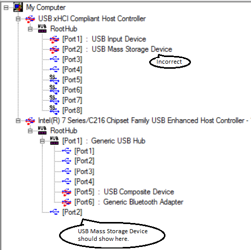

# Setting Up Kernel-Mode Debugging over a USB 2.0 Cable Manually


Debugging Tools for Windows supports kernel debugging over a USB 2.0 cable. This topic describes how to set up USB 2.0 debugging manually.

The computer that runs the debugger is called the *host computer*, and the computer being debugged is called the *target computer*.

Debugging over a USB 2.0 cable requires the following hardware:

-   A USB 2.0 debug cable. This cable is not a standard USB 2.0 cable because it has an extra hardware component that makes it compatible with the USB2 Debug Device Functional Specification. You can find these cables with an Internet search for the term *USB 2.0 debug cable*.

-   On the host computer, an EHCI (USB 2.0) host controller

-   On the target computer, an EHCI (USB 2.0) host controller that supports debugging

## <span id="Setting_Up_the_Target_Computer"></span><span id="setting_up_the_target_computer"></span><span id="SETTING_UP_THE_TARGET_COMPUTER"></span>Setting Up the Target Computer


1.  On the target computer, launch the UsbView tool. The UsbView tool is included in Debugging Tools for Windows.
2.  In UsbView, locate all of the host controllers that are compatible with the EHCI specification. For example, you could look for controllers that are listed as Enhanced.
3.  In UsbView, expand the nodes of the EHCI host controllers. Look for an indication that a host controller supports debugging, and look for the number of the debug port. For example, UsbView displays this output for an EHCI host controller that supports debugging on port 1.

    ```console
    Xxx xxx xxx USB2 Enhanced Host Controller - 293A
    ...
    Debug Port Number:  1
    Bus.Device.Function (in decimal): 0.29.7
    ```

    **Note**  Many EHCI host controllers support debugging on port 1, but some EHCI host controllers support debugging on port 2.

     

4.  Make a note of the bus, device, and function numbers for the EHCI controller that you intend to use for debugging. UsbView displays these number. In the preceding example, the bus number is 0, the device number is 29, and the function number is 7.

5.  After you have identified the EHCI controller and the port number that supports debugging, the next step is to locate the physical USB connector that is associated with the correct port number. To find the physical connector, plug any USB 2.0 device into any USB connector on the target computer. Refresh UsbView to see where your device is located. If UsbView shows your device connected to the EHCI host controller and port that you identified as the debug port, then you have found a physical USB connector that you can use for debugging. It could be that there is no external physical USB connector that is associated with a debug port on an EHCI controller. In that case, you can look for a physical USB connector inside the computer. Perform the same steps to determine whether the internal USB connector is suitable for kernel debugging. If you cannot find a physical USB connector (either external or internal) that is associated with a debug port, then you cannot use the computer as a target for debugging over a USB 2.0 cable.

    **Note**  See [this remark](#what-if-usbview-shows-a-debug-capable-port) for an exception.

> [!IMPORTANT]
> Before using bcdedit to change boot information you may need to temporarily suspend Windows security features such as BitLocker and Secure Boot on the test PC. 
> You can re-enable Secure Boot once you’re done debugging and you’ve disabled kernel debugging.  

   

6. On the target computer, open a Command Prompt window as Administrator, and enter these commands:

   - **bcdedit /debug on**
   - **bcdedit /dbgsettings usb targetname:**<em>TargetName</em>

   where *TargetName* is a name that you create for the target computer. Note that *TargetName* does not have to be the official name of the target computer; it can be any string that you create as long as it meets these restrictions:

   -   The maximum length of the string is 24 characters.
   -   The only characters in the string are the hyphen (-), the underscore(\_), the digits 0 through 9, and the letters A through Z (upper or lower case).

7. If there is more than one USB host controller on the target computer, enter this command:

   <span id="Windows_7_or_later"></span><span id="windows_7_or_later"></span><span id="WINDOWS_7_OR_LATER"></span>Windows 7 or later  
   **bcdedit /set "{dbgsettings}" busparams** *b.d.f*

   where *b*, *d*, and *f* are the bus, device, and function numbers for the host controller. The bus, device, and function numbers must be in decimal format (for example, **busparams 0.29.7**).

   <span id="Windows_Vista"></span><span id="windows_vista"></span><span id="WINDOWS_VISTA"></span>Windows Vista  
   **bcdedit /set "{current}" loadoptions busparams=**<em>f.d.f</em>

   where *b*, *d*, and *f* are the bus, device, and function numbers for the host controller. The bus, device, and function numbers must be in hexadecimal format (for example, **busparams=0.1D.7**).

8. Reboot the target computer.

## <span id="Setting-Up-the-Host-Computer"></span><span id="setting_up_the_host_computer"></span><span id="SETTING_UP_THE_HOST_COMPUTER"></span>Setting Up the Host Computer


1.  Verify that the host computer is not configured to be the target of USB debugging. (If necessary, open a Command Prompt window as Administrator, enter **bcdedit /debug off**, and reboot.)
2.  On the host computer, use UsbView to find the EHCI host controllers and ports that support debugging. If possible, plug one end of the USB 2.0 debug cable into an EHCI port (on the host computer) that does not support debugging. Otherwise, plug the cable into any EHCI port on the host computer.
3.  Plug the other end of the USB 2.0 debug cable into the connector that you identified previously on the target computer.

## <span id="Starting-a-Debugging-Session-for-the-First-Time"></span><span id="starting_a_debugging_session_for_the_first_time"></span><span id="STARTING_A_DEBUGGING_SESSION_FOR_THE_FIRST_TIME"></span>Starting a Debugging Session for the First Time


1.  Determine the bitness (32-bit or 64-bit) of Windows running on the host computer.
2.  On the host computer, open a version of WinDbg (as Administrator) that matches the bitness of Windows running on the host computer. For example, if the host computer is running a 64-bit version of Windows, open the 64-bit version of WinDbg as Administrator.
3.  On the **File** menu, choose **Kernel Debug**. In the Kernel Debugging dialog box, open the **USB** tab. Enter the target name that you created when you set up the target computer. Click **OK**.

At this point, the USB debug driver gets installed on the host computer. This is why it is important to match the bitness of WinDbg to the bitness of Windows. After the USB debug driver is installed, you can use either the 32-bit or 64-bit version of WinDbg for subsequent debugging sessions.

**Note**  The USB 2.0 debug cable is actually two cables with a dongle in the middle. The direction of the dongle is important; one side powers the device, and the other side does not. If USB debugging doesn’t work, try swapping the direction of the dongle. That is, unplug both cables from the dongle, and swap the sides that the cables are connected to.

 

## <span id="Starting-a-Debugging-Session"></span><span id="starting_a_debugging_session"></span><span id="STARTING_A_DEBUGGING_SESSION"></span>Starting a Debugging Session


### <span id="Using-WinDbg"></span><span id="using_windbg"></span><span id="USING_WINDBG"></span>Using WinDbg

On the host computer, open WinDbg. On the **File** menu, choose **Kernel Debug**. In the Kernel Debugging dialog box, open the **USB** tab. Enter the target name that you created when you set up the target computer. Click **OK**.

You can also start a session with WinDbg by entering the following command in a Command Prompt window, where *TargetName* is the target name you created when you set up the target computer:

**windbg /k usb:targetname=**<em>TargetName</em>

### <span id="Using_KD"></span><span id="using_kd"></span><span id="USING_KD"></span>Using KD

On the host computer, open a Command Prompt window and enter the following command, where *TargetName* is the target name you created when you set up the target computer:

**kd /k usb:targetname=**<em>TargetName</em>

## <span id="what-if-usbview-shows-a-debug-capable-port"></span><span id="WHAT_IF_USBVIEW_SHOWS_A_DEBUG_CAPABLE_PORT"></span>What if USBView shows a debug-capable port, but does not show the port mapped to any physical connector?


On some computers, USBView shows a debug-capable port, but does not show the port mapped to any physical USB connector. For example, USBView might show port 2 as the debug port number for an eHCI controller.

```console
... USB Enhanced Host Controller ...
...
Debug Port Number:  2
Bus.Device.Function (in decimal): 0.29.0
```

Also, when you use USBView to look at the individual port, it is listed as debug-capable.

```console
[Port 2]
Is Port User Connectiable: Yes
Is Port Debug Capable: Yes
...
Protocols Supported
  USB 1.1      yes
  USB 2.0      yes
  USB 3.0      no
```

But when you plug in a USB 2.0 device (like a flash drive) to all the USB connectors on the computer, USBView never show your device connected to the debug-capable port (port 2 in this example). USBView might show the external connector mapped to a port of an xHCI controller when in fact the external connector is mapped to the debug-capable port of the eHCI controller.



In a case like this, you might still be able to establish kernel-mode debugging over a USB 2.0 cable. In the example given here, you would plug your USB 2.0 debug cable into the connector that shows as being mapped to Port 2 of the xHCI controller. Then you would set your bus parameters to the bus, device, and function numbers of the eHCI controller (in this example, 0.29.0).

**bcdedit /set "{dbgsettings}" busparams 0.29.0**

### <span id="software-setup"></span><span id="SOFTWARE_SETUP"></span>Additional Support

For troubleshooting tips and detailed instructions on setting up kernel debugging over USB, see [Setting Up Kernel Debugging with USB 2.0](https://go.microsoft.com/fwlink/p?linkid=389435).

## <span id="related-topics"></span>Related topics


[Setting Up Kernel-Mode Debugging Manually](setting-up-kernel-mode-debugging-in-windbg--cdb--or-ntsd.md)

 

 


