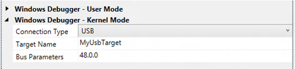

# Setting Up Kernel-Mode Debugging over a USB 3.0 Cable in Visual Studio

> [!IMPORTANT]
> This feature is not available in Windows 10, version 1507 and later versions of the WDK.
>

You can use Microsoft Visual Studio to set up and perform kernel-mode debugging over a USB 3.0 cable. To use Visual Studio for kernel-mode debugging, you must have the Windows Driver Kit (WDK) integrated with Visual Studio. For information about how to install the integrated environment, see [Windows Driver Development](https://go.microsoft.com/fwlink/p?linkid=301383).

As an alternative to using Visual Studio to set up USB 3.0 debugging, you can do the setup manually. For more information, see [Setting Up Kernel-Mode Debugging over a USB 3.0 Cable Manually](setting-up-a-usb-3-0-debug-cable-connection.md).

The computer that runs the debugger is called the *host computer*, and the computer that is being debugged is called the *target computer*.

Debugging over a USB 3.0 connection requires the following hardware:

-   A USB 3.0 debug cable. This is an A-A crossover cable that has only the USB 3.0 lines and no Vbus.

-   On the host computer, an xHCI (USB 3.0) host controller

-   On the target computer, an xHCI (USB 3.0) host controller that supports debugging

## <span id="setting_up_the_computer_usb3_manual"></span><span id="SETTING_UP_THE_COMPUTER_USB3_MANUAL"></span>Identifying a Debug Port on the Target Computer


1.  On the target computer, launch the UsbView tool. The UsbView tool is included in Debugging Tools for Windows.
2.  In UsbView, locate all of the xHCI host controllers.
3.  In UsbView, expand the nodes of the xHCI host controllers. Look for an indication that a port on the host controller supports debugging.

    ```console
    [Port1] 

    Is Port User Connectable:         yes
    Is Port Debug Capable:            yes
    Companion Port Number:            3
    Companion Hub Symbolic Link Name: USB#ROOT_HUB30#5&32bab638&0&0#{...}
    Protocols Supported:
     USB 1.1:                         no
     USB 2.0:                         no
     USB 3.0:                         yes
    ```

4.  Make a note of the bus, device, and function numbers for the xHCI controller that you intend to use for debugging. UsbView displays these number. In the following example, the bus number is 48, the device number is 0, and the function number is 0.

    ```console
    USB xHCI Compliant Host Controller
    ...
    DriverKey: {36fc9e60-c465-11cf-8056-444553540000}\0020
    ...
    Bus.Device.Function (in decimal): 48.0.0
    ```

5.  After you have identified an xHCI controller that supports debugging, the next step is to locate the physical USB connector that is associated with a port on the xHCI controller. To find the physical connector, plug any USB 3.0 device into any USB connector on the target computer. Refresh UsbView to see where your device is located. If UsbView shows your device connected to the xHCI host controller, then you have found a physical USB connector that you can use for USB 3.0 debugging.

## <span id="Configuring_the_host_and_target_computers"></span><span id="configuring_the_host_and_target_computers"></span><span id="CONFIGURING_THE_HOST_AND_TARGET_COMPUTERS"></span>Configuring the host and target computers


1.  Begin configuring your host and target computers as described in [Provision a computer for driver deployment and testing (WDK 8.1)](https://msdn.microsoft.com/library/windows/hardware/dn745909).
2.  On the host computer, in Visual Studio, when you come to the Computer Configuration dialog box, select **Provision computer and choose debugger settings**.
3.  For **Connection Type**, choose **USB**.

    

    For **Target Name**, enter a string to represent the target computer. This string does not have to be the official name of the target computer; it can be any string that you create as long as it meets these restrictions:

    -   The maximum length of the string is 24 characters.
    -   The only characters in the string are the hyphen (-), the underscore(\_), the digits 0 through 9, and the letters A through Z (upper or lower case).

    If you have more than one USB host controller on the target computer, enter a **Bus Parameters** value of *b*.*d*.*f*, where *b*, *d*, and *f* are the bus, device, and function numbers for the USB host controller that you intend to use for debugging on the target computer. The bus, device, and function numbers must be in decimal format (example: 48.0.0).

4.  The configuration process takes several minutes and might automatically reboot the target computer once or twice. When the process is complete, click **Finish**.

## <span id="Verifying_dbgsettings_on_the_Target_Computer"></span><span id="verifying_dbgsettings_on_the_target_computer"></span><span id="VERIFYING_DBGSETTINGS_ON_THE_TARGET_COMPUTER"></span>Verifying dbgsettings on the Target Computer


On the target computer, open a Command Prompt window as Administrator, and enter these commands:

**bcdedit /dbgsettings**

**bcdedit /enum**

```console
...
targetname              MyUsbTarget
debugtype               USB
debugport               1
baudrate                115200
...
busparams               48.0.0
```

Verify that *debugtype* is USB and *targetname* is the name you specified in Visual Studio on the host comptuer. You can ignore the values of *debugport* and *baudrate*; they do not apply to debugging over USB.

If you entered **Bus Parameters** in Visual Studio, verify that *busparams* matches the bus parameters you specified.

If you do not see the value you entered for **Bus Parameters**, enter this command:

**bcdedit /set "{dbgsettings}" busparams** <em>b</em>**.**<em>d</em>**.**<em>f</em>

where *b*, *d*, and *f* are the bus, device, and function numbers of the xHCI controller on the target computer that you have chosen to use for debugging.

Example:

**bcdedit /set "{dbgsettings}" busparams 48.0.0**

Reboot the target computer.

## <span id="Starting_a_Debugging_Session_for_the_First_Time"></span><span id="starting_a_debugging_session_for_the_first_time"></span><span id="STARTING_A_DEBUGGING_SESSION_FOR_THE_FIRST_TIME"></span>Starting a Debugging Session for the First Time


1.  Connect a Universal Serial Bus (USB) 3.0 debug cable to the USB 3.0 ports that you have chosen for debugging on the host and target computers.
2.  On the host computer, open Visual Studio as Administrator.
3.  On the **Tools** menu, choose **Attach to Process**.
4.  For **Transport**, choose **Windows Kernel Mode Debugger**.
5.  For **Qualifier**, select the name of the target computer that you previously configured.
6.  Click **Attach**.

At this point, the USB debug driver gets installed on the host computer. This is why it is important to run Visual Studio as Administrator. After the USB debug driver is installed, you do not need to run as Administrator for subsequent debugging sessions.

## <span id="starting_the_debugging_session_usb3_vs"></span><span id="STARTING_THE_DEBUGGING_SESSION_USB3_VS"></span>Starting a Debugging Session


1.  On the host computer, in Visual Studio, on the **Tools** menu, choose **Attach to Process**.
2.  For **Transport**, choose **Windows Kernel Mode Debugger**.
3.  For **Qualifier**, select the name of the target computer that you previously configured.
4.  Click **Attach**.

## <span id="troubleshooting_tips_for_debugging_over_usb_3.0"></span><span id="TROUBLESHOOTING_TIPS_FOR_DEBUGGING_OVER_USB_3.0"></span>Troubleshooting tips for debugging over USB 3.0


In some cases, power transitions can interfere with debugging over USB 3.0. If you have this problem, disable selective suspend for the xHCI host controller (and its root hub) that you are using for debugging.

1.  In Device Manager, navigate to the node for the xHCI host controller. Right click the node, and choose **Properties**. If there is a **Power Management** tab, open the tab, and clear the **Allow the computer to turn off this device to save power** check box.
2.  In Device Manager, navigate to the node for the root hub of the xHCI host controller. Right click the node, and choose **Properties**. If there is a **Power Management** tab, open the tab, and clear the **Allow the computer to turn off this device to save power** check box.

When you have finished using the xHCI host controller for debugging, enable selective suspend for the xHCI host controller.

## <span id="related_topics"></span>Related topics


[Setting Up Kernel-Mode Debugging in Visual Studio](setting-up-kernel-mode-debugging-in-visual-studio.md)

 

 


