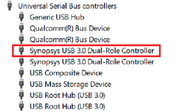
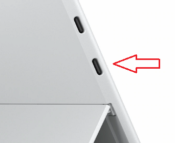
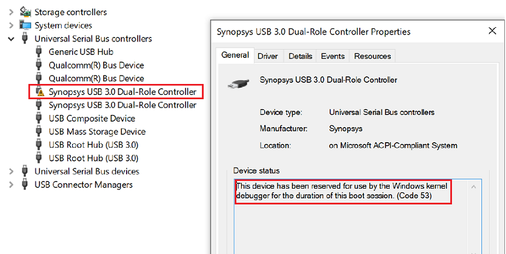
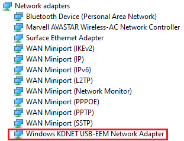

# Setting Up Kernel-Mode Debugging over USB EEM on an ARM device using KDNET

Debugging Tools for Windows supports kernel debugging over a USB cable using EEM on an ARM device. This topic describes how to set up USB EEM on an ARM device using the kdnet.exe utility.

The computer that runs the debugger is called the *host computer*, and the computer being debugged is called the *target computer*.

## Kernel-Mode USB EEM ARM device requirements

The following is required:

- On the target computer, a Synopsys USB 3.0 controller connected to an USB type C port.

- On the host computer, a USB 2.0 or a USB 3.0 port is required.

- A standard USB 3.0 Type C to Type A cable is required to connect the host type A port to the target type C port.

- Windows 10 October 2020 Update (20H2) or later

## Confirm that a supported USB controller is available on the target

On the target computer, launch Device Manager.

Confirm that the *Synopsys USB 3.0 Dual-Role Controller* is listed.



## Determine the debugging port when multiple ports are available

After you have identified a port that supports debugging, the next step is to locate the physical USB connector that is associated with that port.

On the Surface Pro X, use the lower of the two USB C ports is used for KDNET EEM debugging.



## Use kdnet.exe to confirm device support and view the busparams value

To specify the debugging port that will be used, busparm is used. Typically just the first busparam is used and it’s either 0 or 1 depending on the device.

ARM devices use ACPI DBG2 table for configuring the debugger, where the busparams points to the DBG2 table entry. Typically, devices don't use busparams=0, since the 0 DBG2 table entry is normally reserved for the serial device COM.

Use the kdnet.exe utility to display the parameter information for controllers that support KDNET-EEM-USB transport debugging.

1. Confirm that the Windows Debugging Tools are installed on the host system. For information on downloading and installing the debugger tools, see [Download Debugging Tools for Windows](debugger-download-tools.md).

2. Locate the kdnet.exe and VerifiedNICList.xml files. By default, they are located here.

   `C:\Program Files (x86)\Windows Kits\10\Debuggers\x64`

3. On the host computer, copy the two files to a network share or thumb drive, so that they will be available on the target computer.

4. On the target computer, create a C:\KDNET directory and copy the kdnet.exe and VerifiedNICList.xml files to that directory.

5. On the target computer, open a Command Prompt window as Administrator. Enter this command to verify that the target computer has a supported network adapter and to view the busparams value.

   ```console
   C:\KDNET>kdnet.exe

   Network debugging is not supported on any of the NICs in this machine.
   KDNET supports NICs from Intel, Broadcom, Realtek, Atheros, Emulex, Mellanox
   and Cisco.

   Network debugging is supported on the following USB controllers:
   busparams=1, Device-mode USB controller with Vendor ID: 5143 (Default)
   busparams=2, Device-mode USB controller with Vendor ID: 5143
   busparams=3, Device-mode USB controller with Vendor ID: 5143
   busparams=4, Device-mode USB controller with Vendor ID: 5143

   This Microsoft hypervisor supports using KDNET in guest VMs.
   ```

6. As the output from kdnet.exe indicates that a supported USB controller with a busparams value of 1 is available, we can proceed.

## Setting Up the Target Computer

Use the kdnet.exe utility to configure the debugger settings on the target PC, by following these steps.

> [!IMPORTANT]
> Before using bcdedit to change boot information you may need to temporarily suspend Windows security features such as BitLocker and Secure Boot on the test PC.
> You can re-enable Bit Locker and Secure Boot once you’re done using BCDEdit to update the boot information.
> Appropriately manage the test PC, when the security features are disabled.  

1. Use the command shown below to set the, busparams value, the IP address and the port of the host system and generated a unique connection key. The 169.254.255.255 IP address is used for all USB EMM connections.

2. Pick a unique port address for each target/host pair that you work with, within the recommended range of 50000-50039. 50005 is shown in the example.

```console

   C:\>kdnet.exe 169.254.255.255 50005

   Enabling network debugging on Intel(R) 82577LM Gigabit Network Connection.
   Key=2steg4fzbj2sz.23418vzkd4ko3.1g34ou07z4pev.1sp3yo9yz874p
```

3. Copy the returned key into a notepad .txt file. In the example shown, the generated key has a value of:

   `2steg4fzbj2sz.23418vzkd4ko3.1g34ou07z4pev.1sp3yo9yz874p`

4. Use the BCDEdit command to check that the parameters are as expected. For more information, see [BCDEdit /dbgsettings](../devtest/bcdedit--dbgsettings.md)

```console
   C:\>bcdedit /dbgsettings

   busparams               1
   key                     2steg4fzbj2sz.23418vzkd4ko3.1g34ou07z4pev.1sp3yo9yz874p
   debugtype               NET
   hostip                  169.254.255.255
   port                    50005
   dhcp                    No
   The operation completed successfully.
 ```

## Disable the firewall on the host

On the host, disable the firewall for the debugger.

## Connecting WinDbg to the target for kernel debugging

On the host computer, open WinDbg. On the **File** menu, choose **Kernel Debug**. In the Kernel Debugging dialog box, open the **Net** tab. Paste in your port number and key that you saved to in the notepad .txt file earlier. Select **OK**.

You can also start a WinDbg session by opening a Command Prompt window and entering the following command, where is the port you selected above, and is the key that was returned by kdnet.exe above. Paste in the key in that you saved to in the notepad .txt file earlier.

   `windbg -k -d net:port=<YourDebugPort>,key=<YourKey>`

### Reboot the target computer

Once the debugger is connected, reboot the target computer. One way to do reboot the PC, is to use the `shutdown -r -t 0` command from an administrator's command prompt.

After the target PC restarts, the debugger should connect automatically.

## Troubleshooting Target

Confirm that the Windows KDNET-USB-EMM Network Adapter is present under Network Adapters in Windows Device Manager.

The device properties show when the controller is reserved for use by the Windows kernel debugger.



## Troubleshooting Host

Confirm that the Windows KDNET-USB-EMM Network Adapter is present under Network Adapters in Windows Device Manager.

On the host the KDNET-EEM connection using the USB Type A port is shown.



## Related topics

[Setting Up KDNET Network Kernel Debugging Automatically](setting-up-a-network-debugging-connection-automatically.md)

[Setting Up KDNET Network Kernel Debugging Manually](setting-up-a-network-debugging-connection.md)

[Setting Up Kernel-Mode Debugging over a USB 3.0 Cable Manually](setting-up-a-usb-3-0-debug-cable-connection.md)

[Setting Up Kernel-Mode Debugging Manually](setting-up-kernel-mode-debugging-in-windbg--cdb--or-ntsd.md)
