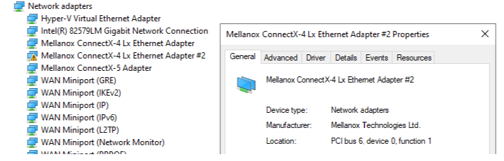

# Setting Up 2PF Kernel-Mode Debugging using KDNET

Debugging Tools for Windows supports kernel debugging over a network cable using multiple Physical Functions (PFs) on the supported NICs by partitioning the PCI configuration space.

With 2PF debugging, each PF can be connected to a single network port, so it allows the kernel debugging functionality to be connected to one PF while the standard network stack talks to the other PF. Because of this, KDNIC doesn't need to route the Windows networking traffic via KDNET, and KDNET will only be responsible to route the host kernel debugger traffic. This results in a dramatic performance increase.

This topic describes how to set up 2PF debugging using the kdnet.exe utility.

Network card vendors are encouraged to enable support for this feature. For more information, see [Debugger 2PF KDNET Miniport Network Driver Support](../network/debugger-2pf-kdnet-support.md).

Two drivers will run over the partitioned PCI configuration space

- The Windows inbox driver will run out of the primary network port at bus.dev.**fun0.0** PCI location.

- The KDNET-Ext. module will run out of the added PF at bus.dev.**fun0.1**, This technique ensures that the Windows inbox NIC driver does not get impacted by sharing the NIC with KDNET.

The computer that runs the debugger is called the *host computer*, and the computer being debugged is called the *target computer*.

## Kernel-Mode 2PF device requirements

The following is required:

- On the target computer, a supported 2PF network card.

- On the host computer, a network card.

- A network connection between the target and host.

- Windows 10 Insider Preview Build 21313 and later.

## Supported 2PF Network Cards

Vendors such as NVIDIA Mellanox and Cisco provide NICs that support 2PF network debugging. Check with the network card vendor to see which models of the network card are supported. Note that some vendors support 2PF on a sub set of network cards that share the same PnP ID.

## Use kdnet.exe to confirm device support and view the busparams value

Use the kdnet.exe utility to display the parameter information for controllers that support KDNET 2PF transport debugging.

1. Confirm that the Windows Debugging Tools are installed on the host system. For information on downloading and installing the debugger tools, see [Download Debugging Tools for Windows](debugger-download-tools.md).

2. Locate the kdnet.exe and VerifiedNICList.xml files. By default, they are located here.

   `C:\Program Files (x86)\Windows Kits\10\Debuggers\x64`

3. On the host computer, copy the two files to a network share or thumb drive, so that they will be available on the target computer.

4. On the target computer, create a `C:\KDNET` directory and copy the kdnet.exe and VerifiedNICList.xml files to that directory.

5. On the target computer, open a Command Prompt window as Administrator. Enter this command to verify that the target computer has a supported network adapter and to view the busparams value.

   ```dbgcmd

   C:\KDNET>kdnet.exe

   Network debugging is supported on the following NICs:
   busparams=141.0.0, Mellanox ConnectX-4 Lx Ethernet Adapter #2, Plugged in, Primary function, multiple physical functions are supported.

   Network debugging is supported on the following USB controllers:
   busparams=128.15.0, Standard USB 3.0 eXtensible Host Controller - 1.0 (Microsoft)
   busparams=0.15.0, Standard USB 3.0 eXtensible Host Controller - 1.0 (Microsoft)
   busparams=128.15.1, Standard USB 3.0 eXtensible Host Controller - 1.0 (Microsoft)
   busparams=0.15.1, Standard USB 3.0 eXtensible Host Controller - 1.0 (Microsoft)
   ```
   Because the output shown above, does not include *"KDNET is running on this NIC."*, this indicates that traditional KDNET debugging is not enabled on any of the adapters. 

   If the NIC does **not** support the multiple PF feature, then the PF status notification of *"multiple physical functions are supported"* will be omitted (blank) from the displayed information.

   If NIC supports multiple PF, then the actual displayed information will depend on the combination of the Network port (root port/PF added port), as well as cable connected/disconnected status to/from the NIC physical port.

   This table summarizes different PF notifications for the primary NIC.

   |NIC adapter bus.dev.fun corresponds to |Cable status	| PF Status |
   |---------------------------------------|-------------|-----------|
   | original (primary) | PF	cable connected |	Primary function, multiple physical functions are enabled |
   | original (primary) | PF	cable disconnected |	 Primary function, multiple physical functions are supported |

   This table summarizes different PF notifications for the secondary NIC.

   | NIC adapter bus.dev.fun corresponds to |Cable status	   | PF Status |
   |--------------------------------------|-----------------|-----------|
   | new (secondary)  PF port | Kdnet is running | Secondary function |
   | new (secondary) PF port |	cable disconnected or unknown status |	Primary function, multiple physical functions are enabled, but secondary function is not used |

6. If the output from kdnet.exe indicates that a supported NIC controller is available, we can proceed.

## Setting Up the Target Computer for 2PF

Use the kdnet.exe utility to configure the debugger settings on the target PC for 2PF, by following these steps.

> [!IMPORTANT]
> Before using bcdedit to change boot information you may need to temporarily suspend Windows security features such as BitLocker and Secure Boot on the test PC.
> You can re-enable Bit Locker and Secure Boot once you’re done using BCDEdit to update the boot information.
> Appropriately manage the test PC, when the security features are disabled.  

This process will adds a new physical function (PF) to the a NIC, specified by  `bus.device.function`. The new PF can be used only by KDNET, since the Windows inbox driver is set up to not run on an added, secondary PF. Follow these steps to add a new PF that will be used by the debug device.

### Confirm that debugging is disabled before adding the new physical function

1. Use the BCDEdit command to confirm that the KD is disabled on the target before adding a new PF on the NIC. This is needed to make sure the standard vendor NIC driver is loaded so that it can be used to add the new PF.

```console
C:\> bcdedit /enum 
...

debug           No
```

As an alternative, use kdnet.exe with out parameters to see if debugging is enabled. The output below, shows KDNET running on a system with debugging enabled on one NIC. This is the lower performance legacy setup.

```console

c:\Debuggers>kdnet

Network debugging is supported on the following NICs:
busparams=141.0.0, Mellanox ConnectX-4 Lx Ethernet Adapter #2, KDNET is running on this NIC.

Network debugging is supported on the following USB controllers:
busparams=128.15.0, Standard USB 3.0 eXtensible Host Controller - 1.0 (Microsoft)
busparams=0.15.0, Standard USB 3.0 eXtensible Host Controller - 1.0 (Microsoft)
busparams=128.15.1, Standard USB 3.0 eXtensible Host Controller - 1.0 (Microsoft)
busparams=0.15.1, Standard USB 3.0 eXtensible Host Controller - 1.0 (Microsoft)
```

2. If the debug  value is set to *Yes*, use the set command to disable debugging.

```console
C:\> bcdedit.exe /debug off
C:\> bcdedit.exe /set {default} bootdebug off
C:\> bcdedit.exe /set {bootmgr} bootdebug off
```

3. Use the `shutdown -r -t 0` command from an administrator's command prompt to reboot.

After the target PC restarts, and debugging is disabled, we can add the new physical function.

### Add the new physical function

1. Open an elevated command prompt and run the following command to add a second PF.  All values are provided using decimal values.

```console
C:\KDNET> kdnet -addpf 141.0.0 198.51.100.1 50001

Succeeded adding a Pci PF on :141.0.1. Please power off or reboot the machine.

Enabling network debugging on Mellanox ConnectX-4 Lx Ethernet Adapter #2.
Manage-bde.exe not present.  Bitlocker presumed disabled.

To debug this machine, run the following command on your debugger host machine.
windbg -k net:port=50001,key=2steg4fzbj2sz.23418vzkd4ko3.1g34ou07z4pev.1sp3yo9yz874p

Then reboot this machine by running shutdown -r -t 0 from this command prompt.
```

`bus.dev.fun` is the PCI location port of the NIC adapter that supports the multiple PF feature, so the new PF will be added/attached to this network device.

`-addpf` option enables automatically kernel debugging over KDNET transport on the added PF port.

`[host name/host ip address]` is the TCP/IP address of the host computer. Use the `ipconfig` command on the host computer to determine this address.

`[port number]` is the TCP/IP port number. You can choose any port number from 49152 through 65535. The recommended range is between 50000 and 50039. The port that you choose will be opened for exclusive access by the debugger running on the host computer. Pick a unique port address for each target/host pair that you work with, within the recommended range of 50000-50039. 50005 is shown in the example.

Note that -addpf will also add the `NO_KDNIC` attribute to the OS installation {default} loadoptions. This is because KDNIC is no longer required to run on top of KDNET.

The loadoptions = NO_KDNIC is added to {default} OS tag to ensure that kdnic.sys won't run out of the new added pf (141.0.1)

Use the bcdedit command to confirm that NO_KDNIC has been set.

```console
C:\KDNET> bcdedit /enum {default}

Windows Boot Loader
-------------------
identifier              {current}
device                  partition=C:
path                    \Windows\system32\winload.efi
description             Windows Server
locale                  en-US
loadoptions             NO_KDNIC
inherit                 {bootloadersettings}
recoverysequence        {c23c4005d-12ae-11eb-9399-ac9840c152e7}
displaymessageoverride  Recovery
recoveryenabled         Yes
bootdebug               No
testsigning             Yes
isolatedcontext         Yes
flightsigning           Yes
allowedinmemorysettings 0x15000075
osdevice                partition=C:
systemroot              \Windows
resumeobject            {c23c4005d-12ae-11eb-9399-ac9840c152e7}
nx                      OptOut
debug                   Yes
hypervisordebug         No

2. Run the bcdedit /enum command to display the generated key.

```console
C:\KDNET> bcdedit /dbgsettings
busparams               141.0.1
key                     2steg4fzbj2sz.23418vzkd4ko3.1g34ou07z4pev.1sp3yo9yz874p
debugtype               NET
hostip                  198.51.100.1
port                    50001
dhcp                    Yes
The operation completed successfully.
   
```

3. Copy the returned key into a notepad .txt file. In the example shown, the generated key has a value of:

   `2steg4fzbj2sz.23418vzkd4ko3.1g34ou07z4pev.1sp3yo9yz874p`

4. Optionaly use kdnet.exe to confirm that the multiple physical functions are enabled.

```console
C:\KDNET> kdnet.exe

Network debugging is supported on the following NICs:
busparams=141.0.0, Mellanox ConnectX-4 Lx Ethernet Adapter #2, Plugged in, Primary function, multiple physical functions are enabled.
busparams=141.0.1, Mellanox ConnectX-4 Lx Ethernet Adapter, KDNET is running on this NIC, Secondary function.

Network debugging is supported on the following USB controllers:
busparams=128.15.0, Standard USB 3.0 eXtensible Host Controller - 1.0 (Microsoft)
busparams=0.15.0, Standard USB 3.0 eXtensible Host Controller - 1.0 (Microsoft)
busparams=128.15.1, Standard USB 3.0 eXtensible Host Controller - 1.0 (Microsoft)
busparams=0.15.1, Standard USB 3.0 eXtensible Host Controller - 1.0 (Microsoft)
```

## Disable the firewall on the host

On the host, disable the firewall for the debugger port.

## Connecting WinDbg to the target for kernel debugging

On the host computer, open WinDbg. On the **File** menu, choose **Kernel Debug**. In the Kernel Debugging dialog box, open the **Net** tab. Paste in your port number and key that you saved to in the notepad .txt file earlier. Select **OK**.

You can also start a WinDbg session by opening a Command Prompt window and entering the following command, where is the port you selected above, and is the key that was returned by kdnet.exe above. Paste in the key in that you saved to in the notepad .txt file earlier.

   `windbg -k -d net:port=<YourDebugPort>,key=<YourKey>`

### Reboot the target computer

Once the debugger is connected, reboot the target computer. One way to do reboot the PC, is to use the `shutdown -r -t 0` command from an administrator's command prompt.

After the target PC restarts, the debugger should connect automatically.

Once the machine rebooted, then the NIC firmware will assign a new MAC address to the new added KDNET PF, and dbgsettings::busparams will point to the new added PF.

## Finding the MAC address for the 2PF adapter

Since the new added PF is a PCI bus configured port, there will be a new MAC address value assigned to new added PF by the NIC firmware. The kdnet.exe tool does not currently support displaying the MAC address for the added 2PF.

There are two ways of finding the new MAC address:

### Use WinDbg/KD with a local KD session

Run the local kernel debugger windbg.exe -kl on the target.

Make sure you have access to the kdnet.pdb symbol file by running .reload /f kdnet.dll

Run [.kdtargetmac](-kdtargetmac--display-target-mac-address-.md) command to get the MAC address.

```dbgcmd
kd> .kdtargetmac
Force unload of kdnet.dll
ModLoad: fffff800`18510000 fffff800`18557000   kdnet.dll
Loading symbols for fffff800`18510000        kdnet.dll ->   kdnet.dll

The target machine MAC address in open-device format is: DC9840C151E8
```

### Run the vendor provided firmware tools

One way to locate the MAC address is to run the vendor provided firmware tools. Refer to the NIC vendor for information on downloading, installing and using the vendor's tools.

```console
... 
Base MAC:              98039baa757c           4

```

Find the MAC address field. Calculate the KDNET 2PF MAC address value by sequentially adding one to the last digit of the root MAC device. So for the root device with and address of `98039baa757c`, the KDNET 2PF device would have an address of  `98039baa757d`.

## Restoring the previous configuration state - Removing the second PCI PF

You can remove the previously added PF from a device by using the `kdnet -removepf` option and the original *bus.device.function* value. The PF will be detached from the NIC and the PF assigned resource will be released by the NIC firmware.

To remove the KDNET PF from the device, open an elevated command prompt and run the following command.

`kdnet -removepf [bus.dev.fun] [host name/host ip address] [port number]`

Where `bus.dev.fun` is the PCI location port of the NIC adapter where the PF was originally attached. This is the same PCI location originally passed to kdnet -addpf.

Using the -removepf option also re-enables kernel debugging over KDNET on the original bus.dev.fun.

```console
C:\KDNET> kdnet -removepf 141.0.0 198.51.100.1 50001

Succeeded removing a Pci PF on :141.0.0. Please power off or reboot the machine.

Enabling network debugging on Mellanox ConnectX-4 Lx Ethernet Adapter #2.
Manage-bde.exe not present.  Bitlocker presumed disabled.
```

The kdnet.exe -removepf command also will remove the NO_KDNIC attribute from the OS installation {default} loadoptions, since KDNET will be enabled on the original bus.dev.fun, that is the dbgsettings::busparams will point to the original network port. This will cause KDNIC to be used again, providing a network connection again on top of KDNET.


Once the PF is removed the machine needs to be rebooted for the BCD changes to be applied.

```console
shutdown -r -t 0
```


## Troubleshooting host adapter configuration

### Verify the 2PF adapter is present in device manager

You can verify that the KDNET PF was added successfully by checking the new NIC adapter has a new bus.dev.fun port on Windows Device manager adapter list.

This diagram shows three different adapters, with Adapter #2 reserved for use by the kernel debugger.



### Common error messages - adding a new PF

```console
C:\KDNET> kdnet -addpf 28.0.0 192.168.137.1 50005

Device Name:\\.\Mlx5Util

Pci Bus:28.0.0
```

**The PCI PF is already configured on this port**: *Error=(0x80004004) Failed PF operation on the debug device. The debug device is not configured for KDNET.*

- Do not add/remove again a PF on the root port where it is already added as a PF.

### Common error messages - removing a PF

```console
C:\KDNET> kdnet -removepf 28.0.1 192.168.137.1 50005

Adapter is not active: Error=(0x80070002)

Device Name:\\.\Mlx5Util

Pci Bus:28.0.1
```

**Adapter is not active**: Error=(0x80070002) *Failed PF operation on the debug device. The debug device is not configured for KDNET*

- Do not use an added PF port with the “-removepf/-addpf” command line parameter, because any operation on the added PF port will result in a failure (error: Adapter is not active on port), since the vendor NIC inbox driver is set up to expressly *not* run on an added PF.
- Both command line options (-addpf/-removepf) must be used only on the root PCI device.

```console
C:\KDNET> kdnet -removepf 28.0.0 192.168.137.1 50005

Device Name:\\.\Mlx5Util

Pci Bus:28.0.0
```

**There is no PCI PF to remove on this port**: *Error=(0x80004005) Failed PF operation on the debug device. The debug device is not configured for KDNET*

- If you add a new PF and then decide to remove it w/o rebooting it will result in a failure, since the vendor NIC firmware requires a rebooting/resetting the NIC HW before it can recognize the new added PF.

### Common error messages - BCDEdit

**NO_KDNIC is *not* present in the BCD OS {default} installation.**

- It is not recommended to use bcdedit.exe to modify/change the debug device (dbgsettings) after adding a new PF. The kdnet -addpf/removepf command line options will configure the debug device and will also add/remove automatically the `NO_KDNIC` token to/from the `{default}::loadoptions`.

## Related topics

[Setting Up KDNET Network Kernel Debugging Automatically](setting-up-a-network-debugging-connection-automatically.md)

[Setting Up KDNET Network Kernel Debugging Manually](setting-up-a-network-debugging-connection.md)

[Setting Up Kernel-Mode Debugging over a USB 3.0 Cable Manually](setting-up-a-usb-3-0-debug-cable-connection.md)

[Setting Up Kernel-Mode Debugging Manually](setting-up-kernel-mode-debugging-in-windbg--cdb--or-ntsd.md)
