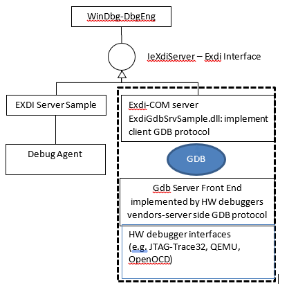
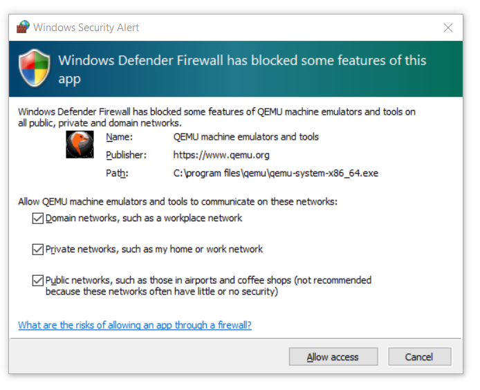
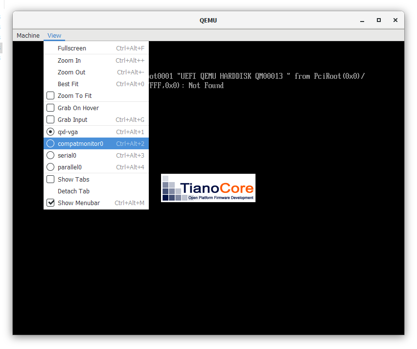
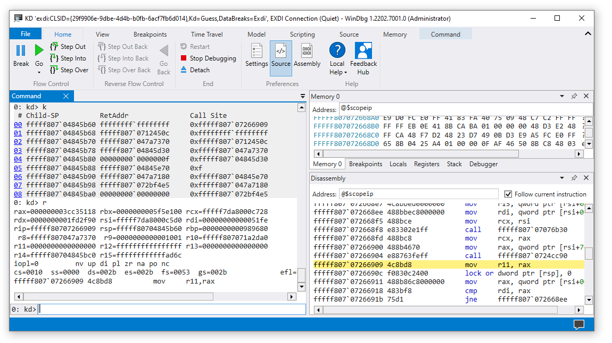

# Setting Up QEMU Kernel-Mode Debugging using EXDI

This topic describes how to set up QEMU Kernel-Mode Debugging using EXDI. The Windows debugger supports kernel debugging a QEMU environment using EXDI. This document describes the required steps to establish a GdbServer RSP session between the ExdiGdbSrv.dll (GDB server client) and QEMU GDB server.  

The scenario described uses a Windows x64 Virtual Machine and a QEMU GDB server, also running on Windows.

It is possible to  connect to other operating systems serving as the host, such as Linux. QEMU, the virtualization and machine emulation software, can run on numerous architectures, such as x64 and Arm64. The ExdiGdb debugging server also supports other processors, for example it is possible to use WinDbg to debug QEMU running on Arm64. This provides multiple options, to debug a Windows VMs, so the Windows VM can be HW debugged via the available QEMU GDB server connected to the Debugger Host EXDI GDB server client.

For general information on setting up configuring and troubleshooting EXDI connections, see [Configuring the EXDI Debugger Transport](configuring-the-exdi-debugger-transport.md).

>[!NOTE]
> EXDI is an advanced, specialized form of debugging for specific environments. Using a standard KDNET connection is easier to configure, and is recommended.  To set up network debugging automatically, see **[Setting Up KDNET Network Kernel Debugging Automatically](setting-up-a-network-debugging-connection-automatically.md)**.

## EXDI COM Server

EXDI is an interface that allows extending WinDbg by adding support for hardware debuggers (e.g. JTAG-based, or GdbServer based). The diagram below illustrates the role of EXDI-GdbServer.



>[!IMPORTANT]
> Because EXDI does not make use of the KDNET protocol, the connected debugger has significantly less information about what is running on the PC and many commands will work differently or may not work at all. Access to private symbols for the code being debugged can help the debugger better understand the target systems code execution. For more information, see [Public and Private Symbols](public-and-private-symbols.md).

## Setup a debugger connection to a Windows Image on QEMU

In this topic, we will describe the process to attach to a QEMU Virtual Windows Image running on Windows.

1. Download and install QEMU on Windows.
1. Configure a target QEMU Virtual Windows Image to launch with the required network and BIOS/UEFI settings for debugging.
1. Start the QEMU environment, using the configured launch script.
1. Start the gdbserver on QEMU.
1. Check network connectivity and locate and record the target image IP address. (HOST IP default address of 1.2.3.4).
1. Download and install the Windows debugging tools on the host system.
1. Download, build, register and configure the EXDI server for QEMU located on Github.
1. Configure the debugger host (WinDbg) by editing the EXDI configuration XML files.
1. Launch WinDbg using the command line to connect to the EXDI server.
1. Use WinDbg to debug the target QEMU Windows image.

## Download and Install QEMU On Windows

QEMU is a generic and open source machine emulator and virtualizer that causes dynamic translation. When QEMU is used as a machine emulator - it can run OS’s and programs made for one processor (such as an Arm64) on a different machine (a x64 PC). It can also run/host virtual machines images for different OS's (Windows/Linux/Mac).

QEMU can use other hypervisors like KVM to use CPU extensions (HVM) for virtualization. When QEMU is used as a virtualizer, QEMU achieves near native performances by executing the guest code directly on the host CPU. QEMU can take advantage of OS hypervisor features to offload CPU and MMU emulation to real hardware.

### Download and install QEMU

In this walk through, QEMU for Windows x64 will be installed on an x64 PC where the Windows debugger will also run on.

Download QEMU from the QEMU download page: https://www.qemu.org/download/

Refer to the QEMU documentation for information on installing QEMU: https://www.qemu.org/documentation/

### Configure a Target Virtual Disk

Locate or create a virtual disk image that has the software that you wish to debug.

In this example, a Windows x64 VHDX virtual machine disk image will be used. To learn more about Windows virtual machine images, see [Create Virtual Machine with Hyper-V on Windows 10](/virtualization/hyper-v-on-windows/quick-start/create-virtual-machine).

### Inject the VirtIO drivers into the Windows Image

To allow network functionality and reasonable storage device performance, either inject or install the VirtIO drivers into the Windows virtual machine disk image. The VirtIo drivers are available here: https://github.com/virtio-win/kvm-guest-drivers-windows

VirtIO is a standardized interface which allows virtual machines access to abstracted hardware, such as block devices, network adapters and consoles. Virtio serves as an abstraction layer to hardware devices in a virtualized environment like QEMU. 

### Convert VHDX to QEMU

This step is not required, but it is recommended, as better performance is achieved when using a native QEMU QCOW image instead of a VHDX.

Use the following qemu-img.exe command to convert the vhdx. This utility is located where you installed QEMU, for example `C:\Program Files\qemu`.

```Console
C:\Program Files\qemu> qemu-img convert -c -p -O qcow2 MyVHDXFile.vhdx MyQEMUFile.qcow2 
```

### Download UEFI Firmware

For the best results, download or compile the UEFI firmware file (OVMF.fd). The firmware is needed because otherwise by default QEMU emulates older BIOS systems.

One source for UEFI Firmware is the Open Clear Linux project:
https://clearlinux.org/

The example UEFI `OVMF.fd` file is available here:
https://github.com/clearlinux/common/blob/master/OVMF.fd

Extract the content of the downloaded file in `C:\Program Files\qemu\Firmware`.  

For platforms other than Intel AMD64 you should compile the firmware from the EDK2. For more information, see https://github.com/tianocore/tianocore.github.io/wiki/How-to-build-OVMF.


### Configure QEMU Launch Script

Create your configuration file in QEMU. For example create a `StartQEMUx64Windows.bat` file under the QEMU root directory. See the example file below.

#### Use the QEMU Launch Script to start QEMU

Execute the QEMU launch script to start QEMU.

```bat
c:\Program Files\qemu\StartQEMUx64Windows.bat
```

If a firewall defender prompt appears, grant the app all rights to all types of networks to enable Windbg through the Windows firewall for the host debugger machine.



Once the Windows Virtual Machine is launched in the QEMU environment the QEMU UI will appear.



Use CTRL+ALT+ a number key combination to go in the QEMU monitor console. This monitor is also available using *View->compatmonitor*.

Type `gdbserver` to launch the front end GDB server on QEMU.

QEMU should display `Waiting for gdb connection on device ‘tcp::1234’`

Return to the main window using the CTRL+ALT+1 keys combination.

Tip: The GDB console window supports the “system_reset” command to quickly restart the emulation. Type help for a list of GDB console commands.

### Sample of QEMU x64 Windows VM launching script

Here is an example QEMU configuration script that can be used for AMD64 Virtual Machines. Replace the links that point to the DISK and CDROM files to the locations on your PC. 

```bat
    REM
    REM  This script is used to run a Windows x64 VM on QEMU that is hosted by a Windows x64 host system
    REM  The Host system is a PC with Intel(R) Xeon(R) CPU.
    REM
    set EXECUTABLE=qemu-system-x86_64
    set MACHINE=-m 6G -smp 4

    REM No acceleration
    REM generic cpu emulation.
    REM to find out which CPU types are supported by the QEMU version on your system, then run:
    REM	 qemu-system-x86_64.exe -cpu help
    REM the see if your host system CPU is listed
    REM

    set CPU=-machine q35 

    REM Enables x64 UEFI-BIOS that will be used by QEMU :
    set BIOS=-bios D:\temp\firmware\OVMF.fd

    REM  Use regular GFX simulation
    set GFX=-device ramfb -device VGA 
    set USB_CTRL=-device usb-ehci,id=usbctrl
    set KEYB_MOUSE=-device usb-kbd -device usb-tablet

    REM # The following line enable the full-speed HD controller (requires separate driver)
    REM # Following line uses the AHCI controller for the Virtual Hard Disk:
    set DRIVE0=-device ahci,id=ahci -device ide-hd,drive=disk,bus=ahci.0

    REM
    REM This will set the Windows VM x64 disk image that will be launched by QEMU
    REM The disk image is in the qcow2 format accepted by QEMU.
    REM You get the .qcow2 image, once you get the VHDX Windows VM x64 image 
    REM and apply the script to inject the virtio x64 drivers and then run the 
    REM the QEMU tool to convert the .VHDX image to .qcow2 format
    REM 	i.e. 
    REM	qemu-img convert -c -p -O qcow2 Windows_VM_VHDX_with_injected_drivers_file.vhdx file.qcow2
    REM file : points to the specified qcow2 image path.
    REM
    set DISK0=-drive id=disk,file=D:\temp\x64_image_qcow2_for_windows\basex64Client.qcow2,if=none

    REM
    REM for kdnet on, then best option:
    REM   NETWORK0="-netdev user,id=net0,hostfwd=tcp::53389-:3389,hostfwd=tcp::50001-:50001 -device virtio-net,netdev=net0,disable-legacy=on"
    REM
    set NETHOST=-netdev user,id=net0,hostfwd=tcp::3589-:3389
    set NETGUEST=-device e1000,netdev=net0

    REM # The following line should enable the Daemon (instead of interactive)
    set DEAMON=-daemonize"
    %EXECUTABLE% %MACHINE% %CPU% %BIOS% %GFX% %USB_CTRL% %DRIVE0% %DISK0% %NETHOST% %NETGUEST%
```

## Check network connectivity

Ensure to get the Windows IP address (if the debugger host session won't be located at the same Windows machine as QEMU VM).

If the GDB server started properly, then you will see the port number where the GDB server will be listening, and you will need to use this port to setup the host debugger (IP:Port pair) in the exdiConfigData.xml).

If your Host debugger is located at the same machine that host the QEMU guest, then the Localhost identifier will be used in the exdiconfigdata.xml as IP:Port pair (e.g. LocalHost:Port:1234). In this example, with the server and host debugger on the same PC, the default values will be used.  

Set the current target name attribute (CurrentTarget) value to “QEMU” in the ExdiConfigData.xml file.

If working on  a remote PC, set the target QEMU IP `<address>` : Port `<number>` where the GDB server is listening by:

- Locate the QEMU component Tag element in the exdiCondifgData.xml.
- Set the IP:Port number (LocalHost if Debugger runs on the same Host as QEMU VM) for the QEMU GDB server by:
- Save the changes to the exdiConfigdata.xml file that is located at path specified by EXDI_GDBSRV_XML_CONFIG_FILE environment variable.

For additional information on QEMU networking, see https://wiki.qemu.org/Documentation/Networking

The following commands can be issued on the QEMU console (compatmonitor0) to display information about the network and connection status.

```console
info network
info usernet
```

## Download and install the Windows debugging tools on the host system

Install the Windows Debugging Tools on the host system. For information on downloading and installing the debugger tools, see [Download Debugging Tools for Windows](debugger-download-tools.md).

## Download, build and register the EXDI Server DLL

Download the corresponding ExdiGdbSrv.dll binary (EXDI COM server client) source code from the microsoft/WinDbg-Samples, GitHub https://github.com/microsoft/WinDbg-Samples)

```console
git clone https://github.com/microsoft/WinDbg-Samples
```

Build the VS solution (ExdiGdbSrv.sln) according to the architecture of your Host Debugger installation located in Exdi/exdigdbsrv.

Locate the ExdiGdbSrv.dll produced by the build.

Copy the EXDI com server (ExdiGdbSrv.dll) to the Host machine, into the directory containing your debugger, .g. `C:\Program Files (x86)\Windows Kits\10\Debuggers\x64` or `C:\Debuggers`)

Use regsvr32 to register the DLL in an Administrator command prompt.

```console
C:\Program Files (x86)\Windows Kits\10\Debuggers\x64>regsvr32 ExdiGdbSrv.dll
```
RegSvr32 should return a message indicating that the `DLLRegisterServer in ExdiGdbSrv.dll succeeded`.

This step is only needs to be done once, but if you change the location of the ExdiGdbSrv.dll, then you will need to register the COM server again.

Another option is to use the example PowerShell script is to install the EXDI DLL, and launch the debugger the first time. For more information, see [Example EXDI PowerShell script](configuring-the-exdi-debugger-transport.md#example-exdi-powershell-script) in [Configuring the EXDI Debugger Transport](configuring-the-exdi-debugger-transport.md).

## Configure the debugger host (WinDbg) by editing the EXDI configuration XML files

Locate the two needed configuration files in `WinDbg-Samples/Exdi/exdigdbsrv/` and copy them to a local to your Host debugger machine to where the debugger is installed.

- `exdiConfigData.xml`
- `systemregisters.xml`

EXDI_GDBSRV_XML_CONFIG_FILE – Describes the full path to the EXDI xml configuration file.

EXDI_SYSTEM_REGISTERS_MAP_XML_FILE – Describes the full path to the EXDI xml system register map file.

For general information on setting up configuring and troubleshooting EXDI connections, as well as the  exdiConfigData.xml tags and attributes, see [Configuring the EXDI Debugger Transport](configuring-the-exdi-debugger-transport.md).

Set the environment variable EXDI_GDBSRV_XML_CONFIG_FILE and EXDI_SYSTEM_REGISTERS_MAP_XML_FILE to describe the full path to the exdi xml configuration file.

#### Command Prompt

Open a command prompt and set the following environment variables.

```bat
set EXDI_GDBSRV_XML_CONFIG_FILE="C:\Program Files (x86)\Windows Kits\10\Debuggers\x64\exdiConfigData.xml"

set EXDI_SYSTEM_REGISTERS_MAP_XML_FILE="C:\Program Files (x86)\Windows Kits\10\Debuggers\x64\systemregisters.xml"
```

Type `SET` to confirm that the path specified is available from the location of the ExdiGdbSrvSample.dll

#### Powershell

Open a PowerShell prompt and set the following environment variables:

```powershell
$env:EXDI_GDBSRV_XML_CONFIG_FILE = 'C:\Program Files (x86)\Windows Kits\10\Debuggers\x64\exdiConfigData.xml'

$env:EXDI_SYSTEM_REGISTERS_MAP_XML_FILE = 'C:\Program Files (x86)\Windows Kits\10\Debuggers\x64\systemregisters.xml'
```

Type `dir env:` to confirm that the path specified is available from the location of the ExdiGdbSrvSample.dll

## Launch WinDbg on the host system

Launch the windbg session via exdi interface at the same command prompt where you set the environment variables
(EXDI_GDBSRV_XML_CONFIG_FILE and EXDI_SYSTEM_REGISTERS_MAP_XML_FILE).

```dbgcmd
c:\Debuggers> windbg.exe -v -kx exdi:CLSID={29f9906e-9dbe-4d4b-b0fb-6acf7fb6d014},Kd=Guess,DataBreaks=Exdi
```

To display additional output, the **-v:** verbose session can be used. For general information about the WinDbg options, see [WinDbg Command-Line Options](windbg-command-line-options.md).

Another option is to use the example PowerShell script is to install the EXDI DLL, and launch the debugger the first time. For more information, see [Example EXDI PowerShell script](configuring-the-exdi-debugger-transport.md#example-exdi-powershell-script), in  [Configuring the EXDI Debugger Transport](configuring-the-exdi-debugger-transport.md).

```powershell
PS>.\Start-ExdiDebugger.ps1 -ExdiTarget "QEMU" -GdbPort 1234 -Architecture x64 -ExdiDropPath "C:\path\to\built\exdi\files"
```

The debugger should launch and connect to the QEMU GdbServer.



The debugger will show the successful EXDI transport initialization.

```dbgcmd
EXDI: DbgCoInitialize returned 0x00000001
EXDI: CoCreateInstance() returned 0x00000000
EXDI: QueryInterface(IExdiServer3) returned 0x00000000
Target command response: QEMU
exdiCmd: The function: 'ExdiDbgType' was completed.
EXDI: Server::GetTargetInfo() returned 0x00000000
EXDI: Server::SetKeepaliveInterface() returned 0x00000000
EXDI: Server::GetNbCodeBpAvail() returned 0x00000000
EXDI: ExdiNotifyRunChange::Initialize() returned 0x00000000
EXDI: LiveKernelTargetInfo::Initialize() returned 0x00000000
EXDI: Target initialization succeeded
```

The EXDIGdbServer console packets window can also display information about the status of the EXDI connection, if displayCommPackets="yes" is set in the exdiConfigData.xml file. For more information, refer to the troubleshooting information in [Configuring the EXDI Debugger Transport](configuring-the-exdi-debugger-transport.md#troubleshooting).

### Use WinDbg to debug the target QEMU Windows image

The dbgeng.dll uses a heuristic algorithm to find the location of the NT base load address at the time that the break command occurred.  If private symbols are not available, this process will fail.

This means that under many connection sequences, the break will not function as expected. if you manually break into the code, it will be a random location that Windows happened to be executing at that moment. As symbols for the target code may not be available, it can be difficult to set breakpoints using symbols.

Commands such as the following that access memory directly will work.

[k, kb, kc, kd, kp, kP, kv (Display Stack Backtrace)](k--kb--kc--kd--kp--kp--kv--display-stack-backtrace-.md)

[r (Registers)](r--registers-.md)

[d, da, db, dc, dd, dD, df, dp, dq, du, dw (Display Memory)](d--da--db--dc--dd--dd--df--dp--dq--du--dw--dw--dyb--dyd--display-memor.md)

[u (Unassemble)](u--unassemble-.md)

And you can step through code.

[p (Step)](p--step-.md)

There are also commands that can be used to attempt to locate code that you wish to debug.

[s (Search Memory)](s--search-memory-.md)

[.imgscan (Find Image Headers)](-imgscan--find-image-headers-.md)

Imgscan can be helpful with EDXI debugging, as unlike traditional KDNET based kernel debugging, setting breakpoints based on symbols may not be available. Locating a desired target image, can facilitate using its location to set a memory access breakpoint.

### .exdicmd (EXDI Command)

The .exdicmd sends an EXDI command to the target system using the active EXDI debugging connection. For more information, see [.exdicmd (EXDI Command)](-exdicmd--exdi-command-.md).

## EXDI XML Configuration files

There are two required xml files that are consumed by the EXDI GDB COM server (ExdiGdbSrv.dll).

1. *exdiConfigData.xml* - This file contains the main configuration data that is required by the GDB server client to establish a successfully GDB session with the HW debugger GDB server target, so the GDB server client won’t run if the file location is *not* set by the EXDI_GDBSRV_XML_CONFIG_FILE environment variable.  Each xml tag allows configuring specific set of the GDB server functionality. See below for a list of the attributes you can modify in the XML, and sample XML.

2. *Systemregister.xml* - This file contains a mapping between system registers and theirs access code. This is needed because the access code is not provided by the GDB server in the xml file, and the debugger accesses each system register via the access code.

For more information and a description of the GDBServer Tags and attributes defined in the XML configuration files, see [Configuring the EXDI Debugger Transport](configuring-the-exdi-debugger-transport.md).

## Troubleshooting

Refer to the troubleshooting information in [Configuring the EXDI Debugger Transport](configuring-the-exdi-debugger-transport.md#troubleshooting).

## Related topics

[Configuring the EXDI Debugger Transport](configuring-the-exdi-debugger-transport.md)

[.exdicmd (EXDI Command)](-exdicmd--exdi-command-.md)

[Setting Up KDNET Network Kernel Debugging Automatically](setting-up-a-network-debugging-connection-automatically.md)

[Setting Up KDNET Network Kernel Debugging Manually](setting-up-a-network-debugging-connection.md)
