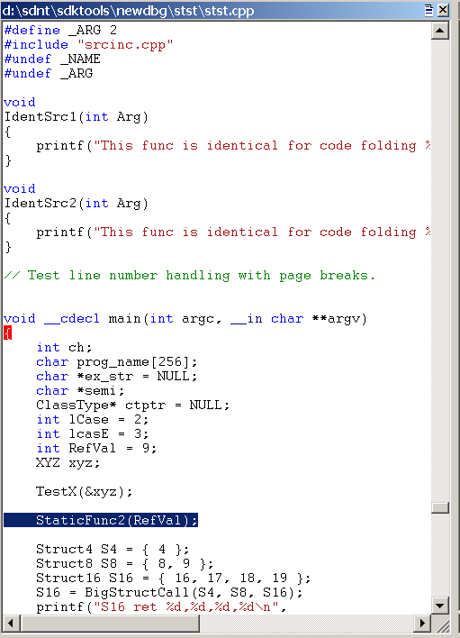

# Source Code Debugging in WinDbg


## <span id="ddk_source_path_dbg"></span><span id="DDK_SOURCE_PATH_DBG"></span>Source Path


The source path specifies the directories where the C and C++ source files are located. For more information about viewing source code in the debugger, see [Source Code](source-code.md).

**Note**   If you are connected to a corporate network, the most efficient way to access source files is to use a source server. You can use a source server by using the srv\* string within your source path. For more information about source servers, see [Using a Source Server](using-a-source-server.md).

 

To control the source path in WinDbg, do one of the following:

-   Choose **Source File Path** from the **File** menu or press CTRL+P.

-   Use the [**.srcpath (Set Source Path)**](-srcpath---lsrcpath--set-source-path-.md) command. If you are using a source server, [**.srcfix (Use Source Server)**](-srcfix---lsrcfix--use-source-server-.md) is slightly easier.

-   Use the [**.lsrcpath (Set Local Source Path)**](-srcpath---lsrcpath--set-source-path-.md) command. If you are using a source server, [**.lsrcfix (Use Local Source Server)**](-srcfix---lsrcfix--use-source-server-.md) is slightly easier.

-   When you start the debugger, use the **-srcpath** or **-lsrcpath** command-line option. See [**WinDbg Command-Line Options**](windbg-command-line-options.md).

-   Before you start the debugger, set the \_NT\_SOURCE\_PATH [environment variable](environment-variables.md).

## <span id="Opening_and_Closing_Source_Files"></span><span id="opening_and_closing_source_files"></span><span id="OPENING_AND_CLOSING_SOURCE_FILES"></span>Opening and Closing Source Files


To open or close a source file directly, do one of the following:

-   Choose **Open Source File** from the **File** menu, or press CTRL+O. You can also use the **Open source file** button () on the toolbar.

    **Note**  When you use the menu or the toolbar button to open a source file, the path of that file is automatically appended to the source path.

     

-   Choose **Close Current Window** from the **File** menu.
-   Click the **Close** button in the corner of the Source window.
-   Choose **Recent Files** from the **File** menu to open one of the four source files that you most recently opened in WinDbg.
-   Enter the [**.open (Open Source File)**](-open--open-source-file-.md) command.
-   Enter the [**lsf (Load or Unload Source File)**](lsf--lsf---load-or-unload-source-file-.md) command.

## <span id="ddk_source_windows_dbg"></span><span id="DDK_SOURCE_WINDOWS_DBG"></span>


In WinDbg, the Source window displays source files that have been loaded into the debugger.

### <span id="opening_the_source_window"></span><span id="OPENING_THE_SOURCE_WINDOW"></span>Opening the Source Window

The debugger opens a source window when it loads a new source file. To restore or switch to an open Source window, go to the **Window** menu and choose from the list of windows at the bottom of the menu.

The following screen shot shows an example of a Source window.



Each source file resides in its own Source window. The title of each Source window is the full path of the source file.

### <span id="using_the_source_window"></span><span id="USING_THE_SOURCE_WINDOW"></span>Using the Source Window

Each Source window displays the text of one source file. You cannot edit a source file in the debugger. For more information about changing the font and tab settings, see [Changing Text Properties](changing-text-properties.md).

Each Source window has a shortcut menu with additional commands. To access the menu, right-click the title bar or click the icon that appears near the upper-right corner of the window (). The following list describes some of the menu commands:

-   **Set instruction pointer to current line** changes the value of the instruction pointer to the instruction that corresponds to the current line. This command is equivalent to using the [Edit | Set Current Instruction](edit---set-current-instruction.md) command or pressing CTRL+SHIFT+I.

-   **Edit this file** opens the source file in a text editor. The editor is determined by the WinDiff editor registry information or by the value of the WINDBG\_INVOKE\_EDITOR environment variable. For example, consider the case when the value of WINDBG\_INVOKE\_EDITOR is the following.

    ```console
    c:\my\path\myeditor.exe -file %f -line %l
    ```

    In this case, Myeditor.exe will open to the one-based line number of the current source file. The %l option indicates that line numbers should be read as one-based, while %f indicates that the current source file should be used. Other substitution possibilities include %L, which indicates that line numbers are zero-based, and %p, which can also indicate that the current source file should be used.

-   **Evaluate selection** evaluates the currently selected text by using the C++ expression evaluator. The result appears in the [Debugger Command window](debugger-command-window.md). If the selected text includes more than one line, a syntax error results. This command is equivalent to using the [Edit | Evaluate Selection](edit---evaluate-selection.md) command, pressing CTRL+SHIFT+V, or using the [**?? (Evaluate C++ Expression)**](----evaluate-c---expression-.md) command with the selected text as its argument.

-   **Display selected type** displays the data type of the selected object. This display appears in the Debugger Command window. If the selected text includes more than a single object, a syntax error or other irregular results might be displayed. This command is equivalent to using the [Edit | Display Selected Type](edit---display-selected-type.md) command or pressing CTRL+SHIFT+Y.

-   **Open memory window for selection** opens a new docked Memory window that displays memory starting at the address of the selected expression.

-   **Add selection to Watch window** appends the selected source token to the Watch window.

-   **Disassemble at current line** causes the instruction that corresponds to the current line to appear in the [Disassembly window](disassembly-window.md). The selected line is highlighted in the Source window and in the Disassembly window, but this command affects only the display—the instruction pointer is not changed. If the Disassembly window is closed when this command is clicked, it is opened.

-   **Select source language** displays a list of programming languages. Select the programming language that you used to generate the source file, and then click **OK** to enable basic syntax highlighting for the current Source window. Select **&lt;None&gt;** to disable syntax highlighting for the current Source window.

### <span id="source_window_colors_and_hover_evaluation"></span><span id="SOURCE_WINDOW_COLORS_AND_HOVER_EVALUATION"></span>Source Window Colors and Hover Evaluation

If the debugger recognizes the source file name extension, the Source window displays certain syntax elements in color. To turn off or change the colors, do the following:

-   To turn the syntax colors off in a single window, open the Source window's shortcut menu, click **Select source language**, and then click **&lt;None&gt;**.

-   To turn the syntax colors off for all Source windows, choose **Options** from the **View** menu. Then clear the **Parse Source Languages** check box.

-   To change the syntax colors, choose **Options** from the **View** menu. Then, in the **Colors** area, select a syntax element and click the **Change** button to change the color.

-   The parsing method that is used for the highlighting is determined by the programming language that is associated with the file extension for the source file. To change the programming language that is associated with a specific file extension, use the [File Extensions for Source Languages dialog box](view---source-language-file-extensions.md). To open this dialog box, choose **Source language file extensions** from the **View** menu.

The line that represents the current program counter is highlighted. Lines at which breakpoints are set are highlighted as well.

If you select a Source window and then use the mouse to hover over a symbol in that window, the symbol will be evaluated. The evaluation is the same as that produced by the [**dt (Display Type)**](dt--display-type-.md) command. To deactivate this evaluation, choose **Options** from the **View** menu. Then clear the **Evaluate on hover** check box.

### <span id="additional_information"></span><span id="ADDITIONAL_INFORMATION"></span>Additional Information

For more information about source debugging and related commands, see [Debugging in Source Mode](debugging-in-source-mode.md).

 

 


