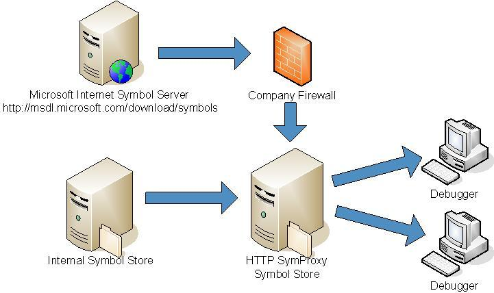

# SymProxy


## <span id="ddk_using_other_symbol_stores_dbg"></span><span id="DDK_USING_OTHER_SYMBOL_STORES_DBG"></span>


You can configure your HTTP-based symbol store to act as a proxy between client computers and other symbol stores. The implementation is through an Internet Server Application Programming Interface (ISAPI) filter called SymProxy (Symproxy.dll). The SymProxy server can be used as a gateway computer to the Internet or other sources within your company network. The following diagram shows an example SymProxy configuration.



SymProxy is useful in many situations. For example:

-   You are debugging many systems within a lab environment in which the computers are not attached to the company network, but the symbols are stored in the network and must be accessed using Integrated Windows Authentication (IWA).

-   Your corporate computing environment includes a firewall that prevents access to the Internet from computers that are debugging and you must obtain symbols from an internet Web site.

-   You want to present a single symbol path for all users in your company so that they need not know or care about where symbols are located, and you can add new symbol stores without user intervention.

-   You have a remote site that is physically far from the rest of your company resources, and network access is slow. This system can be used to acquire symbols and cache them to the remote site.

To install SymProxy, you must manually copy the files to the correct location, configure the registry, choose network security credentials, and configure Internet Information Services (IIS). To ensure that your HTTP symbol store is properly configured, see [HTTP Symbol Stores](http-symbol-stores.md).

### <span id="Multiple_Symbol_Server_Performance_Considerations"></span><span id="multiple_symbol_server_performance_considerations"></span><span id="MULTIPLE_SYMBOL_SERVER_PERFORMANCE_CONSIDERATIONS"></span>Multiple Symbol Server Performance Considerations

Each Virtual Directory can be associated with multiple (upstream) symbol stores. Each symbol store is queried independently. For performance, local SMB servers should be processed before internet HTTP servers. Unlike a debugger symbol path, multiple HTTP symbol stores can be specified in a SymProxy symbol path. A maximum of 10 entries are supported per Virtual Directory.

### <span id="SymProxy_Symbol_Path"></span><span id="symproxy_symbol_path"></span><span id="SYMPROXY_SYMBOL_PATH"></span>SymProxy Symbol Path

SymProxy splits the (registry defined) symbol path value up in to the individual entries and uses each entry to generate a SRV\* based symbol path to retrieve the file. It uses the Virtual Directory’s folder as the downstream store in each of the queries – in effect, merging the upstream stores in to a single downstream symbol store.

The (generated) symbol path used by SymProxy is equivalent to this:

```dbgcmd
SRV*<Virtual Directory Folder>*<SymbolPath Entry #N>
```

In this example, a UNC path and two HTTP paths are associated with a Virtual Directory to merge the symbols from a corporate symbol server, Microsoft and a 3rd party (Contoso). The SymProxy SymbolPath would be set like this:

```console
\\MainOffice\Symbols;https://msdl.microsoft.com/download/symbols;
https://symbols.contoso.com/symbols
```

The Main Office Symbol file share is queried first using a (generated) symbol path of:

```dbgcmd
SRV*D:\SymStore\Symbols*\\MainOffice\Symbols
```

If the symbol file is not found, the Microsoft Symbol Store is queried using a (generated) symbol path of:

```dbgcmd
SRV*D:\SymStore\Symbols*https://msdl.microsoft.com/download/symbols
```

If the file is still not found, the Contoso Symbol Store (https://symbols.contoso.com/symbols) is queried using a (generated) symbol path of:

```dbgcmd
SRV*D:\SymStore\Symbols*https://symbols.contoso.com/symbols
```

This section includes:

[Installing SymProxy](installing-symproxy.md)

[Configuring the Registry](configuring-the-registry.md)

[Choosing Network Security Credentials](choosing-network-security-credentials.md)

[Configuring IIS for SymProxy](configuring-iis-for-symproxy.md)

[Setting Up Exclusion Lists](setting-up-exclusion-lists.md)

[Dealing with Unavailable Symbol Stores](dealing-with-unavailable-symbol-stores.md)

[Checking and Updating Status](checking-and-updating-status.md)

[Handling File Pointers](handling-file-pointers.md)

[Caching Acquired Symbol Files](caching-acquired-symbol-files.md)

 

 


