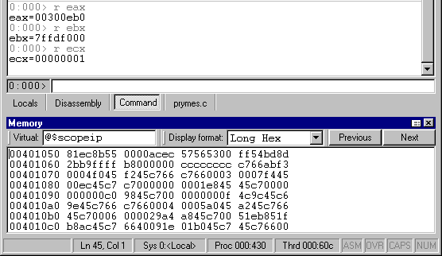

# Tabbing a Window

To tab a floating or docked window, drag it on top of another docked window. Drag the window with the mouse pointer over the center of an already-docked window, and then release the mouse button. The dragged window joins the already-docked window as a tabbed window collection.

All Source windows can be grouped automatically into a tabbed collection by selecting one Source window and designating it as the tab-dock target for all Source windows by choosing the **Set as tab-dock target for window type** option in its short-cut menu. Once this is done, all future Source windows that are opened will automatically be included in a tabbed collection with this first Source window. The Source window marked as the tab-dock target will not be closed when the **Window | Close All Source Windows** menu command is selected. Thus you can set up a placeholder window for the Source windows without worrying that it will be closed when you don't want it to be. The same process also works for Memory windows.

**Note**   If you want a window to join another window in a tabbed window collection, watch the outline of the window that moves as you drag the window. When this outline completely surrounds the window that you want to join, release the mouse button.

 

A set of tabs always controls the window immediately above the tabs. In the following illustration, the [Debugger Command window](debugger-command-window.md) is selected and is visible above the tabs.

 

 

