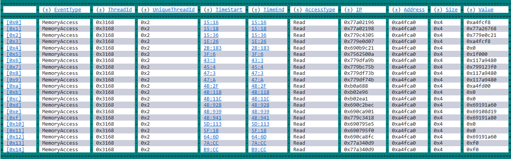

# TTD Memory Objects
## Description
*TTD Memory* is a method that takes beginAddress, endAddress and dataAccessMask parameters and returns a collection of memory objects that contain memory access information.

## Parameters

| Property | Description |
| --- | --- |
| beginAddress | The beginning address of the memory object prefaced with 0x.|
| endAddress| The ending address of the memory object prefaced with 0x.|
| dataAccessMask |The data access mask contained in double quotes. This can be r for read, w for write, e for execute and c for change. |


## Children

| Object      | Description |
| ----------- | ----------- |
| EventType  |  The type of event. This is "MemoryAccess" for all TTD.Memory objects. |
| ThreadId   |  The OS thread ID of thread that made the request. |
| UniqueThreadId |   A unique ID for the thread across the trace. Regular thread IDs can get reused over the lifetime of a process but UniqueThreadIds cannot. |
| TimeStart | A [position object](time-travel-debugging-position-objects.md) that describes the position when memory access was made. |
| TimeEnd | A [position object](time-travel-debugging-position-objects.md) that describes the position when memory access was made. This will always be the same as the TimeStart for TTD.Memory objects.
| AccessType |  The access type - Read, Write or Execute. |
| IP         |  The instruction pointer of the code that made the memory access. |
| Address    |  The Address that was read / written to / executed and will be in the range of [beginAddress, endAddress) from the parameters to .Memory().  Note that the interval is half-open.  That is, none of the returned events will have an address matching endAddress but there could be events matching endAddress – 1.|
| Size       |  The size of the read/write/execute in bytes. This will typically be 8 bytes or less. In the event of code execution, it is the number of bytes in the instruction that was executed. |
| Value   | The value that was read, written or executed. In the case of execution, it contains the code bytes for the instruction. Note the instruction bytes are listed in MSB order by the disassembler but will be stored in value in LSB order. |


## Remarks

The following access types are allowed in TTD.Memory queries:

-   r - read
-   w - write
-   rw - read / write
-   e - execute
-   rwe - read / write / execute
-   ec - execute /change

Note that this is a function that does computation, so it takes a while to run. 


## Example Usage

This example shows a grid display of all the positions in the trace where the four bytes of memory starting at 0x00a4fca0 were read access occurred. Click on any entry to drill down on each occurrence of memory access.

```dbgcmd
dx -g @$cursession.TTD.Memory(0x00a4fca0,0x00a4fca4, "r")
```

 

You can click on the TimeStart fields in any of the events in the grid display, to display information for that event. 

```dbgcmd
0:000> dx -r1 @$cursession.TTD.Memory(0x00a4fca0,0x00a4fca4, "r")[16].TimeStart
@$cursession.TTD.Memory(0x00a4fca0,0x00a4fca4, "r")[16].TimeStart                 : 5D:113 [Time Travel]
    Sequence         : 0x5d
    Steps            : 0x113
```

To move to the position in the trace that the event occurred, click on [Time Travel].

```dbgcmd
0:000> dx @$cursession.TTD.Memory(0x00a4fca0,0x00a4fca4, "r")[16].TimeStart.SeekTo()
@$cursession.TTD.Memory(0x00a4fca0,0x00a4fca4, "r")[16].TimeStart.SeekTo()
(27b8.3168): Break instruction exception - code 80000003 (first/second chance not available)
Time Travel Position: 5D:113

eax=0000004c ebx=00dd0000 ecx=00a4f89c edx=00a4f85c esi=00a4f89c edi=00b61046
eip=690795e5 esp=00a4f808 ebp=00a4f818 iopl=0         nv up ei pl nz na pe nc
cs=0023  ss=002b  ds=002b  es=002b  fs=0053  gs=002b             efl=00000206
690795e5 ffb604040000    push    dword ptr [esi+404h] ds:002b:00a4fca0=00000000
```

In this example, all of the positions in the trace where the four bytes of memory starting at 0x1bf7d0 were read/write accessed are listed. Click on any entry to drill down on each occurrence of memory access.

```dbgcmd
0:000> dx @$cursession.TTD.Memory(0x1bf7d0,0x1bf7d4, "rw")
@$cursession.TTD.Memory(0x1bf7d0,0x1bf7d4, "rw")                
    [0x0]           
    [0x1]           
    [0x2]           
    [0x3]           
     ...
```
In this example all of the postions in the trace where the four bytes of memory starting at 0x13a1710 were execute/change accessed are listed. Click on any occurrence to drill down on for addtional information on each occurrence of memory access.  

```dbgcmd
0:000> dx -r1 @$cursession.TTD.Memory(0x13a1710,0x13a1714, "ec")[0]
@$cursession.TTD.Memory(0x13a1710,0x13a1714, "ec")[0]                
    EventType        : MemoryAccess
    ThreadId         : 0x1278
    UniqueThreadId   : 0x2
    TimeStart        : 5B:4D [Time Travel]
    TimeEnd          : 5B:4D [Time Travel]
    AccessType       : Execute
    IP               : 0x13a1710
    Address          : 0x13a1710
    Size             : 0x1
    Value            : 0x55
```


## See Also

[Time Travel Debugging - Introduction to Time Travel Debugging objects](time-travel-debugging-object-model.md)

[Time Travel Debugging - Overview](time-travel-debugging-overview.md)

---


