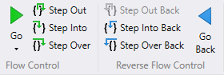

# Time Travel Debugging - Replay a trace


This section describes how to replay time travel traces, navigating forwards and backwards in time.

## Command time travel navigation

Use a trailing minus sign with the following commands to travel back in time.

| Command  |
|----------------|
| p- (Step Back) |
| t- (Trace Back)|
| g- (Go Back)   |

For more information, see [Time Travel Debugging - Navigation commands](time-travel-debugging-navigation-commands.md). 

## Ribbon button time travel navigation

Alternatively, use the ribbon buttons to navigate in the trace.



## Example TTD Trace Replay

Use the g- command to execute backwards until either an event or the beginning of the TTD trace is reached. The events that can stop backward execution are the same that would stop forward execution. In this example, the start of the trace is reached.

```dbgcmd
0:000> g-
TTD: Start of trace reached.
(3f78.4274): Break instruction exception - code 80000003 (first/second chance not available)
Time Travel Position: 29:0
ntdll!ZwTestAlert+0x14:
00007ffc`61f789d4 c3              ret
```

Use the [p (Step)](p--step-.md) command to step forward in a TTD trace. 

```dbgcmd
0:000> p
Time Travel Position: F:1
eax=0173a5b0 ebx=00fd8000 ecx=7774f821 edx=0f994afc esi=0f99137c edi=00de0000
eip=7774f828 esp=010ff34c ebp=010ff584 iopl=0         nv up ei pl zr na pe nc
cs=0023  ss=002b  ds=002b  es=002b  fs=0053  gs=002b             efl=00000246
ntdll!LdrpInitializeProcess+0x1bc5:
7774f828 740b            je      ntdll!LdrpInitializeProcess+0x1bd2 (7774f835) [br=1]
0:000> p
Time Travel Position: F:2
eax=0173a5b0 ebx=00fd8000 ecx=7774f821 edx=0f994afc esi=0f99137c edi=00de0000
eip=7774f835 esp=010ff34c ebp=010ff584 iopl=0         nv up ei pl zr na pe nc
cs=0023  ss=002b  ds=002b  es=002b  fs=0053  gs=002b             efl=00000246
ntdll!LdrpInitializeProcess+0x1bd2:
7774f835 83bdd0feffff00  cmp     dword ptr [ebp-130h],0 ss:002b:010ff454=00000000
0:000> p
Time Travel Position: F:3
eax=0173a5b0 ebx=00fd8000 ecx=7774f821 edx=0f994afc esi=0f99137c edi=00de0000
eip=7774f83c esp=010ff34c ebp=010ff584 iopl=0         nv up ei pl zr na pe nc
cs=0023  ss=002b  ds=002b  es=002b  fs=0053  gs=002b             efl=00000246
ntdll!LdrpInitializeProcess+0x1bd9:
7774f83c 0f8450e8ffff    je      ntdll!LdrpInitializeProcess+0x42f (7774e092) [br=1]
```

You an also use the [t (Trace)](t--trace-.md) command to navigate in the trace.

```dbgcmd
0:000> t
Time Travel Position: F:4
eax=0173a5b0 ebx=00fd8000 ecx=7774f821 edx=0f994afc esi=0f99137c edi=00de0000
eip=7774e092 esp=010ff34c ebp=010ff584 iopl=0         nv up ei pl zr na pe nc
cs=0023  ss=002b  ds=002b  es=002b  fs=0053  gs=002b             efl=00000246
ntdll!LdrpInitializeProcess+0x42f:
7774e092 33c0            xor     eax,eax
0:000> t
Time Travel Position: F:5
eax=00000000 ebx=00fd8000 ecx=7774f821 edx=0f994afc esi=0f99137c edi=00de0000
eip=7774e094 esp=010ff34c ebp=010ff584 iopl=0         nv up ei pl zr na pe nc
cs=0023  ss=002b  ds=002b  es=002b  fs=0053  gs=002b             efl=00000246
ntdll!LdrpInitializeProcess+0x431:
7774e094 e9f5170000      jmp     ntdll!LdrpInitializeProcess+0x1c2b (7774f88e)
```

Use the p- command to step backwards in a TTD trace. 

```dbgcmd
0:000> p-
Time Travel Position: F:4
eax=0173a5b0 ebx=00fd8000 ecx=7774f821 edx=0f994afc esi=0f99137c edi=00de0000
eip=7774e092 esp=010ff34c ebp=010ff584 iopl=0         nv up ei pl zr na pe nc
cs=0023  ss=002b  ds=002b  es=002b  fs=0053  gs=002b             efl=00000246
ntdll!LdrpInitializeProcess+0x42f:
7774e092 33c0            xor     eax,eax
0:000> p-
Time Travel Position: F:3
eax=0173a5b0 ebx=00fd8000 ecx=7774f821 edx=0f994afc esi=0f99137c edi=00de0000
eip=7774f83c esp=010ff34c ebp=010ff584 iopl=0         nv up ei pl zr na pe nc
cs=0023  ss=002b  ds=002b  es=002b  fs=0053  gs=002b             efl=00000246
ntdll!LdrpInitializeProcess+0x1bd9:
7774f83c 0f8450e8ffff    je      ntdll!LdrpInitializeProcess+0x42f (7774e092) [br=1]
```

You can also use the t- command to navigate backwards in time.

## !tt navigation commands

Use the !tt command to navigate forward or backwards in time, by skipping to a given position in the trace. 

!tt [position]

Provide a time position in any of the following formats to travel to that point in time.

- If [position] is a decimal number between 0 and 100, it travels to approximately that percent into the trace. For example `!tt 50` travels to halfway through the trace.

- If {position} is #:#, where # are a hexadecimal numbers, it travels to that position. For example, `!tt 1A0:12F` travels to position 1A0:12F in the trace.

For more information, see [Time Travel Debugging - !tt (time travel)](time-travel-debugging-extension-tt.md).


## !positions

Use `!positions` to display all the active threads, including their position in the trace. For more information, see [Time Travel Debugging - !positions (time travel)](time-travel-debugging-extension-positions.md).

```dbgcmd
0:000> !positions
>*Thread ID=0x1C74 - Position: F:2
 Thread ID=0x1750 - Position: A5:0
 Thread ID=0x3FFC - Position: 200:0
 Thread ID=0x36B8 - Position: 403:0
 Thread ID=0x3BC4 - Position: 5F2:0
 Thread ID=0x392C - Position: B45:0
 Thread ID=0x32B4 - Position: C87:0
 Thread ID=0x337C - Position: DF1:0
* indicates an actively running thread
```

This example shows that there are eight threads at the current position. The current thread is 3604, marked with '>'.  

> [!TIP]
> Another way to display the current list of threads and their positions, is to use the data model dx command:
>
> `dx -g @$curprocess.Threads.Select(t => new { IsCurrent = t.Id == @$curthread.Id, ThreadId = t.Id, Position = t.TTD.Position })`
>

Use the user mode [~ (Thread Status)](---thread-status-.md) command shows the same eight threads, and marks the current thread with '.':

```dbgcmd
0:000> ~
.  0  Id: 954.1c74 Suspend: 4096 Teb: 00fdb000 Unfrozen
   1  Id: 954.1750 Suspend: 4096 Teb: 00fea000 Unfrozen
   2  Id: 954.3ffc Suspend: 4096 Teb: 00fde000 Unfrozen
   3  Id: 954.36b8 Suspend: 4096 Teb: 00fe1000 Unfrozen
   4  Id: 954.3bc4 Suspend: 4096 Teb: 00fe4000 Unfrozen
   5  Id: 954.392c Suspend: 4096 Teb: 00fed000 Unfrozen
   6  Id: 954.32b4 Suspend: 4096 Teb: 00ff0000 Unfrozen
   7  Id: 954.337c Suspend: 4096 Teb: 00ff3000 Unfrozen
```

In the !positions command output, click on the link next to the third thread (3FFC), to time travel to that position in the trace, 200:0.

```dbgcmd
0:002> !tt 200:0
Setting position: 200:0
(954.3ffc): Break instruction exception - code 80000003 (first/second chance not available)
Time Travel Position: 200:0
eax=00000000 ebx=012da718 ecx=7775396c edx=00000000 esi=012e1848 edi=012e1a08
eip=7775396c esp=014cf9f8 ebp=014cfbfc iopl=0         nv up ei ng nz ac po cy
cs=0023  ss=002b  ds=002b  es=002b  fs=0053  gs=002b             efl=00000293
ntdll!NtWaitForWorkViaWorkerFactory+0xc:
7775396c c21400          ret     14h
```

Use the [~ (Thread Status)](---thread-status-.md) command to confirm that we are now positioned at the third thread, 3ffc.

```dbgcmd
0:002> ~
   0  Id: 954.1c74 Suspend: 4096 Teb: 00fdb000 Unfrozen
   1  Id: 954.1750 Suspend: 4096 Teb: 00fea000 Unfrozen
.  2  Id: 954.3ffc Suspend: 4096 Teb: 00fde000 Unfrozen
   3  Id: 954.36b8 Suspend: 4096 Teb: 00fe1000 Unfrozen
   4  Id: 954.3bc4 Suspend: 4096 Teb: 00fe4000 Unfrozen
   5  Id: 954.392c Suspend: 4096 Teb: 00fed000 Unfrozen
   6  Id: 954.32b4 Suspend: 4096 Teb: 00ff0000 Unfrozen
   7  Id: 954.337c Suspend: 4096 Teb: 00ff3000 Unfrozen
```

> [!NOTE]
> The *~s#*, where *#* is a thread number, also switches to the given thread, but it doesn’t change the current position in the trace.  When *!tt* is used to time travel to another thread’s position, any values you (and the debugger) read from memory will  be looked up at that position. When switching threads with *~s#*, the debugger doesn't change the current position internally,which is used for all memory queries. This works this way primarily so that *~s#* doesn’t have to reset the debugger’s inner loop.

## Time travel debugging extension commands

For information on the `!tt`, `!positions` and the `!index` commands see [Time Travel Debugging - Extension Commands](time-travel-debugging-extension-commands.md).

## See Also

[Time Travel Debugging - Overview](time-travel-debugging-overview.md)

[Time Travel Debugging - Record a trace](time-travel-debugging-record.md)

[Time Travel Debugging - Working with trace files](time-travel-debugging-trace-file-information.md)

[Time Travel Debugging - Sample App Walkthrough](time-travel-debugging-walkthrough.md)
