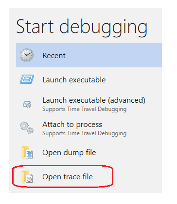
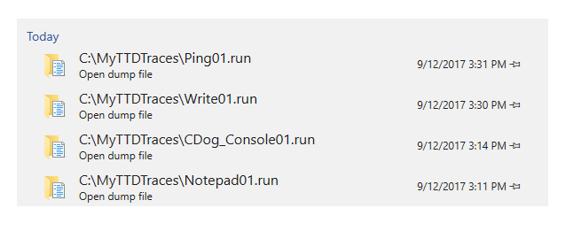

# Time Travel Debugging - Working with Trace Files

 

This section describes how to work with files created and consumed by time travel debugging.

## Trace File Overview

Time Travel Debugging uses the following files to debug code execution.

- The trace file contains the code execution recording and has a .RUN extension.

- The index file enables quick access to information in the Trace file and has an .IDX extension.

- Recording errors and other recording output is written to the debugger log file.


## Trace .RUN files  

Trace .RUN files can be opened after they are recorded using **File** > **Start debugging** > **Open trace file**.

 

All of the trace output files are stored in the users document folder by default. For example, for User1 the TTD files would be stored here:

```console
C:\Users\User1\Documents
```
You can change the location of the trace files when you start to record. For more information, see [Time Travel Debugging - Recording](time-travel-debugging-record.md).

The most recently used list of files allows you to quickly access previously used target configuration files. Any recently used trace files or dump files are listed as well.

 

## Index .IDX files  

An index .IDX file is created for the associated trace .RUN file automatically when opening the trace file in WinDbg Preview. You can manually create the index file by using the !index command. An index allows for faster access to the trace information. 

IDX files can also be large, typically twice the size of the  .RUN file.  

## Recreating the .IDX file
You can recreate the .IDX file from the .RUN file, using the `!index` command. For more information, see [Time Travel Debugging - !index (time travel)](time-travel-debugging-extension-index.md).

```dbgcmd
0:0:001> !index
Indexed 3/3 keyframes
Successfully created the index in 49ms.
```

## Sharing TTD Trace .RUN files

TTD is local only and does not work remotely connected to another machine.

TTD trace files can be shared with others by copying the .RUN file. This can be handy for having a coworker help you figure out the problem. They don't need to install the crashing app or do any other related setup to attempt to reproduce the issue. They can just load the trace file and debug the app as if it was installed on their PC.

The machine where you replay the TTD trace must support all instructions that were used on the record machine - for example AVX instructions.

You can rename the file to include any additional information, such as the date or a bug number.

The .IDX file does not need to be copied as it can be re-created using the !index command as described above.

> [!TIP]
> When collaborating with others, pass on any relevant trace positions related to the problem at hand. The collaborator can use the `!tt x:y` command to move to that exact point in time in the execution of the code. Time position ranges can be included in bug descriptions to track where the possible issue may be occurring.
>

## Error - Log File

Recording errors and other recording output is written to the debugger log file. To view the log file, select **View** > **Logs**. 

This example shows the error log text when attempting to launch and record an executable named Foo.exe that is not in the C:\Windows directory.

```console
2017-09-21:17:18:10:320 : Information : DbgXUI.dll : TTD: Output: 
Microsoft (R) TTD 1.01.02
Release: 10.0.16366.1000
Copyright (C) Microsoft Corporation. All rights reserved.
Launching C:\Windows\Foo.exe
2017-09-21:17:18:10:320 : Error : DbgXUI.dll : TTD: Errors: 
Error: Trace of C:\Windows\Foo.exe PID:0 did not complete successfully: status:27
Error: Could not open 'Foo.exe'; file not found.
Error: Corrupted trace dumped to C:\Users\User1\Documents\Foo01.run.err.
```

## Trace file size

TTD trace files can get really big and it is important to ensure that you have adequate free disk space available.  If you record an app or process even just for a few minutes, the trace file may grow to be several gigabytes in size.  The size of the trace file is dependent on a number of factors described below.  

TTD does not set a maximum size of trace files to allow for complex long running scenarios. Quickly re-creating the issue, will keep the trace file size as small as possible.

### Trace file size factors

It is not possible to provide and exact estimate of the the trace file size but there are a few rules of thumb to help you understand TTD file sizes.

The following factors can affect the size of the trace file:

- The number of code instructions executed across all threads when recording the running app or process
- The length of time during which the app or process was recorded (only as this affects the number of code instructions recorded)
- The size of the memory data used by the app or process

The number of instructions executed and recorded is the biggest factor that affects the trace file size.  A trace typically requires between 1 bit and 1 byte per instruction executed.  A trace is likely to be towards the lower end of that range when the recorded program executes a smaller number of distinct functions and operates on a smaller set of data.  A trace is likely to be towards the higher end of that range when the recorded program executes a larger number of distinct functions or operates on a larger set of data.

### Trace file size rule of thumb

The trace file grows roughly 5MB to 50MB per second when recording an active app or process, depending on the trace file size factors identified above.

The trace file will not grow when the app or process being recorded is idle (e.g., when waiting for input).

Currently there is no maximum file size limit for trace files.  WinDbg Preview can replay trace files that are well into the hundreds of gigabytes in size.

### Index file size

The index file is automatically created by WinDbg Preview when you open a trace for the first time.  It contains information that helps the debugger to replay the trace and query information about memory more efficiently.  Its size generally ranges from 1 to 2 times the size of the trace file.  The factors that affect its size are similar to those that affect the size of the trace file.

First, the size of the index file scales relative to the length of the trace.  A trace that contains a larger number of recorded instructions will generally have a larger index.

Second, the size of the index scales relative to the breadth of the memory accesses.  If the program that was recorded frequently accessed a large number of distinct memory locations, the index will generally be larger than if the program that was recorded accessed fewer distinct memory locations or if accesses to memory locations was less frequent.

Since these factors are similar to the factors that affect the size of the trace file, the size of the index file generally scales relative to the size of the index file (thus our estimate that it's typically between 1x and 2x the size of the trace file).

### What if I run out of disk space?

Both the TTD trace and index files are written to disk. Currently there is not a maximum file size limitation for either the trace or index file. The trace file grows in size until you stop recording or exceed the amount of available disk space.

*During recording:* TTD will write out last page to the trace file and then effectively wait until it can write again. WinDbg continues to show the Recording dialog but does not show an error/warning message when running out of disk space during recording.  

Running out of disk space during recording results in a trace file with an incomplete record of the code execution. The incomplete trace file can be opened in WinDbg Preview but it may not include the actual problem if the error occurs after running out of disk space when writing the trace file.

Workaround: Open File Explorer and check if the disk (i.e. C: drive) Free space is near zero. Alternately watch the trace (.RUN) file in File Explorer (default in Documents folder) and if not regularly growing in size then recording may be waiting. Select the Stop and Debug button in WinDbg, free up space or save to another disk, and start recording again.

*During indexing:* The debugger may produce an invalid index file, resulting in unpredictable behavior in the debugger, or the debugger engine host may crash.

Workaround:  Close the debugger and delete any index file (.idx) that may exist for your trace.  Either free up sufficient disk space, or move the trace file to a different disk with sufficient free space.  Open the trace again in the debugger and run !index to create a new, correct index.  Indexing does not modify the original trace file (.run), so no data will have been lost.

## See Also

[Time Travel Debugging - Overview](time-travel-debugging-overview.md)
