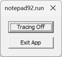

# Time Travel Debugging - TTD.exe command line utility


This article describes when and how to use the TTD.exe command line utility to record a trace.

## When to use the TTD.exe command line utility

Time Travel Debugging (TTD) allows you to record the code execution of an app or process and save it in a trace file. The file can be played back in the Windows debugger to locate an issue with code execution.

For many scenarios, the easiest way to use TTD to record an app or process is directly from the WinDbg UI. For information on time travel debugging using the WinDbg UI, see [Time Travel Debugging - Overview](time-travel-debugging-overview.md).

You may have scenarios where only the TTD command line recorder is required: recording on a PC without installing the debugger, advanced recording scenarios, test automation, etc. In these scenarios you can install just the TTD command line recorder through a URL.

### TTD recording impacts the recorded process

TTD recording is an invasive technology. You will notice anywhere from 5x-20x or more slowdown of the running app or process while recording, depending on the application and the recording options selected.

The created trace files grow over time and can take significant storage space. Work to trace for the shortest period of time, capturing the program activity of interest and then close the trace as soon as possible.

Once TTD is attached to a process, it cannot be removed from it. Close the app or end the process once TTD recording is complete. For system-critical processes, this will require a reboot of the OS.

### TTD recordings may contain personally identifiable or security related information

TTD recordings capture memory contents and may contain personally identifiable or security related information,
including but not necessarily limited to file paths, registry, memory or file contents. The exact
information depends on target process activity while it was recorded.

## How to download and install the TTD.exe command line utility

Download the TTD command line utility here - [https://aka.ms/ttd/download](https://aka.ms/ttd/download)

Select *Install* and TTD will download and install. The TTD command is added to the system path and is available for use at the command prompt, when the install completes.

If you encounter difficulties installing, see [Troubleshoot installation issues with the App Installer file](/windows/msix/app-installer/troubleshoot-appinstaller-issues).

On some PC's you may need to install the [Microsoft App Installer for Windows 10](https://www.microsoft.com/store/productId/9NBLGGH4NNS1). It is available in the Microsoft Store app in Windows. Windows Package Manager is supported through App Installer starting on Windows 10 1809.

## How to record a trace using the TTD.exe command line utility

There are three ways to record a trace.

- Launch a process
- Attach to a process
- Monitor a process

Once the process is being recorded, you need to trigger the issue that you wish to debug. You might open a problematic file or click on a specific button in the app to cause the event of interest to occur. When the application being recorded terminates, naturally or by crashing, the trace file will be finalized.

> [!TIP]
> Recording TTD traces requires administrative rights. Typically this is done by running ttd.exe from an administrator command prompt.

For more information about recording a time travel trace using WinDbg, see [Time Travel Debugging - Record a trace](time-travel-debugging-record.md).

### Launch a process

`-launch <Program> [<arguments>]`

Launch and trace the program (default mode).

This is the only mode that allows you to pass arguments to the program. The program will launch with the same privileges as TTD.exe (as an admin). Use `-attach` or `-monitor` to record the program with its normal set of privileges.

Including `-launch` is optional, but may be used for clarity.

The first unrecognized argument that doesn't start with - or / will be assumed to be an executable path to launch, and any subsequent arguments will be assumed to be the arguments for that program.

For example, use `TTD.exe notepad.exe` to launch and record notepad. The trace will stop when you close notepad.

For example usage, see [Scenario usage examples - recording a process](#scenario-usage-examples---recording-a-process).

### Attach to a process

`-attach <PID>`

Attach to a running process specified by process ID. Use TaskManager or the TaskList utility to identify process numbers. For more information, see [Finding the process ID](finding-the-process-id.md).

For example, use `TTD.exe -attach 21440 -out C:\traces\MyTraceFile.run` to launch and record the process with and ID of 21440 and save the trace in MyTraceFile.run.

Make sure the directory exists (`C:\traces` in this example) before running TTD.exe.

For example usage, see [Scenario - Locate and attach to a running process](#scenario---locate-and-attach-to-a-running-process).

### Monitor a process

`-monitor  <Program>`

The monitor option allows for a program to be monitored and traced each time they are started. To use this option, you must specify a full path to the output location with `-out`.

To stop monitoring press Ctrl+C.

The main benefits of monitoring compared to the other methods are:

- You can launch the target app the normal way, no need to figure out the command line to start it.
- The target app will run with its normal privileges. If you launch the app directly from ttd.exe it will launch elevated and that may change the behavior of the program.
- It is useful for automation (use a script that monitors the launch of a program and collects a trace).

For example usage, see [Scenario usage examples - monitoring processes](#scenario-usage-examples---monitoring-processes).

## Command line options

### Syntax

`TTD.exe  [options] [mode] [program [<arguments>]]`

`-?` | `-help`

Display the command line help.

### Modes

`-launch <Program> [<arguments>]`

Launch and trace the program (default mode).

This is the only mode that allows you to pass arguments to the program.  The `-launch` option must be the last TTD option in the command-line, followed by the program to launch, and any arguments that the program requires. If no mode is specified it will be treated as launch as well. For example `TTD.exe -out C:\traces ping.exe msn.com` is treated as a launch.

`-attach <PID>`

Attach to a running process specified by process ID. Use TaskManager or TaskList utility to identify process IDs. For more information, see [Finding the process ID](finding-the-process-id.md).

`-monitor <Program>`

Trace programs or services each time they are started (until reboot). To use this option, you must specify a full path to the output location with `-out`.

### Basic command line options

`-out <path>`

Specify a trace file name or a directory.  If a directory, the directory must already exist. If a file name, the file name must not exist.

`-noUI`

Disables the UI for manual control of recording.

If this option is not selected a small UI is displayed when recording is active. “Tracing Off” stops tracing and app continues; “Exit App” closes the app which also stops tracing.



`-accepteula`

Use this option to accept the EULA user license agreement. This option can be used in automation scenarios, after the EULA has been reviewed and accepted.

TTD displays the EULA the first time it is run. Type Y or N to accept the EULA. Once accepted, the ELA will no longer be displayed at startup. If the EULA is not accepted TTD exits, and the EULA will be displayed, the next time TTD is run.

### Trace control

`-stop <process name> | <PID> | all`

Stop tracing the specified process name, PID or "all" can be specified.

`-wait <timeout>`

Wait for up to the amount of seconds specified for all trace sessions on the system to end.  Specify -1 to wait infinitely.

`-tracingOff`

Starts application with trace recording off.  You can use the UI checkbox to turn tracing back on after it has been turned off.

### Additional command line options

`-children`

Record the target as well as any processes created by the target. Each child process will be recorded into its own trace file.

`-cmdLineFilter "<string>"`

Record the target if its command line contains the string. This option works only with `-monitor` mode. It is useful for situations when the command line argument uniquely identifies the process you are interested in. For example, `-monitor notepad.exe -cmdLineFilter "specialfile.txt"` records notepad.exe only if specialfile.txt appears on the command line.

`-cleanup`

Uninstall process monitor driver.

### Trace behavior settings

`-timestampFilename`

Adds a timestamp to the last part of the trace file name. For example, ping_2023-06-17_103116.run.

For example to record ping.exe, with a timestamp included in the file name, use this command.

```console
ttd.exe  -out c:\traces -timestampFilename ping.exe msn.com
```

By default a sequential scan is done to find an unused file in the output directory. If ping.exe is recorded the recorder will try ping01.run, ping02.run, etc. until an unused file name is found. For most scenarios this naming method is sufficient. However, if you want to record the same program many times, the default file naming algorithm can become inefficient, when there is large number of existing files.

`-ring`

Trace to a ring buffer. The file size will not grow beyond the limits specified by `-maxFile`. Only the last portion of the recording that fits within the given size, will be saved.

`-maxFile <size>`

Maximum size of the trace file in MB.  When in full trace mode the default is 1024GB and the minimum value is 1MB. When in ring buffer mode the default is 2048MB, the minimum value is 1MB, and the maximum value is 32768MB.

The default for in-memory ring on 32-bit processes is 256MB.

`-maxConcurrentRecordings <count>`

Maximum number of recordings that can be ongoing at any one point in time. If not specified, an unlimited number of recordings can occur simultaneously.

`-numVCpu <number>`

Specifies a number of Virtual CPUs to be reserved and used when tracing. This value affects the total memory overhead placed on the guest process' memory by TTD. If not specified then default per platform is: 55 for x64/ARM64 and 32 for x86.

Change this setting in order to limit the memory impact *only* if you are running out of memory. Changing the numVCpu value to a lower number can severely impact the performance of tracing and should only be done to work around memory usage issues.

If TTD.exe fails to record, or the .out file indicates a simulation of 0 seconds, using `-numVCpu` may enable the recording to succeed.

`-replayCpuSupport <support>`

 Specifies what support is expected from the CPUs that will be used to replay the trace. The default setting is recommended for portability of traces between machines but other options may be used to produce small traces files and record faster (depending on the specific instructions used by the target program).

 `<support>` values

| Value              | Description |
|--------------------|-------------|
| `Default`          | Default CPU support, just requires basic commonly-available support in the replay CPU.  |
| `MostConservative` | Requires no special support in the replay CPU. Adequate for traces that will be replayed on a completely different CPU architecture, like an Intel trace on ARM64 CPU. |
| `MostAggressive`   | Assumes that the replay CPU will be similar and of equal or greater capability than the CPU used to record. |
|`IntelAvxRequired`  | Assumes that the replay CPU will be Intel/AMD 64-bit CPU supporting AVX. |
|`IntelAvx2Required` | Assumes that the replay CPU will be Intel/AMD 64-bit CPU supporting AVX2.|

### Event related settings

`-passThroughExit`

Pass the guest process exit value through as TTD.exe's exit value. This value is available to batch files
through the `%ERRORLEVEL%` variable. Powershell and other command line environments offer mechanisms for getting the process exit value as well.

`-onInitCompleteEvent <eventName>`

Allows an event to be signaled when tracing initialization is complete.

## Scenario usage examples - recording a process

### Scenario - Launch and record a Windows app

In this scenario notepad is launched and a trace is created.

1. Use the `-launch` option to start notepad and record it.

```console
C:\TTD> TTD.exe -launch notepad.exe
Launching 'notepad.exe'
    Recording process (PID:9960) on trace file: C:\TTD\notepad01.run
notepad.exe(x64) (PID:9960): Process exited with exit code 0 after 12984ms
  Full trace dumped to C:\TTD\notepad01.run
```

2. A small application menu is displayed showing that tracing is on.


3. When the application is closed, a trace file is generated. In this example notepad01.run.

### Scenario - Launch and record a Windows app with a passed parameter

In this scenario ping is started, and the address to ping is passed in as a parameter.

1. In this example the `-launch` option is omitted as that is the default mode.

```console
C:\TTD> TTD.exe ping.exe msn.com
Launching 'ping.exe msn.com'
    Recording process (PID:24044) on trace file: C:\TTD\ping01.run

Pinging msn.com [204.79.197.219] with 32 bytes of data:
Reply from 204.79.197.219: bytes=32 time=22ms TTL=118
Reply from 204.79.197.219: bytes=32 time=21ms TTL=118
Reply from 204.79.197.219: bytes=32 time=25ms TTL=118
Reply from 204.79.197.219: bytes=32 time=21ms TTL=118

Ping statistics for 204.79.197.219:
    Packets: Sent = 4, Received = 4, Lost = 0 (0% loss),
Approximate round trip times in milli-seconds:
    Minimum = 21ms, Maximum = 25ms, Average = 22ms
ping.exe(x64) (PID:24044): Process exited with exit code 0 after 3390ms
  Full trace dumped to C:\TTD\ping01.run
```

2. When the application is closed, a trace file is generated. In this example ping01.run.

### Scenario - Locate and attach to a running process

In this scenario notepad is started, its process ID is located and a trace is created by attaching to the running application

1. Start the target app, in this example notepad.

2. Use TaskList or other methods described in to locate the process ID. For more information, see [Finding the process ID](finding-the-process-id.md).

```console
C:\TTD> TaskList
...
Notepad.exe                  21440 Console                    1     73,020 K
...
```

3. Using that process ID, use the `-attach` option to attach and record it. Optionally specify a filename for the trace file using `-out`.

```console
C:\TTD> TTD.exe -attach 21440 -out C:\TTD\MyTraceFile.run
Attaching to 21440
    Recording process (PID:21440) on trace file: C:\TTD\MyTraceFile.run
(x64) (PID:21440): Process exited with exit code 0 after 26672ms
  Full trace dumped to C:\TTD\MyTraceFile.run
```

### Scenario - Recording a parent and its children processes

In this scenario a parent and its children processes will be recorded. As some apps may use many children processes, the family trace file that contains the children, may become quite large.


1. Specify the `-children` option and the name of the parent app to record.

This is an example of recording cmd.exe launching ping.exe as a child process.

```console
ttd.exe -out d:\traces -children cmd.exe /C ping.exe msn.com

Microsoft (R) TTD 1.01.11
Release: 1.11.0.0
Copyright (C) Microsoft Corporation. All rights reserved.

Launching 'cmd.exe /C ping.exe msn.com'
    Recording process (PID:48200) on trace file: d:\traces\cmd01.run
    Recording process (PID:53724) on trace file: d:\traces\PING01.run

Pinging msn.com [204.79.197.219] with 32 bytes of data:
Reply from 204.79.197.219: bytes=32 time=6ms TTL=117
Reply from 204.79.197.219: bytes=32 time=6ms TTL=117
Reply from 204.79.197.219: bytes=32 time=7ms TTL=117
Reply from 204.79.197.219: bytes=32 time=7ms TTL=117

Ping statistics for 204.79.197.219:
    Packets: Sent = 4, Received = 4, Lost = 0 (0% loss),
Approximate round trip times in milli-seconds:
    Minimum = 6ms, Maximum = 7ms, Average = 6ms
(x64) (PID:53724): Process exited with exit code 0 after 3516ms
  Trace family nesting level is 1; Parent process ID is 48200
  Full trace dumped to d:\traces\PING01.run

...

```

2. Multiple trace files are created: one for the parent process and a trace file for each child process. WinDbg only opens one trace file at a time so you will need to run separate instances of WinDbg for each trace, if you want to debug them at the same time.

## Scenario usage examples - monitoring processes

### Scenario - monitoring for program launches and starting recording

In this scenario the `-monitor` option is used to record all currently running instances as well as future instances of notepad.exe, until system is rebooted or ttd.exe is exited via Ctrl+C. The `-out` option is required for monitor, and the output folder must exist already.

1. Monitor and trace the current, as well as any future instances of notepad.exe.

```console
C:\TTD> TTD.exe -out C:\TTD\ -monitor notepad.exe
Microsoft (R) TTD 1.01.11
Release: 1.11.121.0
Copyright (C) Microsoft Corporation. All rights reserved.


The Process Launch Monitor driver is not installed
Successfully installed the Process Launch Monitor driver
Recording process Notepad.exe(15904)        From parent process explorer.exe(8440)
    Recording process (PID:15904) on trace file: C:\TTD\notepad01.run
Recording process Notepad.exe(19920)        From parent process explorer.exe(8440)
    Recording process (PID:19920) on trace file: C:\TTD\notepad02.run
(x64) (PID:19920): Process exited with exit code 0 after 1281ms
  Full trace dumped to C:\TTD\notepad02.run

(x64) (PID:15904): Process exited with exit code 0 after 30719ms
  Full trace dumped to C:\TTD\notepad01.run

```

2. In this example two instances of notepad.exe were loaded after tracing had started. After the activity of interest was captured, CTRL-C, was used at the command prompt to stop the recording.

### Scenario - monitoring two programs for program launches

In this scenario the `-monitor` option is used to monitor and record two applications.

1. Monitor and trace the current, as well as any future instances of notepad.exe and ping.exe.

```console
C:\TTD> TTD.exe -out C:\TTD\ -monitor notepad.exe -monitor ping.exe
Microsoft (R) TTD 1.01.11
Release: 1.11.121.0
Copyright (C) Microsoft Corporation. All rights reserved.


Successfully uninstalled the Process Launch Monitor driver
Successfully installed the Process Launch Monitor driver
Recording process Notepad.exe(17972)        From parent process explorer.exe(8440)
    Recording process (PID:17972) on trace file: C:\TTD\Notepad01.run
Tracking process svchost.exe(7824)        From parent process services.exe(1292)
Tracking process sppsvc.exe(10376)        From parent process services.exe(1292)
Tracking process ClipUp.exe(15108)        From parent process svchost.exe(7824)
Tracking process ClipUp.exe(21180)        From parent process ClipUp.exe(15108)
Tracking process consent.exe(24280)        From parent process svchost.exe(892)
Tracking process ctfmon.exe(24508)        From parent process svchost.exe(5064)
Tracking process wt.exe(10768)        From parent process explorer.exe(8440)
Tracking process WindowsTerminal.exe(23296)        From parent process wt.exe(10768)
Tracking process OpenConsole.exe(6816)        From parent process WindowsTerminal.exe(23296)
Tracking process powershell.exe(15956)        From parent process WindowsTerminal.exe(23296)
Tracking process git.exe(3656)        From parent process powershell.exe(15956)
Tracking process git.exe(1928)        From parent process git.exe(3656)
Tracking process git.exe(20312)        From parent process powershell.exe(15956)
Tracking process git.exe(5712)        From parent process git.exe(20312)
Tracking process csc.exe(16144)        From parent process powershell.exe(15956)
Tracking process cvtres.exe(19488)        From parent process csc.exe(16144)
Recording process PING.EXE(21468)        From parent process powershell.exe(15956)
    Recording process (PID:21468) on trace file: C:\TTD\PING01.run
(x64) (PID:21468): Process exited with exit code 1 after 234ms
  Full trace dumped to C:\TTD\PING01.run


Tracking process Teams.exe(10060)        From parent process Teams.exe(2404)
Tracking process cmd.exe(21796)        From parent process powershell.exe(15956)
Recording process PING.EXE(364)        From parent process cmd.exe(21796)
    Recording process (PID:364) on trace file: C:\TTD\PING02.run
(x64) (PID:364): Process exited with exit code 1 after 234ms
  Full trace dumped to C:\TTD\PING02.run
```

2. In this example notepad.exe and then ping.exe were loaded after tracing had started. After the activity of interest was captured, CTRL-C, was used at the command prompt to stop the recording.

### Scenario - Stopping the recording in a second window

In this scenario the activity of interest was captured, and all recording is stopped using `-stop all`. A second command window is used to execute the `-stop all` option.

```console
C:\TTD> TTD.exe -stop all
Microsoft (R) TTD 1.01.11
Release: 1.11.121.0
Copyright (C) Microsoft Corporation. All rights reserved.

Full trace written to 'C:\TTD\Notepad01.run'
```

### Scenario - Cleaning up the monitor driver

In this scenario the `-cleanup` option is used to clean up the monitor driver after all recording is complete.

```console
C:\TTD> TTD.exe -cleanup
The monitor service is not installed
Successfully uninstalled the Process Launch Monitor driver
```

### Additional command line examples

This table highlights some additional command line usage examples. Refer to the [Command line options](#command-line-options) for additional information about the illustrated options.

| Scenario                                          | Command                                                                  |Description |
|---------------------------------------------------|--------------------------------------------------------------------------|------------|
 Attach to process but do not start recording yet   | `Ttd.exe -tracingoff notepad.exe`                                        | Launches notepad with recording turned off. The recording can be started at any time through the UI.
Filter by command line                              | `Ttd.exe -cmdlinefilter foo.txt -monitor notepad.exe`                    | Record notepad.exe but only if foo.txt is on the command line when it is launched, placing output in current directory.
Ring recording                                      | `Ttd.exe -ring -attach 1234`                                             | Records PID 1234 into a trace file capped to 2GB, placing output in the current directory. Older contents in the trace file are overwritten as needed to keep the file under the maximum size. </p> Use `-maxfile` to change the max size. |
Limit trace file size                               | `Ttd.exe -maxfile 4096 notepad.exe`                                      | Record notepad.exe until the trace file reaches 4GB, placing output in current directory.
Limit number of recordings that happen at same time | `Ttd.exe -maxconcurrentrecordings 1 -out c:\my\dir -monitor notepad.exe` | Recording is CPU-intensive and in some cases.
Reduce memory usage in the target process           | `Ttd.exe -numvcpu 8 -monitor w3wp.exe`                                   | Some processes, such as w3wp.exe, set a small quota on the amount of memory it can use. If ttd.exe fails to start recording, use `-numvcpu` to reduce the number of virtual CPUs TTD allocates. Only try this option if ttd.exe is unable to record through other means.
Choose between trace portability and recording speed / trace file size | `Ttd.exe -replaycpusupport mostaggressive notepad.exe` | By default TTD produces trace files that are portable across a wide range of hardware. Choosing 'mostaggressive' tells TTD it is ok to record a trace which can only be played back on CPUs with the same capabilities as the machine that recorded the trace. In some cases this can substantially improve recording speed and trace file size.

### Automation command line examples

This table highlights some additional command line usage examples that can be useful for the automated use of TTD.exe utility.

| Scenario                                  | Command                                                | Description |
|-------------------------------------------|--------------------------------------------------------|-------------|
Disable UI                                  |`Ttd.exe -noui -accepteula notepad.exe`                             | Record notepad.exe, placing output into current directory, without showing the UI.
Wait for recorder to start programmatically | `Ttd.exe -accepteula -oninitcompleteevent ttd_notepad notepad.exe` | Create a Win32 named event 'ttd_notepad' and launch notepad.exe. TTD will signal 'ttd_notepad' when recording is initialized. Automation can wait on the event before proceeding with the behavior they want to record.
Preserve target's exit code                 | `Ttd.exe -accepteula -passthroughexit ping.exe msn.com`            | Records ping.exe, placing output in current directory. Ttd.exe's exit code will be the same as ping.exe's exit code.
Wait for recording to end                   | `Ttd.exe -accepteula -wait 30`                                     | After recording is stopped, wait up to 30 seconds for TTD to finish writing trace file to disk. Use `-wait -1` to wait indefinitely.

All of these examples use the `-accepteula` option to make sure that the automation is not blocked by the EULA confirmation dialog.

## Working with the generated trace file

For information on working with a trace and instructions on how to replay time travel traces, and navigate forwards and backwards in time, see [Time Travel Debugging - Replay a trace](time-travel-debugging-replay.md).

### Tips on working with trace files

- When sharing traces with others you only have to share the .run file. The index file (.idx) can be as large as the .run file and is automatically created when the trace file is loaded by WinDbg.
- When collaborating with others, pass on any relevant trace positions related to the problem at hand. The collaborator can use the `!tt x:y` command to move to that exact point in time in the execution of the code. Time position ranges can be included in bug descriptions to track where the possible issue may be occurring.
- When reporting an issue with TTD, if you supply the .run file, supply the .out file as well. This allows for the confirmation that the recording process worked properly.
- Trace files (.run) compress well.

### Troubleshooting TTD.exe

There are some cases where trace file errors can occur. For more information, see [Time Travel Debugging - Troubleshooting](time-travel-debugging-troubleshooting.md).

The .out file can be used for troubleshooting. The example out file shows a functional trace, ending with an exit code of zero.

```console
Microsoft (R) TTDRecord 1.01.11
Release: 1.11.47.0
Copyright (C) Microsoft Corporation. All rights reserved.


Initializing Time Travel Debugging for Attach to 9916
Time: 05/08/2023 17:07:15
OS:10.0.25314 EDITION:x64

SessionID: 008F918C-B8A7-4C4E-B91B-34CFC953C501

   (TTD::ManageTTDTrace:2725)
Running 
   (TTD::StartGuestProcess:1512)
Group tracing GUID: B84DF180-DA54-46E5-9019-73690C689979

Running "C:\WINDOWS\SYSTEM32\TTDInject.exe" /duration 1 /InjectMode LoaderForCombinedRecording /ClientParams "37 C:\TTD\Notepad03.run 0 0 0 0 0 0 0 0 c06001 0" /RecordScenario 268435458 /attach 9916 -TraceFileHandle 4f8 -GuestEventHandle 380 -ClientEventHandle 384 -ActiveEventHandle 4f4 -MutexHandle 46c -CommunicationBufferHandle 3c0 -SharedSequenceMutexHandle 3b8 -SharedSequenceBufferHandle 330 /TelemetryFeatureSessionId "008F918C-B8A7-4C4E-B91B-34CFC953C501"
   (TTD::StartGuestProcess:1955)
Microsoft (R) TTDInject 1.01.11
Release: 1.11.27.0
Copyright (C) Microsoft Corporation. All rights reserved.

TTDLoader Params:
 LauncherDll = TTDLoader
 ClientDll   = TTDRecordCPU
 ClientEntry = InitializeNirvanaClient
 ClientParams= 37 C:\TTD\Notepad03.run 0 0 0 0 0 0 0 0 c06001 0
 Attach
WaitForMain is off
Allocated processors:55, running threads:2.
Loader TTDLoader.dll injected at 0x00007FFF423B0000 0xc000 -- .reload  TTDLoader.dll=0x00007FFF423B0000,0xc000

Injection by thread is complete.
RecordingEngine initialization successful.
RecordVcpu initialization successful.
Loader initialization successful.
Guest Process is x64 binary.
Tracing started at: Tue May  9 00:07:16 2023 (UTC) Mon May  8 17:07:16 2023 (Local)

Guest process exited with exit code 0
Simulation time of '' (x64): 18781ms.
Tracing completed at: Tue May  9 00:07:34 2023 (UTC) Mon May  8 17:07:34 2023 (Local)
```

Most of the .out file content is used internally by the time travel debugging team to troubleshoot recording errors. The following information can be helpful to others that are working with the trace file.

- Some error messages are only displayed in the .out file and may be used to the determine the specifics of the failure.
- Indication of wall clock time the recording started / stopped
- How long the recording session lasted (simulation time)
- Whether the recording is a launch (with command line) or attach recording
- The OS version

## See Also

[Time Travel Debugging - Overview](time-travel-debugging-overview.md)

[Time Travel Debugging - Record a trace](time-travel-debugging-record.md)

[Time Travel Debugging - Replay a trace](time-travel-debugging-replay.md)
