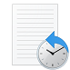

#  Time Travel Debugging - Sample App Walkthrough

This lab introduces Time Travel Debugging (TTD), using a small sample program with a code flaw. TTD is used to debug, identify and root cause the issue. Although the issue in this small program is easy to find, the general procedure can be used on more complex code. This general procedure can be summarized as follows.

1. Capture a time travel trace of the failed program.
2. Use the [dx (Display Debugger Object Model Expression)](dx--display-visualizer-variables-.md) command to find the exception event stored in the recording. 
3. Use the [!tt (time travel)](time-travel-debugging-extension-tt.md) command to travel to the position of the exception event in the trace.
4. From that point in the trace single step backwards until the faulting code in question comes into scope.
5. With the faulting code in scope, look at the local values and develop a hypothesis of a variable that may contain an incorrect value.
6. Determine the memory address of the variable with the incorrect value.
7. Set a memory access (ba) breakpoint on the address of the suspect variable using the ba [(Break on Access)](ba--break-on-access-.md) command.
8. Use g- to run back to last point of memory access of the suspect variable.
9. See if that location, or a few instructions before, is the point of the code flaw. If so, you are done.
If the incorrect value came from some other variable, set another break on access breakpoint on the second variable. 
10. Use g- to run back to the last point of memory access on the second suspect variable. See if that location or a few instructions before contains the code flaw. If so, you are done.
11. Repeat this process walking back until the code that set the incorrect value that caused the error is located.
 
Although the general techniques described in this procedure apply to a broad set of code issues, there are unique code issues that will require a unique approach. The techniques illustrated in the walkthrough should serve to expand your debugging tool set and will illustrate some of what is possible with a TTD trace.


## <span id="Lab_objectives"></span><span id="lab_objectives"></span><span id="LAB_OBJECTIVES"></span>Lab objectives

After completing this lab, you will be able to use the general procedure with a time travel trace to locate issues in code. 


## <span id="Lab_setup"></span><span id="lab_setup"></span><span id="LAB_SETUP"></span>Lab setup

You will need the following hardware to be able to complete the lab.

-   A laptop or desktop computer (host) running Windows 10 

You will need the following software to be able to complete the lab.

-   The WinDbg Preview. For information on installing WinDbg Preview, see [WinDbg Preview - Installation](https://docs.microsoft.com/windows-hardware/drivers/debugger/windbg-install-preview)
-   Visual Studio to build the sample C++ code. 

The lab has the following three sections.

-   [Section 1: Build the sample code](#build)
-   [Section 2: Record a trace of the "DisplayGreeting" sample](#record)
-   [Section 3: Analyze the trace file recording to identify the code issue](#analyze)


## <span id="build"></span>Section 1: Build the sample code

*In Section 1, you will build the sample code using Visual Studio.*

**Create the sample app in Visual Studio**

1.  In Microsoft Visual Studio, click **File** &gt; **New** &gt; **Project/Solution...** and click on the Visual **C++** templates. 
    
    Select the Win32 Console Application.

    Provide a project name of *DisplayGreeting* and click on **OK**.

2. Uncheck the Security Development Lifecycle (SDL) checks.

    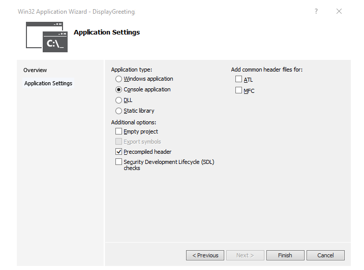 

3. Click on **Finish**.

3. Paste in the following text to the DisplayGreeting.cpp pane in Visual Studio.

    ```cpp
    // DisplayGreeting.cpp : Defines the entry point for the console application.
    //

    #include "stdafx.h"
    #include <array>
    #include <stdio.h>
    #include <string.h>

    void GetCppConGreeting(wchar_t* buffer, size_t size)
    {
	   wchar_t const* const message = L"HELLO FROM THE WINDBG TEAM. GOOD LUCK IN ALL OF YOUR TIME TRAVEL DEBUGGING!";
 
 	   wcscpy_s(buffer, size, message);
    }

    int main()
    {
	    std::array <wchar_t, 50> greeting{};
	    GetCppConGreeting(greeting.data(), sizeof(greeting));

	    wprintf(L"%ls\n", greeting.data());

	    return 0;
    }
    ```

4.  In Visual Studio, click **Project** &gt; **DisplayGreeting properties**. Then click on **C/C++** and **Code Generation**.

    Set the following properties.

    | Setting              |  Value                        |
    |----------------------|-------------------------------|
    | Security Check       | Disable Security Check (/GS-) |
    | Basic Runtime Checks |  Default                      |

 
   > [!NOTE]
   > Although these setting are not recommended, it is possible to imagine a scenario where someone would advise using these settings
   > to expedite coding or to facilitate certain testing environments.
   >  

5.  In Visual Studio, click **Build** &gt; **Build Solution**.

    If all goes well, the build windows should display a message indicating that the build succeeded.

6.  **Locate the built sample app files**

    In the Solution Explorer, right click on the *DisplayGreeting* project and select **Open Folder in File explorer**.
    
    Navigate to the Debug folder that contains the complied exe and symbol pdb file for the sample. For example, you would navigate to *C:\Projects\DisplayGreeting\Debug*, if that's the folder that your projects are stored in. 

7. **Run the sample app with the code flaw**

    Double click on the exe file to run the sample app.

    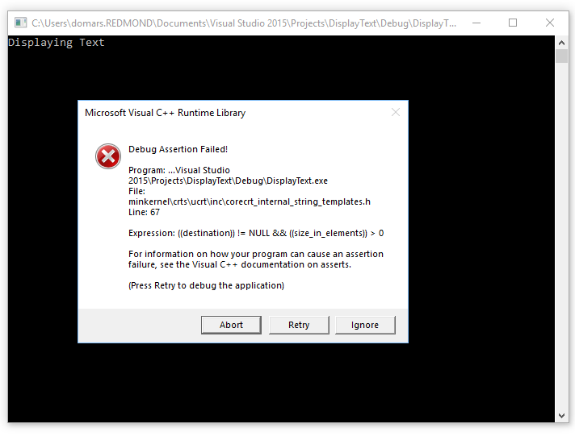 

    If this dialog box appears, select **Close program**

    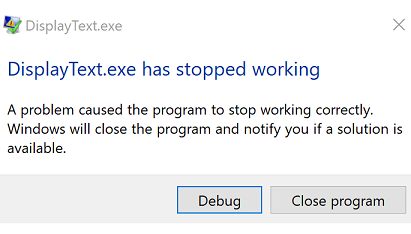 
    
    In the next section of the walkthrough, we will record the execution of the sample app to see if we can determine why this exception is occurring. 


## <span id="record"></span>Section 2: Record a trace of the "DisplayGreeting" sample

*In Section 2, you will record a trace of the misbehaving sample "DisplayGreeting" app*

To launch the sample app and record a TTD trace, follow these steps. For general information about recording TTD traces, see [Time Travel Debugging - Record a trace](time-travel-debugging-record.md)

1. Run WinDbg Preview as an Administrator, so as to be able to record time travel traces.

2. In WinDbg Preview, select **File** > **Start debugging** > **Launch executable (advanced)**.

3. Enter the path to the user mode executable that you wish to record or select **Browse** to navigate to the executable. For information about working with the launch executable menu in WinDbg Preview, see [WinDbg Preview - Start a user-mode session](windbg-user-mode-preview.md).

    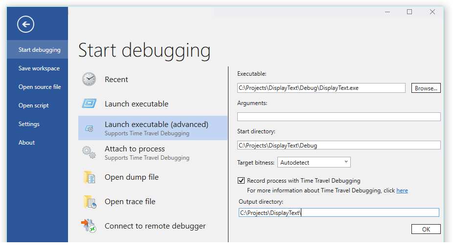

4. Check the **Record process with Time Travel Debugging** box to record a trace when the executable is launched. 

5. Click **OK** to launch the executable and start recording. 

6. The recording dialog appears indicating the trace is being recorded. Shortly after that, the application crashes.

7. Click on **Retry**, to allow the code to try and run.

8. The program crashes and the trace file will be closed and written out to disk. 

    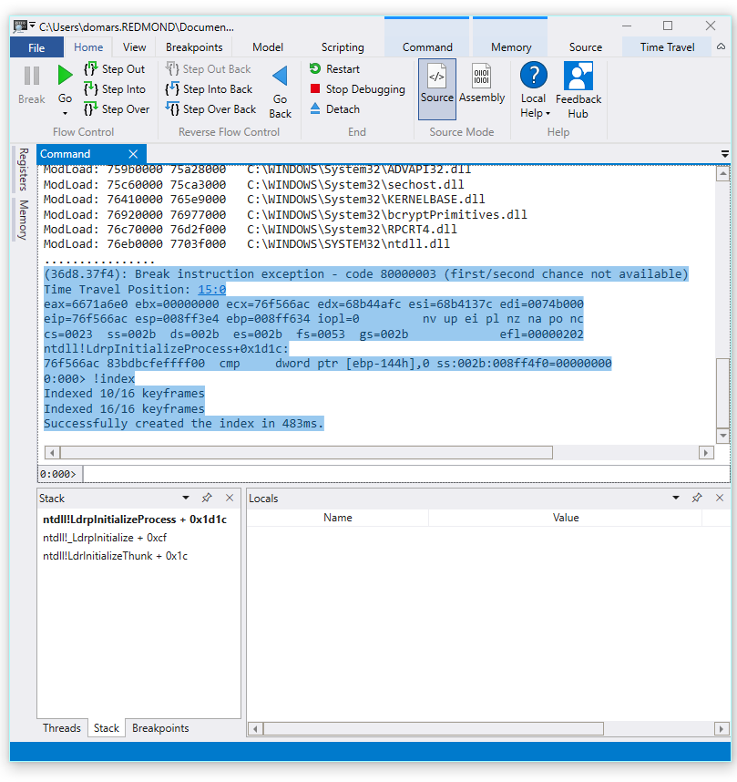

9. The debugger will automatically open the trace file and index it. Indexing is a process that enables efficient debugging of the trace file. This indexing process will take longer for larger trace files.

    ```dbgcmd
    0:000> !index
    Indexed 1/1 keyframes
    Successfully created the index in 95ms.
    ```
   
   > [!NOTE]
   > A keyframe is a location in a trace used for indexing. Keyframes are generated automatically. Larger traces will contain more keyframes. 
   >   
 
10. At this point you are at the beginning of the trace file and are ready to travel forward and backward in time.

    Now that you have a recorded a TTD trace, you can replay the trace back or work with the trace file, for example sharing it with a co-worker. For more information about working with trace files, see [Time Travel Debugging - Working with Trace Files](time-travel-debugging-trace-file-information.md)

In the next section of this lab we will analyze the trace file to locate the issue with our code.


## <span id="analyze"></span>Section 3: Analyze the trace file recording to identify the code issue

*In Section 3, you will analyze the trace file recording to identify the code issue.*

**Configure the WinDbg Environment**

1.  Add your local symbol location to the symbol path and reload the symbols, by typing the following commands.

    ```dbgcmd
    .sympath+ C:\Projects\DisplayGreeting\Debug
    .reload 
    ```

2.  Add your local code location to the source path by typing the following command.

    ```dbgcmd
    .srcpath C:\Projects\DisplayGreeting\DisplayGreeting
    ```

3. To be able to view the state of the stack and local variables, on the WinDbg Preview ribbon, select **View** and **Locals** and **View** and **Stack**. Organize the windows to allow you to view them, the source code and the command windows at the same time.

4.  On the WinDbg Preview ribbon, select **Source** and **Open Source File**. Locate the DisplayGreeting.cpp file and open it.

**Examine the exception**

1. When the trace file was loaded it displays information that an exception occurred. 

    ```dbgcmd
    2fa8.1fdc): Break instruction exception - code 80000003 (first/second chance not available)
    Time Travel Position: 15:0
    eax=68ef8100 ebx=00000000 ecx=77a266ac edx=69614afc esi=6961137c edi=004da000
    eip=77a266ac esp=0023f9b4 ebp=0023fc04 iopl=0         nv up ei pl nz na pe nc
    cs=0023  ss=002b  ds=002b  es=002b  fs=0053  gs=002b             efl=00000206
    ntdll!LdrpInitializeProcess+0x1d1c:
    77a266ac 83bdbcfeffff00  cmp     dword ptr [ebp-144h],0 ss:002b:0023fac0=00000000
    ```
2. Use the dx command to list all of the events in the recording. The exception event is listed in the events.

    ```dbgcmd
    0:000> dx -r1 @$curprocess.TTD.Events
    ...
    [0x2c]           : Module Loaded at position: 9967:0
    [0x2d]           : Exception at 9BDC:0
    [0x2e]           : Thread terminated at 9C43:0
    ...
    
    ```

   > [!NOTE]
   > In this walkthrough three periods are used to indicate that extraneous output was removed. 
   >


3. Click on the Exception event to display information about that TTD event. 

    ```dbgcmd
    0:000> dx -r1 @$curprocess.TTD.Events[17]
    @$curprocess.TTD.Events[17]                 : Exception at 68:0
        Type             : Exception
        Position         : 68:0 [Time Travel]
        Exception        : Exception of type Hardware at PC: 0X540020
    ```


4. Click on the Exception field to further drill down on the exception data. 

    ```dbgcmd
    0:000> dx -r1 @$curprocess.TTD.Events[17].Exception
    @$curprocess.TTD.Events[17].Exception                 : Exception of type Hardware at PC: 0X540020
        Position         : 68:0 [Time Travel]
        Type             : Hardware
        ProgramCounter   : 0x540020
        Code             : 0xc0000005
        Flags            : 0x0
        RecordAddress    : 0x0
    ```

   The exception data indicates that this is a Hardware fault thrown by the CPU. It also provides the exception code of 0xc0000005 that indicates that this is an access violation. This typically indicates that we were attempting to write to memory that we don't have access to.

5. Click on the [Time Travel] link in the exception event to move to that position in the trace.

    ```dbgcmd
    0:000> dx @$curprocess.TTD.Events[17].Exception.Position.SeekTo()
    Setting position: 68:0

    @$curprocess.TTD.Events[17].Exception.Position.SeekTo()
    (16c8.1f28): Break instruction exception - code 80000003 (first/second chance not available)
    Time Travel Position: 68:0
    eax=00000000 ebx=00cf8000 ecx=99da9203 edx=69cf1a6c esi=00191046 edi=00191046
    eip=00540020 esp=00effe4c ebp=00520055 iopl=0         nv up ei pl zr na pe nc
    cs=0023  ss=002b  ds=002b  es=002b  fs=0053  gs=002b             efl=00000246
    00540020 ??              
    ```
    
    Of note in this output is that the stack and base pointer are pointing to two very different addresses.

    ```dbgcmd
    esp=00effe4c ebp=00520055
    ```

    This could indicate that stack corruption - possibly a function returned and then corrupted the stack. To validate this, we need to travel back to before the CPU state was corrupted and see if we can determine when the stack corruption occurred.


**Examine the local variables and set a code breakpoint**

At the point of failure in trace it is common to end up a fews steps after the true cause in error handling code. With time travel we can go back an instruction at a time, to locate investigate the true root cause.


1. From the **Home** ribbon use the  **Step Into Back** command to step back three instructions. As you do this, continue to examine the stack and memory windows.

    The command window will display the time travel position and the registers as you step back three instructions.

    ```dbgcmd
    0:000> t-
    Time Travel Position: 67:40
    eax=00000000 ebx=00cf8000 ecx=99da9203 edx=69cf1a6c esi=00191046 edi=00191046
    eip=00540020 esp=00effe4c ebp=00520055 iopl=0         nv up ei pl zr na pe nc
    cs=0023  ss=002b  ds=002b  es=002b  fs=0053  gs=002b             efl=00000246
    00540020 ??              ???

    0:000> t-
    Time Travel Position: 67:3F
    eax=00000000 ebx=00cf8000 ecx=99da9203 edx=69cf1a6c esi=00191046 edi=00191046
    eip=0019193d esp=00effe48 ebp=00520055 iopl=0         nv up ei pl zr na pe nc
    cs=0023  ss=002b  ds=002b  es=002b  fs=0053  gs=002b             efl=00000246
    DisplayGreeting!main+0x4d:
    0019193d c3    

    0:000> t-
    Time Travel Position: 67:39
    eax=0000004c ebx=00cf8000 ecx=99da9203 edx=69cf1a6c esi=00191046 edi=00191046
    eip=00191935 esp=00effd94 ebp=00effe44 iopl=0         nv up ei pl nz ac po nc
    cs=0023  ss=002b  ds=002b  es=002b  fs=0053  gs=002b             efl=00000212
    DisplayGreeting!main+0x45:
    ```

   > [!NOTE]
   > In this walkthrough, the command output shows the commands that can be used instead of the UI Menu options to allow users with a
   > command line  usage preference to use command line commands.
   > 

2. At this point in the trace our  stack and base pointer have values that make more sense, so it appears that we have getting closer to the point in the code where the corruption occurred.

    ```dbgcmd
    esp=00effd94 ebp=00effe44
    ```

    Also of interest is that the locals window contains values from our target app and the source code window is highlighting the line of code that is ready to be executed at this point in the trace.

    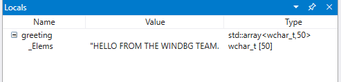

3. To further investigate, we can open up a memory window to view the contents near the base pointer memory address of *0x00effe44*.

4. To display the associated ASCII characters, from the Memory ribbon, select **Text** and then **ASCII**.

    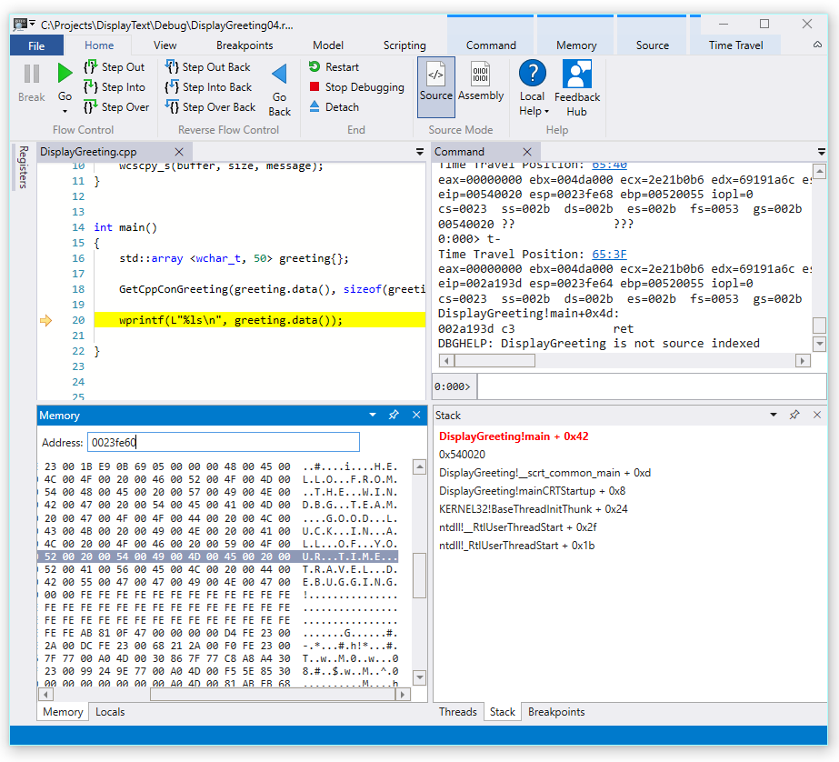

5. Instead of the base pointer pointing to an instruction it is pointing to our message text. So something is not right here, this may be close to the point in time that we have corrupted the stack. To further investigate we will set a breakpoint. 


> [!NOTE]
> In this very small sample it would be pretty easy to just look in the code, but if there are hundreds of lines of code and dozens of subroutines the techniques described here can be used to decrease the time necessary to locate the issue.
>


**TTD and breakpoints**

Using breakpoints is a common approach to pause code execution at some event of interest.  TTD allows you to set a breakpoint and travel back in time until that breakpoint is hit after the trace has been recorded. The ability to examine the process state after an issue has happened, to determine the best location for a breakpoint, enables additional debugging workflows unique to TTD. 

**Memory access breakpoints**

You can set breakpoints that fire when a memory location is accessed. Use the **ba** (break on access) command, with the following syntax.

```dbgcmd
ba <access> <size> <address> {options}
```

<table>
<colgroup>
<col width="50%" />
<col width="50%" />
</colgroup>
<thead>
<tr class="header">
<th align="left">Option</th>
<th align="left">Description</th>
</tr>
</thead>
<tbody>
<tr class="odd">
<td align="left"><p>e</p></td>
<td align="left"><p>execute (when CPU fetches an instruction from the address)</p></td>
</tr>
<tr class="even">
<td align="left"><p>r</p></td>
<td align="left"><p>read/write (when CPU reads or writes to the address)</p></td>
</tr>
<tr class="odd">
<td align="left"><p>w</p></td>
<td align="left"><p>write (when the CPU writes to the address)</p></td>
</tr>
</tbody>
</table>

 
Note that you can only set four data breakpoints at any given time and it is up to you to make sure that you are aligning your data correctly or you won’t trigger the breakpoint (words must end in addresses divisible by 2, dwords must be divisible by 4, and quadwords by 0 or 8).


**Set the break on memory access breakpoint for the base pointer**    

1.  At this point in the trace we would like to set a breakpoint on write memory access to base pointer - ebp which in our example is 00effe44. To do this use the **ba** command using the address we want to monitor. We want to monitor writes for four bytes, so we specify w4. 

    ```dbgcmd
    0:000> ba w4 00effe44
    ```

2. Select **View** and then **Breakpoints** to confirm they are set as intended.

    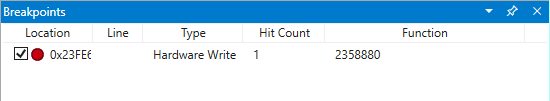


3.  From the Home menu, select **Go Back**  to travel back in time until the breakpoint is hit.

    ```dbgcmd
    0:000> g-
    Breakpoint 0 hit
    Time Travel Position: 5B:92
    eax=0000000f ebx=003db000 ecx=00000000 edx=00cc1a6c esi=00d41046 edi=0053fde8
    eip=00d4174a esp=0053fcf8 ebp=0053fde8 iopl=0         nv up ei pl nz ac pe nc
    cs=0023  ss=002b  ds=002b  es=002b  fs=0053  gs=002b             efl=00000216
    DisplayGreeting!DisplayGreeting+0x3a:
    00d4174a c745e000000000  mov     dword ptr [ebp-20h],0 ss:002b:0053fdc8=cccccccc
    ```

4. Select **View** and then **Locals**. In the locals window we can see that the *destination* variable has only part of the message, while the *source* has contains all of the text. This information supports the idea that the stack was corrupted. 

    


5. At this point we can examine the program stack to see what code is active. From the **View** ribbon select **Stack**. 

    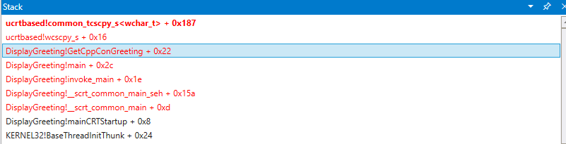


As it is very unlikely that the Microsoft provided wscpy_s() function would have a code bug like this, we look further in the stack. The stack shows that Greeting!main calls Greeting!GetCppConGreeting. In our very small code sample we could just open the code at this point and likely find the error pretty easily. But to illustrate the techniques that can be used with larger, more complex program, we will set a new breakpoint to investigate further. 


**Set the break on access breakpoint for the GetCppConGreeting function**        

1. Use the breakpoints window to clear the existing breakpoint by right clicking on the existing breakpoint and selecting **Remove**.

2. Determine the address of the DisplayGreeting!DetermineStringSize function using the **dx** command. 

    ```dbgcmd
    0:000> dx &DisplayGreeting!GetCppConGreeting
    &DisplayGreeting!GetCppConGreeting                 : 0xb61720 [Type: void (__cdecl*)(wchar_t *,unsigned int)]
        [Type: void __cdecl(wchar_t *,unsigned int)]
    ```

3. Use the **ba** command to set a breakpoint on memory access. Because the function will just be read from memory for execution, we need to set a r - read breakpoint.

    ```dbgcmd
    0:000> ba r4 b61720
    ```

4. Confirm that a Hardware Read breakpoint is active in the breakpoints window.

    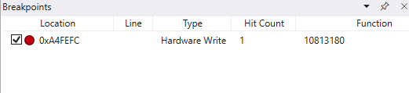


5. As we are wondering about the size of the greeting string we will set a watch window to display the value of sizeof(greeting). From the View ribbon, select **Watch** and provide *sizeof(greeting)*.

    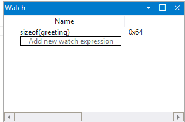

6. On the Time Travel menu, use **Time travel to start** command to move to the start of the trace.

    ```dbgcmd
    0:000> !tt 0
    Setting position to the beginning of the trace
    Setting position: 15:0
    (1e5c.710): Break instruction exception - code 80000003 (first/second chance not available)
    Time Travel Position: 15:0
    eax=68e28100 ebx=00000000 ecx=77a266ac edx=69e34afc esi=69e3137c edi=00fa2000
    eip=77a266ac esp=00ddf3b8 ebp=00ddf608 iopl=0         nv up ei pl nz na pe nc
    cs=0023  ss=002b  ds=002b  es=002b  fs=0053  gs=002b             efl=00000206
    ntdll!LdrpInitializeProcess+0x1d1c:
    77a266ac 83bdbcfeffff00  cmp     dword ptr [ebp-144h],0 ss:002b:00ddf4c4=00000000
    ```

7.  On the Home menu, select **Go**  to  move forward in the code until the breakpoint is hit.

    ```dbgcmd
    0:000> g
    Breakpoint 2 hit
    Time Travel Position: 4B:1AD
    eax=00ddf800 ebx=00fa2000 ecx=00ddf800 edx=00b61046 esi=00b61046 edi=00b61046
    eip=00b61721 esp=00ddf7a4 ebp=00ddf864 iopl=0         nv up ei pl nz na po nc
    cs=0023  ss=002b  ds=002b  es=002b  fs=0053  gs=002b             efl=00000202
    DisplayGreeting!GetCppConGreeting+0x1:
    00b61721 8bec            mov     ebp,esp
    ```


8.  On the Home menu, select **Step Out Back** to back one step.

    ```dbgcmd
    0:000> g-u
    Time Travel Position: 4B:1AA
    eax=00ddf800 ebx=00fa2000 ecx=00ddf800 edx=00b61046 esi=00b61046 edi=00b61046
    eip=00b61917 esp=00ddf7ac ebp=00ddf864 iopl=0         nv up ei pl nz na po nc
    cs=0023  ss=002b  ds=002b  es=002b  fs=0053  gs=002b             efl=00000202
    DisplayGreeting!main+0x27:
    00b61917 e8def7ffff      call    DisplayGreeting!ILT+245(?GetCppConGreetingYAXPA_WIZ) (00b610fa)
    ```


9. It looks like we have found the root cause. The *greeting* array that we declared is 50 characters in length, while the sizeof(greeting) that we pass into GetCppConGreeting is 0x64, 100).  

    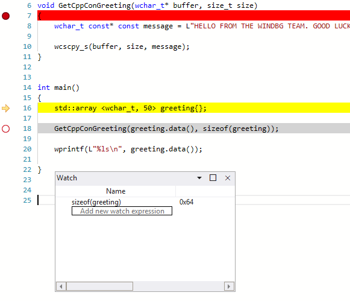

    As we look at the size issue further, we also notice that the message is 75 characters in length, 76 including the end of string character.

    ```dbgcmd
    HELLO FROM THE WINDBG TEAM. GOOD LUCK IN ALL OF YOUR TIME TRAVEL DEBUGGING!
    ```


10. One way to fix the code would be to expand the size of the character array to 100.

    ```cpp
    std::array <wchar_t, 100> greeting{};
    ```

    And we also need to change sizeof(greeting) to size(greeting) in this line of code.

    ```cpp
     GetCppConGreeting(greeting.data(), size(greeting));
    ```

11. To validate these fixes, we could recompile the code and confirm that it runs without error.


**Setting a breakpoint using the source window**


1. An alternative way to perform this investigation would be to set a breakpoint by clicking on any line of code. For example clicking on the right side of the std:array definition line in the source window will set a breakpoint there.

    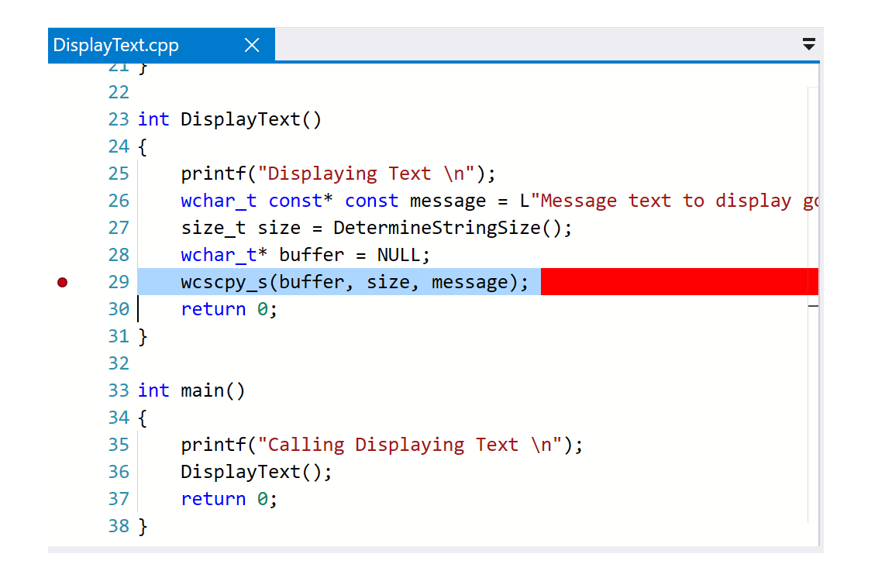

2. On the Time Travel menu, use **Time travel to start** command to move to the start of the trace.

    ```dbgcmd
    0:000> !tt 0
    Setting position to the beginning of the trace
    Setting position: 15:0
    (1e5c.710): Break instruction exception - code 80000003 (first/second chance not available)
    Time Travel Position: 15:0
    eax=68e28100 ebx=00000000 ecx=77a266ac edx=69e34afc esi=69e3137c edi=00fa2000
    eip=77a266ac esp=00ddf3b8 ebp=00ddf608 iopl=0         nv up ei pl nz na pe nc
    cs=0023  ss=002b  ds=002b  es=002b  fs=0053  gs=002b             efl=00000206
    ntdll!LdrpInitializeProcess+0x1d1c:
    77a266ac 83bdbcfeffff00  cmp     dword ptr [ebp-144h],0 ss:002b:00ddf4c4=00000000
    ```

3. On the Home Ribbon click on **Go** to travel back until the breakpoint is hit.

    ```dbgcmd
    Breakpoint 0 hit
    Time Travel Position: 5B:AF
    eax=0000000f ebx=00c20000 ecx=00000000 edx=00000000 esi=013a1046 edi=00effa60
    eip=013a17c1 esp=00eff970 ebp=00effa60 iopl=0         nv up ei pl nz na po nc
    cs=0023  ss=002b  ds=002b  es=002b  fs=0053  gs=002b             efl=00000202
    DisplayGreeting!DisplayGreeting+0x41:
    013a17c1 8bf4            mov     esi,esp
    ```


**Set the break on access breakpoint for the *greeting* variable**    

Another alternative way to perform this investigation, would be to set a breakpoint on suspect variables and examine what code is changing them. For example, to set a breakpoint on the greeting variable in the GetCppConGreeting method, use this procedure.

This portion of the walkthrough assumes that you are still located at the breakpoint from the previous section. 

1. From **View** and then **Locals**. In the locals window, *greeting* is available in the current context, so we will be able to determine its memory location. 

2.  Use the **dx** command to examine the *greeting* array. 

    ```dbgcmd
    0:000> dx &greeting
    &greeting                 : 0xddf800 [Type: std::array<wchar_t,50> *]
       [+0x000] _Elems           : "꽘棶檙瞝???" [Type: wchar_t [50]]
    ```

    In this trace, *greeting* is located in memory at ddf800. 


2. Use the breakpoints window to clear any existing breakpoint by right clicking on the existing breakpoint and selecting **Remove**.


3.  Set the breakpoint with the **ba** command using the memory address we want to monitor for write access. 

    ```dbgcmd
    ba w4 ddf800
    ```

4. On the Time Travel menu, use **Time travel to start** command to move to the start of the trace.

    ```dbgcmd
    0:000> !tt 0
    Setting position to the beginning of the trace
    Setting position: 15:0
    (1e5c.710): Break instruction exception - code 80000003 (first/second chance not available)
    Time Travel Position: 15:0
    eax=68e28100 ebx=00000000 ecx=77a266ac edx=69e34afc esi=69e3137c edi=00fa2000
    eip=77a266ac esp=00ddf3b8 ebp=00ddf608 iopl=0         nv up ei pl nz na pe nc
    cs=0023  ss=002b  ds=002b  es=002b  fs=0053  gs=002b             efl=00000206
    ntdll!LdrpInitializeProcess+0x1d1c:
    77a266ac 83bdbcfeffff00  cmp     dword ptr [ebp-144h],0 ss:002b:00ddf4c4=00000000
    ```

5. On the Home menu, select **Go** to travel forward to the first point of memory access of the greeting array. 

    ```dbgcmd
    0:000> g-
    Breakpoint 0 hit
    Time Travel Position: 5B:9C
    eax=cccccccc ebx=002b1000 ecx=00000000 edx=68d51a6c esi=013a1046 edi=001bf7d8
    eip=013a1735 esp=001bf6b8 ebp=001bf7d8 iopl=0         nv up ei pl nz na po nc
    cs=0023  ss=002b  ds=002b  es=002b  fs=0053  gs=002b             efl=00000202
    DisplayGreeting!DetermineStringSize+0x25:
    013a1735 c745ec04000000  mov     dword ptr [ebp-14h],4 ss:002b:001bf7c4=cccccccc
    ```

   Alternatively, we could have traveled to the end of the trace and worked in reverse through the code to find that last point in the trace that the array memory location was written to.
      

**Use the TTD.Memory objects to view memory access**    

Another way to determine at what points in the trace memory has been accessed, is to use the TTD.Memory objects and the dx command.

1.  Use the **dx** command to examine the *greeting* array. 

    ```dbgcmd
    0:000> dx &greeting
    &greeting                 : 0xddf800 [Type: std::array<wchar_t,50> *]
       [+0x000] _Elems           : "꽘棶檙瞝???" [Type: wchar_t [50]]
    ```

    In this trace, *greeting* is located in memory at ddf800. 

2. Use the **dx** command to look at the four bytes in memory starting at that address with the read write access.

    ```dbgcmd
    0:000> dx -r1 @$cursession.TTD.Memory(0xddf800,0xddf804, "rw")
    @$cursession.TTD.Memory(0x1bf7d0,0x1bf7d4, "rw")                
        [0x0]           
        [0x1]           
        [0x2]           
        [0x3]           
        [0x4]           
        [0x5]           
        [0x6]           
        [0x7]           
        [0x8]           
        [0x9]           
        [0xa]           
        ...         
    ```

3. Click on any of the occurrences to display more information about that occurrence of memory access.

    ```dbgcmd
    0:000> dx -r1 @$cursession.TTD.Memory(0xddf800,0xddf804, "rw")[5]
    @$cursession.TTD.Memory(0xddf800,0xddf804, "rw")[5]                
        EventType        : MemoryAccess
        ThreadId         : 0x710
        UniqueThreadId   : 0x2
        TimeStart        : 27:3C1 [Time Travel]
        TimeEnd          : 27:3C1 [Time Travel]
        AccessType       : Write
        IP               : 0x6900432f
        Address          : 0xddf800
        Size             : 0x4
        Value            : 0xddf818
    ```

4. Click on [Time Travel] to position the trace at the point in time.

    ```dbgcmd
    0:000> dx @$cursession.TTD.Memory(0xddf800,0xddf804, "rw")[5].TimeStart.SeekTo()
    @$cursession.TTD.Memory(0xddf800,0xddf804, "rw")[5].TimeStart.SeekTo()
    (1e5c.710): Break instruction exception - code 80000003 (first/second chance not available)
    Time Travel Position: 27:3C1
    eax=00ddf81c ebx=00fa2000 ecx=00ddf818 edx=ffffffff esi=00000000 edi=00b61046
    eip=6900432f esp=00ddf804 ebp=00ddf810 iopl=0         nv up ei pl nz ac po nc
    cs=0023  ss=002b  ds=002b  es=002b  fs=0053  gs=002b             efl=00000212
    ucrtbased!_register_onexit_function+0xf:
    6900432f 51              push    ecx
   ```

5. If we are interested in the last occurrence of read/write memory access in the trace we can click on the last item in the list or append the .Last() function to the end of the dx command.

    ```dbgcmd
    0:000> dx -r1 @$cursession.TTD.Memory(0xddf800,0xddf804, "rw").Last()
    @$cursession.TTD.Memory(0xddf800,0xddf804, "rw").Last()                
        EventType        : MemoryAccess
        ThreadId         : 0x710
        UniqueThreadId   : 0x2
        TimeStart        : 53:100E [Time Travel]
        TimeEnd          : 53:100E [Time Travel]
        AccessType       : Read
        IP               : 0x690338e4
        Address          : 0xddf802
        Size             : 0x2
        Value            : 0x45
    ```

6. We could then click on [Time Travel] to move to that position in the trace and look further at the code execution at that point, using the techniques described earlier in this lab.

For more information about the TTD.Memory objects, see [TTD.Memory Object](time-travel-debugging-object-model.md).


**Summary**      

In this very small sample the issue could have been determined by looking at the few lines of code, but in larger programs the techniques presented here can be used to decrease the time necessary to locate an issue. 

Once a trace is recorded, the trace and repro steps can be shared, and the issue will be reproducible on demand on any PC.  


---

## See Also

[Time Travel Debugging - Overview](time-travel-debugging-overview.md)

[Time Travel Debugging - Recording](time-travel-debugging-record.md)

[Time Travel Debugging - Replay a trace](time-travel-debugging-replay.md)

[Time Travel Debugging - Working with trace files](time-travel-debugging-trace-file-information.md)

---


