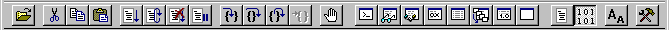

# Using the Toolbar and Status Bar

## 

The *toolbar* appears underneath the menu bar, near the top of the WinDbg window. The *status bar* appears at the bottom of the WinDbg window.

### Using the Toolbar

The following screen shot shows the WinDbg toolbar.

The toolbar buttons have various effects. Most of them are equivalent to menu commands. To execute the command that is associated with a toolbar button, click the toolbar button. When you cannot use a button, it appears unavailable.

For more information about each button, see [Toolbar Buttons](https://msdn.microsoft.com/library/windows/hardware/ff558907).

### Using the Status Bar

The following screen shot shows the WinDbg status bar.

The following table describes the sections of the WinDbg status bar.

<table>
<colgroup>
<col width="50%" />
<col width="50%" />
</colgroup>
<thead>
<tr class="header">
<th align="left">Section</th>
<th align="left">Description</th>
</tr>
</thead>
<tbody>
<tr class="odd">
<td align="left">
Message
</td>
<td align="left">
Displays messages from the debugger.
</td>
</tr>
<tr class="even">
<td align="left">
Ln, Col
</td>
<td align="left">
Displays the line number and column number at the cursor in the active [Source window](source-window.md).
</td>
</tr>
<tr class="odd">
<td align="left">
Sys
</td>
<td align="left">
Shows the internal decimal number of the system that you are debugging, followed by its computer name (or <strong>&lt;Local&gt;</strong> if it is the same as the computer as the debugger is running on).
</td>
</tr>
<tr class="even">
<td align="left">
Proc
</td>
<td align="left">
Shows the internal decimal number of the process that you are debugging, followed by its hexadecimal process ID.
</td>
</tr>
<tr class="odd">
<td align="left">
Thrd
</td>
<td align="left">
Shows the internal decimal number of the thread that you are debugging, followed by its hexadecimal thread ID.
</td>
</tr>
<tr class="even">
<td align="left">
ASM
</td>
<td align="left">
Indicates that WinDbg is in assembly mode. If ASM is unavailable, WinDbg is in source mode.
</td>
</tr>
<tr class="odd">
<td align="left">
OVR
</td>
<td align="left">
Indicates that overtype mode is active. If OVR is unavailable, insert mode is active.
</td>
</tr>
<tr class="even">
<td align="left">
CAPS
</td>
<td align="left">
Indicates that CAPS LOCK is on.
</td>
</tr>
<tr class="odd">
<td align="left">
NUM
</td>
<td align="left">
Indicates that NUM LOCK is on.
</td>
</tr>
</tbody>
</table>

 

### Hiding the Toolbar or Status Bar

To display or hide the toolbar, select or clear [Toolbar](https://msdn.microsoft.com/library/windows/hardware/ff560319) on the **View** menu. To display or hide the status bar, select or clear [Status Bar](https://msdn.microsoft.com/library/windows/hardware/ff560318) on the **View** menu.

If you hide the toolbar or the status bar, you have more space for debugging information windows in the WinDbg display area.

### Setting the Window Title

You can change the title of the WinDbg window by using the [**.wtitle (Set Window Title)**](https://msdn.microsoft.com/library/windows/hardware/ff566185) command.

 

 

[Send comments about this topic to Microsoft](mailto:wsddocfb@microsoft.com?subject=Documentation%20feedback%20[debugger\debugger]:%20Using%20the%20Toolbar%20and%20Status%20Bar%20%20RELEASE:%20%284/24/2017%29&body=%0A%0APRIVACY%20STATEMENT%0A%0AWe%20use%20your%20feedback%20to%20improve%20the%20documentation.%20We%20don't%20use%20your%20email%20address%20for%20any%20other%20purpose,%20and%20we'll%20remove%20your%20email%20address%20from%20our%20system%20after%20the%20issue%20that%20you're%20reporting%20is%20fixed.%20While%20we're%20working%20to%20fix%20this%20issue,%20we%20might%20send%20you%20an%20email%20message%20to%20ask%20for%20more%20info.%20Later,%20we%20might%20also%20send%20you%20an%20email%20message%20to%20let%20you%20know%20that%20we've%20addressed%20your%20feedback.%0A%0AFor%20more%20info%20about%20Microsoft's%20privacy%20policy,%20see%20http://privacy.microsoft.com/default.aspx. "Send comments about this topic to Microsoft")

