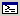

# View | Command Browser

Click **Command Browser** on the **View** menu to open the [Command Browser window](command-browser-window.md). If this window is already open, it becomes active.

This command is equivalent to pressing CTRL+N or clicking the **Command Browser (Ctrl+N)** button () on the toolbar.

For more information about this window and its uses, see [Command Browser Window](command-browser-window.md).

 

 

