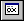

# View | Registers

## 

Click **Registers** on the **View** menu to open the [Registers window](registers-window.md). If this window is already open, it becomes active.

This command is equivalent to pressing ALT+4 or clicking the **Registers (Alt+4)** button () on the toolbar.

For more information about this window and its uses, see [Registers Window](registers-window.md).

 

 

