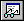

# View | Watch

## 

Click **Watch** on the **View** menu to open the Watch window. If this window is already open, it becomes active.

This command is equivalent to pressing ALT+2 or clicking the **Watch (Alt+2)** button () on the toolbar.

 

 

