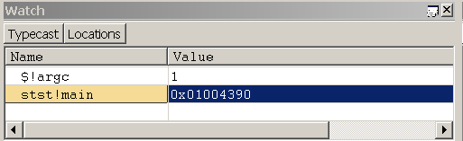
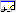

# Using the Watch Window

## 

The Watch window displays information about global variables, local variables, and registers. You can customize this window to show the items that you are tracking.

### Opening the Watch Window

To open or switch to the Watch window, in the WinDbg window, on the **View** menu, click **Watch**.

You can also press ALT+2 or click the **Watch (ALT+2)** button on the toolbar: 

ALT+SHIFT+2 will close the Watch window.

The following screen shot shows an example of a Watch window.

The Watch window can contain four columns. The **Name** and **Value** columns are always displayed, and the **Type** and **Location** columns are optional. To display the **Type** and **Location** columns, click the **Typecast** and **Locations** buttons, respectively, on the toolbar.

### Using the Watch Window

In the Watch window, you can do the following:

- To add a variable to the Watch window, select the first empty cell in the **Name** column, type the variable name, and then press ENTER. Separate the module name from the variable with an exclamation point (**!**). If you do not specify a module, the current module is used. To enter an address in the **Name** field, the address must begin with a decimal digit (if necessary, use the prefix **0x**).

  If the variable name that you have entered is defined in the current function's scope, its value appears in the **Value** column. If it is not defined, the **Value**column displays "Error: Cannot get value".

  Even if a variable is not defined, it can be useful to add it to the Watch window. If the program counter enters a function in which a variable of this name is defined, its value appears in the window at that time.

- To remove a variable from the Watch window, double-click its name, press DELETE, and then press ENTER. You can also replace an old name with a new name by double-clicking the old name, typing the new name, and then pressing ENTER.

- If a variable is a data structure, a check box appears next to its name. To expand and collapse the display of structure members, select or clear the check box.

- Integers of type **int** are displayed as decimal values; integers of type **UINT** are displayed in the current radix. To change the current radix, use the [**n (Set Number Base)**](n--set-number-base-.md) command in the Debugger Command window.

- To change the value of a local variable, double-click its **Value** cell. Enter the new value, or edit the old value. (The cut, copy, and paste commands are available to use for editing.) The value that you enter can include any [C++ expression](c---numbers-and-operators.md). After you enter a new value or edit the old value, you can press ENTER to store the new value or press ESC to discard it. If you submit an invalid value, the old value will reappear after you press ENTER.

  Integers of type **int** are displayed as decimal values; integers of type **UINT** are displayed in the current radix. To change the current radix, use the [**n (Set Number Base)**](n--set-number-base-.md) command in the Debugger Command window.

- The **Type** column (if it is displayed in the Watch window) shows the current data type of each variable. Each variable is displayed in the format that is proper for its own data type. Data structures have their type names in the **Type** column. Other variable types display "Enter new type" in this column.

  If you double-click "Enter new type", you can cast the type by entering a new data type. This cast alters the current display of this variable only in the Watch window; it does not change anything in the debugger or on the target computer. Moreover, if you enter a new value in the **Value** column, the text you enter will be parsed based on the actual type of the symbol, rather than any new type you may have entered in the **Type** column. If you close and reopen the Watch window, you will lose the data type changes.

  You can also enter an extension command in the **Type** column. The debugger will pass the address of the symbol to this extension, and will display the resulting output in a series of collapsible rows beneath the current row. For example, if the symbol in this row is a valid address for a thread environment block, you can enter **!teb** in the **Type** column to run the [**!teb**](-teb.md) extension on this symbol's address.

- The **Location** column (if it is displayed in the Watch window) shows the offset of each member of a data structure.

- In addition to variables, you can also monitor the following items in the Watch window:
  - Registers. When you add a register to the Watch window, prefix its name with an at sign (**@**). Unlike variables, you cannot change register values through the Watch window.
  - Vtables that contain function pointers. When a Vtable appears in the Watch window, you can browse the function entries in the table. If a Vtable is contained in a base class that points to a derived implementation, the notation **\_vtcast\_**<em>Class</em> is displayed to indicate the members that are being added because of the derived class. These members expand like the derived class type.
  - The return values of extension functions, such as \_EFN\_GetPoolData.

Unlike the [Locals window](locals-window.md), the Watch window is not affected by changes to the [register context](changing-contexts.md#register-context). In the Watch window, you can see and modify only those variables that are defined in the scope of the current program counter.

If you open a new workspace, the Watch window contents are discarded and replaced with those in the new workspace.

### Toolbar and Shortcut Menu

The Watch window has a toolbar that contains two buttons (**Typecast** and **Locations**) and a shortcut menu with additional commands. To access the menu, right-click the title bar of the window or click the icon near the upper-right corner of the window: 

The toolbar and menu contain the following buttons and commands:

-   (Toolbar and menu) **Typecast** turns the display of the **Type** column on and off.

-   (Toolbar and menu) **Locations** turns the display of the **Location** column on and off.

-   (Menu only) **Display 16-bit values as Unicode** displays Unicode strings in this window. This command turns on and off a global setting that affects the [Locals window](locals-window.md), the Watch window, and debugger command output. This command is equivalent to using the [**.enable\_unicode (Enable Unicode Display)**](-enable-unicode--enable-unicode-display-.md) command.

-   (Menu only) **Always display numbers in default radix** causes integers to be displayed in the default radix instead of always displaying them in decimal format. This command turns on and off a global setting that affects the Locals window, the Watch window, and debugger command output. This command is equivalent to using the [**.force\_radix\_output (Use Radix for Integers)**](-force-radix-output--use-radix-for-integers-.md) command.
    **Note**   The **Always display numbers in default radix** command does not affect long integers. Long integers are displayed in decimal format unless the [**.enable\_long\_status (Enable Long Integer Display)**](-enable-long-status--enable-long-integer-display-.md) command is used. The **.enable\_long\_status** command affects the display in the Locals window, the Watch window, and debugger command output. There is no equivalent for this command in the menu in the Watch window.

     

-   (Menu only) **Open memory window for selected value** opens a new docked Memory window that displays memory starting at the address of the selected expression.

-   (Menu only) **Invoke dt for selected memory value** runs the [**dt (Display Type)**](dt--display-type-.md) command with the selected symbol as its parameter. The result appears in the [Debugger Command window](debugger-command-window.md). The **-n** option is automatically used to differentiate the symbol from a hexadecimal address. No other options are used. Note that the content produced using this menu selection is identical to the content produced when running the **dt** command from the command line, but the format is slightly different.

-   (Menu only) **Toolbar** turns the toolbar on and off.

-   (Menu only) **Dock** or **Undock** causes the window to enter or leave the docked state.

-   (Menu only) **Move to new dock** closes the Watch window and opens it in a new dock.

-   (Menu only) **Set as tab-dock target for window type** is unavailable for the Watch window. This option is only available for [Source](source-window.md) or [Memory](memory-window.md) windows.

-   (Menu only) **Always floating** causes the window to remain undocked even if it is dragged to a docking location.

-   (Menu only) **Move with frame** causes the window to move when the WinDbg frame is moved, even if the window is undocked. For more information about docked, tabbed, and floating windows, see [Positioning the Windows](positioning-the-windows.md).

-   (Menu only) **Help** opens this topic in the Debugging Tools for Windows documentation.

-   (Menu only) **Close** closes this window.

### Additional Information

For more information about controlling variables and a description of other memory-related commands, see [Reading and Writing Memory](reading-and-writing-memory.md). For more information about registers and their manipulation, see [Viewing and Editing Registers in WinDbg](registers-window.md). For more information about docked, tabbed, and floating windows, see [Positioning the Windows](positioning-the-windows.md). For more information about all techniques that you can use to control debugging information windows, see [Using Debugging Information Windows](using-debugging-information-windows.md).

 

 

