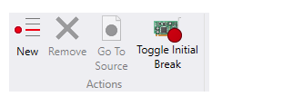
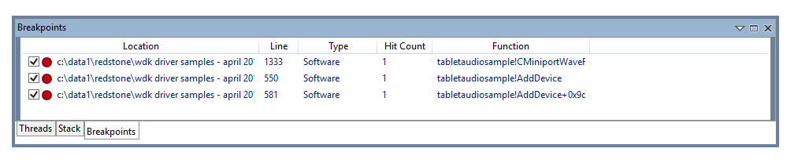

# WinDbg Preview - Breakpoints

This section describes how to work with breakpoints using the WinDbg preview debugger.

## Breakpoints Menu

Use the breakpoints menu to create new and remove existing breakpoints as well as toggle the initial breakpoint (initial breakpoint is currently kernel only).

## Breakpoints Window

Use the breakpoints window, opened via the View menu, to view, set and clear breakpoints. You can also double-click a breakpoint to open its source file.

The breakpoint window keep a running total of each time the breakpoint is hit.

The general process of working with breakpoints is similar to previous versions of WinDbg. For more information about setting breakpoints, see [Setting Breakpoints in WinDbg](setting-breakpoints-in-windbg.md).

 

