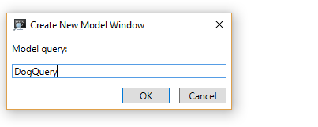

# WinDbg Preview - Data Model 

This section describes how to work with the data model menu in the WinDbg preview debugger.


## New Model Query

Use the New Model Query dialog to create a new model query using the dx command.

For example provide this string to examine the settings debugger objects. 

```
dx -r1 Debugger.Settings
```




## Data Model Explore

Use the data model explore to browse the data model objects.


## Change Query

Use change query to change the query that is used in data model explore.

>>> TBD or something like that -- need to check


## Display Mode

Use display mode to toggle between grid and hierarchy.


*Additional content pending*

 
## See Also

[Debugging Using WinDbg Preview](debugging-using-windbg-preview.md)
 
 

 

[Send comments about this topic to Microsoft](mailto:wsddocfb@microsoft.com?subject=Documentation%20feedback%20[debugger\debugger]:%20Debugging%20Using%20WinDbg%20%20RELEASE:%20%285/15/2017%29&body=%0A%0APRIVACY%20STATEMENT%0A%0AWe%20use%20your%20feedback%20to%20improve%20the%20documentation.%20We%20don't%20use%20your%20email%20address%20for%20any%20other%20purpose,%20and%20we'll%20remove%20your%20email%20address%20from%20our%20system%20after%20the%20issue%20that%20you're%20reporting%20is%20fixed.%20While%20we're%20working%20to%20fix%20this%20issue,%20we%20might%20send%20you%20an%20email%20message%20to%20ask%20for%20more%20info.%20Later,%20we%20might%20also%20send%20you%20an%20email%20message%20to%20let%20you%20know%20that%20we've%20addressed%20your%20feedback.%0A%0AFor%20more%20info%20about%20Microsoft's%20privacy%20policy,%20see%20http://privacy.microsoft.com/default.aspx. "Send comments about this topic to Microsoft")


