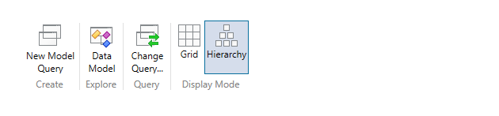
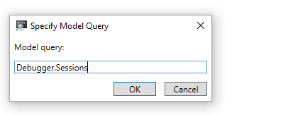
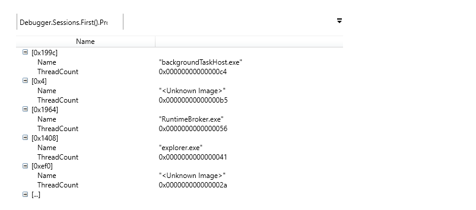
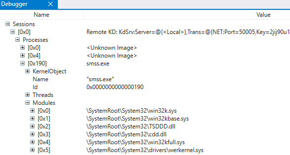
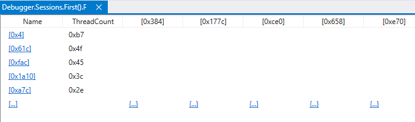
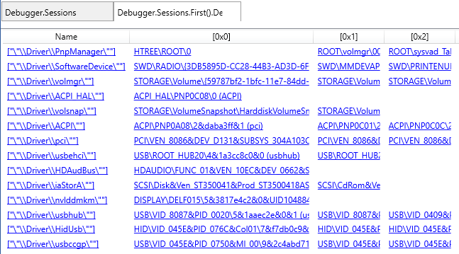

# WinDbg Preview - Data Model 

This section describes how to work with the data model menu in the WinDbg Preview debugger.




## New Model Query

Use the New Model Query dialog to create a new model query. You can put anything here you'd put into a normal `dx` command.

For example, specify `Debugger.Sessions` to examine the debugger sessions objects. 



For general information about the debugger objects refer to [dx (Display Debugger Object Model Expression)](dx--display-visualizer-variables-.md).

Use LINQ queries to dig deeper into the session. This query shows the top 5 processes running the most threads. 

```dbgcmd
Debugger.Sessions.First().Processes.Select(p => new { Name = p.Name, ThreadCount = p.Threads.Count() }).OrderByDescending(p => p.ThreadCount),5
```



## Data Model Explorer

Use the data model explorer to quickly browse every data model object in the `Debugger` namespace.




## Change Query

Use change query to change the query that is used in the active data model window.


## Display Mode

Use display mode to toggle between grid and hierarchy display mode. You can right-click column headers to hide or show more columns.

Grid mode can be useful to dig down in the objects. For example, here is the previous top threads query in grid view. 



When you click on any underlined item a new tab is opened and a query is run to display that information.


This query shows the devices in the plug and play device tree grouped by the name of the physical device object's driver.

```dbgcmd
Debugger.Sessions.First().Devices.DeviceTree.Flatten(n => n.Children).GroupBy(n => n.PhysicalDeviceObject->Driver->DriverName.ToDisplayString()) 
```


---
 
## See Also

[dx (Display Debugger Object Model Expression)](dx--display-visualizer-variables-.md)

[Debugging Using WinDbg Preview](debugging-using-windbg-preview.md)
 

 


