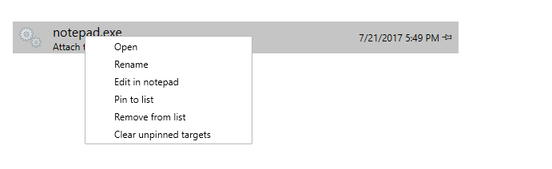

# WinDbg Preview - File Menu 

This topic describes how to how to use the file menu.

### Start debugging

When you first open the file menu, you'll see *Start debugging* and your recent debugger targets. Use *Start debugging* to configure new and open previous debugger sessions.

#### Recent

The recent list contains a list of your recent workspaces and debugger connections. For more information on working settings an workspaces see [WinDbg Preview Setup – Settings and workspaces](windbg-setup-preview.md).

You can use the right click menu to manage your workspaces, like pinning, renaming and moving them. As well as editing them in notepad.



#### Start a new session

Use the other tabs in the *Start debugging* section to start a new debugger session, like attaching or launching a process. For more information on starting a new session see [WinDbg Preview - Start a user-mode session](windbg-user-mode-preview.md)
and [WinDbg Preview - Start a kernel mode session](windbg-kernel-mode-preview.md)


### Save workspace

Use *Save workspace* to save the current workspace.

Session connection information is stored in workspace configuration files. Workspace files are stored with a .debugTarget file extension. 

The default location for workspace files is: 

```console
C:\Users\*UserName*\AppData\Local\DBG\targets
```

### Open source file

Use *Open source file* to open a source file. Do this when you want to work with additional source files that have not been loaded because of code execution. For more information on working with source files, see [Source Code Debugging in WinDbg](source-window.md)


### Open script

Use *Open script* to open an existing Javascript or NatVis script. For more information on working with scripts see [WinDbg Preview - Scripting Menu](windbg-scripting-preview.md).

### Settings

Use the settings menu to set the source and symbol path as well as choose the light and dark theme for the debugger. For more information on settings see [WinDbg Preview Setup – settings and workspaces](windbg-setup-preview.md).


### About
Use *About* to display build version information for the debugger. You can use also use this screen to view the Microsoft privacy statement.

---
 
## See Also

[Debugging Using WinDbg Preview](debugging-using-windbg-preview.md)
 


