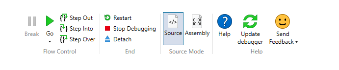

# WinDbg Preview - Home Menu 

This topic describes how to work with the home menu.

## Flow Control

Use the *Flow Control* buttons to break into a connected debugging target, resume code execution on the target and step in to and out of code.

## End

Use the *End* buttons to restart, detach and stop debugging.

## Source Mode

Use *Source Mode* buttons to toggle between source code and assembly views.

## Help (Support)

Use *Help* buttons to do the following:
- Review Help
- Send Feedback (For more information on sending feedback to improve WinDbg, see [Providing feedback](debugging-using-windbg-preview.md#providing-feedback).) 

 
## See Also

[Debugging Using WinDbg Preview](debugging-using-windbg-preview.md)
 

