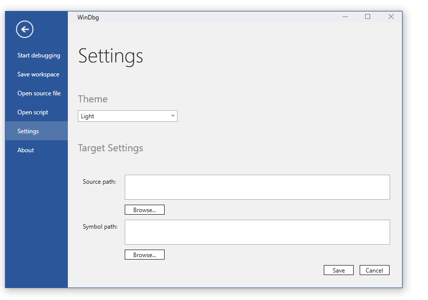

# WinDbg Preview - Settings and workspaces

This section describes how to setup and configure the WinDbg Preview debugger.


## Settings

Use the settings menu to set the source and symbol path as well as choose the light and dark theme for the debugger. 



For more information on setting the paths, see [Accessing Symbols for Debugging](accessing-symbols-for-debugging.md) and [Source Code Debugging in WinDbg](source-window.md).

## Workspaces

Workspaces allows you to save configuration information in the target connection information file.

The options in workspaces are saved upon closing the debugger or can be manually saved using *File* -> *Save Workspace*. 

Workspaces are automatically loaded when launching from the recent targets list or they can be manually loaded in the file menu. 

In addition to the target connection information, the following settings are stored in the workspaces file.

#### General Settings 
> [!NOTE]
> This list and format isn't final and is subject to change.

Setting | Default | Description
--- | --- | ---
FinalBreak |true | If true, ignores the final breakpoint (-g command-line option).
SourceDebugging |true  | Toggles between source or assembly mode.
DebugChildProcesses | false| (User mode only) If true will debug child processes launched by the target application. (-o command-line option).
Noninvasive | false  |  Specifies non-invasive attach (-pv command-line option).
NoDebugHeap | false  |  Specifies the debug heap should not be used (-hd command-line option).
Verbose | false  | When verbose mode is turned on, some display commands (such as register dumping) produce more detailed output. (-v command-line option).
Elevate | - |  Used internally by WinDbg - Do not modify.
Restartable | - |  Used internally by WinDbg - Do not modify.
UseImplicitCommandLine | false | Use implicit command-line (-cimp command-line option). This starts the debugger with an implicit command line instead of an explicit process to run.

For more information about the command line options, see [WinDbg Command-Line Options](windbg-command-line-options.md).


#### Symbol Settings 

Setting | Default | Description
--- | --- | ---
SymbolOptionsOverride | 0 | An explicit symbol option mask, in the form of a single hex number.
ShouldOverrideSymbolOptions | false | If set to *true* override all of the symbol options listed below with the provided  symbol option mask, described  above.
SymOptExactSymbols | false | This option causes the debugger to perform a strict evaluation of all symbol files.
SymOptFailCriticalErrors | false | This symbol option causes file access error dialog boxes to be suppressed.
SymOptIgnoreCvRec | false | This option causes the symbol handler to ignore the CV record in the loaded image header when searching for symbols. 
SymOptIgnoreNtSympath | false | This option causes the debugger to ignore the environment variable settings for the symbol path and the executable image path. 
SymOptNoCpp | false | This symbol option turns off C++ translation. When this symbol option is set, :: is replaced by __ in all symbols. 
SymOptNoUnqualifiedLoads | false | This symbol option disables the symbol handler's automatic loading of modules. When this option is set and the debugger attempts to match a symbol, it will only search modules which have already been loaded. 
SymOptAutoPublics | false | This symbol option causes DbgHelp to search the public symbol table in a .pdb file only as a last resort. If any matches are found when searching the private symbol data, the public symbols will not be searched. This improves symbol search speed. 
SymOptDebug | false | This symbol option turns on noisy symbol loading. This instructs the debugger to display information about its search for symbols.

For more information on symbol options, see [Symbol Options](symbol-options.md).


#### Window layout settings

 Window layout is saved globally and are not saved in the workspaces file. 


#### Workspaces XML file

The workspace and target connection information is stored in XML format. 

The following file, shows an example workspaces configuration file.

```xml
<?xml version="1.0" encoding="utf-8"?>
<TargetConfig Name="C:\paint.dmp" LastUsed="2017-08-03T21:34:20.1013837Z">
  <EngineConfig />
  <EngineOptions>
    <Property name="FinalBreak" value="true" />
    <Property name="SourceDebugging" value="true" />
    <Property name="DebugChildProcesses" value="false" />
    <Property name="Noninvasive" value="false" />
    <Property name="NoDebugHeap" value="false" />
    <Property name="Verbose" value="false" />
    <Property name="SymbolOptionsOverride" value="0" />
    <Property name="ShouldOverrideSymbolOptions" value="false" />
    <Property name="SymOptExactSymbols" value="false" />
    <Property name="SymOptFailCriticalErrors" value="false" />
    <Property name="SymOptIgnoreCvRec" value="false" />
    <Property name="SymOptIgnoreNtSympath" value="false" />
    <Property name="SymOptNoCpp" value="false" />
    <Property name="SymOptNoUnqualifiedLoads" value="false" />
    <Property name="SymOptAutoPublics" value="false" />
    <Property name="SymOptDebug" value="false" />
    <Property name="Elevate" value="false" />
    <Property name="Restartable" value="true" />
    <Property name="UseImplicitCommandLine" value="false" />
  </EngineOptions>
  <TargetOptions>
    <Option name="OpenDump">
      <Property name="DumpPath" value="C:\paint.dmp" />
    </Option>
  </TargetOptions>
</TargetConfig>
```

Note that this file format will continue to evolve as more features are added to the WinDbg Preview debugger.


---

## See Also

[Debugging Using WinDbg Preview](debugging-using-windbg-preview.md)


