# WinDbg Preview - Timelines


Time Travel Debugging (TTD) allows users to record traces, which are recordings of the execution of a program. Timelines  are a visual representation of events that happen during the execution. These events can be locations of: breakpoints, memory read/writes, function calls and returns, and exceptions.

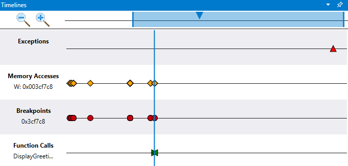

Use the timelines window to quickly view important events, understand relative position and easily jump to their location in your TTD trace file. Use multiple timelines to visually explore events in the time travel trace and discover event correlation.

The timelines window is displayed when opening a TTD trace file and shows key events without you having to manually create data model queries. At the same time, all of the time travel objects are available to allow for more complex data queries.

For more information about creating and working with Time Travel trace files, see [Time Travel Debugging - Overview](time-travel-debugging-overview.md).

## Types of Timelines

The timelines window can display the following events:

- Exceptions (you can further filter on a specific exception code)
- Breakpoints
- Function Calls (search in the form of module!function)
- Memory Accesses (read / write / execute between two memory addresses)

Hover over each event to get more information via tooltip. Clicking on an event will run the query for the event and display more information. Double-clicking an event will jump to that location in the TTD trace file.

### Exceptions

When you load a trace file and the timeline is active, it will display any exceptions in the recording automatically.

When you hover over a breakpoint information such as the exception type and the exception code are displayed.

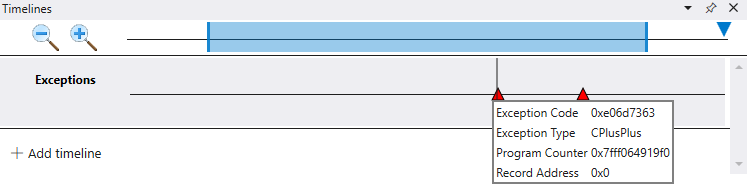

You can further filter on a specific exception code using the optional exception code field.

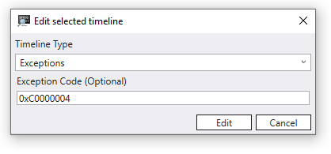

You can also add a new timeline for a specific exception type.

### Breakpoints

After adding a breakpoint, you can display the positions of when that breakpoint is hit on a timeline. This can be done for example using the [bp Set Breakpoint command](bp--bu--bm--set-breakpoint-.md). When you hover over a breakpoint the address and the instruction pointer associated with the breakpoint is displayed.

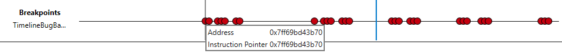

When the breakpoint is cleared, the associated breakpoint timeline is automatically removed.

### Function Calls

You can display the positions of function calls on the timeline. To do this provide the search in the form of `module!function`, for example `TimelineTestCode!multiplyTwo`. You can also specify wildcards, for example `TimelineTestCode!m*`.

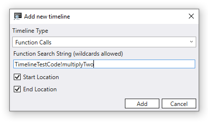

When you hover over a function call the  function name, input parameters, their values, and the return value are displayed. This example shows *buffer* and *size* since those are the parameters to DisplayGreeting!GetCppConGreeting.

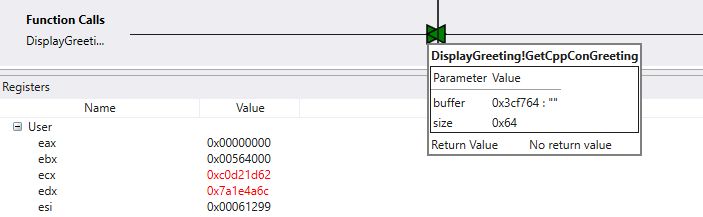

### Memory Access

Use the memory access timeline to display when a specific range of memory has been read or written to, or where code execution has taken place. A start and stop address is used to define a range between two memory addresses.

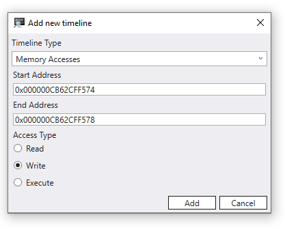

When you hover over a memory access item the value and the instruction pointer are displayed.

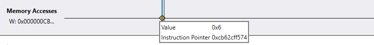

## Work with timelines

A vertical gray line follows the cursor when hovering over the timeline. The vertical blue line indicates the current position in the trace.

Click on the magnifying glass icons to zoom in and out on the timeline.

In the top timeline control area use the rectangle to pan the view of the timeline. Drag the outer delimiters of the rectangle to resize the current timeline view.

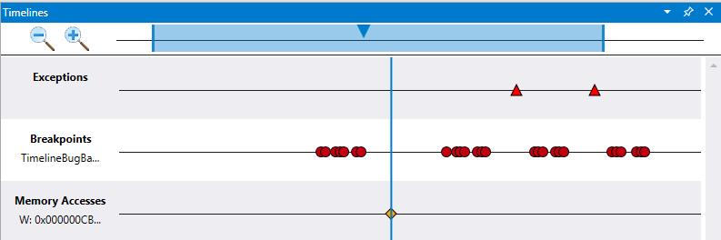

### Mouse Movements

Zoom in and out using Ctrl + Scroll wheel.

Pan from side to side using Shift + Scroll wheel.

## Timeline debugging techniques

To demonstrate debugging timeline techniques, the [Time Travel Debugging Walkthrough](time-travel-debugging-walkthrough.md) is reused here. This demonstration assumes that you have completed the first two steps to build the sample code and created the TTD recording using the first two steps described there.

[Section 1: Build the sample code](./time-travel-debugging-walkthrough.md#build)

[Section 2: Record a trace of the "DisplayGreeting" sample](./time-travel-debugging-walkthrough.md#record)

In this scenario, the first step is to find the exception in the time travel trace. This can be done by double clicking on the only exception that is on the timeline.

Looking in the command window we see the following command was issued when we clicked on the exception.

```dbgcmd
(2dcc.6600): Break instruction exception - code 80000003 (first/second chance not available)
Time Travel Position: CC:0
@$curprocess.TTD.Events.Where(t => t.Type == "Exception")[0x0].Position.SeekTo()
```

Select **View** >> **Registers** to display the registers at this point in the timeline to begin our investigation.

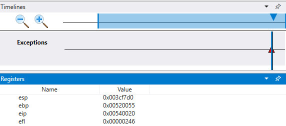

In the command output note that the stack (esp) and base pointer (ebp) are pointing to two very different addresses. This could indicate that stack corruption - possibly a function returned and then corrupted the stack. To validate this, we need to travel back to before the CPU state was corrupted and see if we can determine when the stack corruption occurred.

As we do that, we will examine the values of local variables and the stack.

Select **View** >> **Locals** to display the local values.

Select **View** >> **Stack** to display the code execution stack.

At the point of failure in trace it is common to end up a few steps after the true cause in error handling code. With time travel we can go back an instruction at a time, to locate the true root cause.

From the **Home** ribbon use the **Step Into Back** command to step back three instructions. As you do this, continue to examine the stack, locals and register windows.

The command window will display the time travel position and the registers as you step back three instructions.

```dbgcmd
0:000> t-
Time Travel Position: CB:41
eax=00000000 ebx=00564000 ecx=c0d21d62 edx=7a1e4a6c esi=00061299 edi=00061299
eip=00540020 esp=003cf7d0 ebp=00520055 iopl=0         nv up ei pl zr na pe nc
cs=0023  ss=002b  ds=002b  es=002b  fs=0053  gs=002b             efl=00000246
00540020 ??              ???
0:000> t-
Time Travel Position: CB:40
eax=00000000 ebx=00564000 ecx=c0d21d62 edx=7a1e4a6c esi=00061299 edi=00061299
eip=00061767 esp=003cf7cc ebp=00520055 iopl=0         nv up ei pl zr na pe nc
cs=0023  ss=002b  ds=002b  es=002b  fs=0053  gs=002b             efl=00000246
DisplayGreeting!main+0x57:
00061767 c3              ret
0:000> t-
Time Travel Position: CB:3A
eax=0000004c ebx=00564000 ecx=c0d21d62 edx=7a1e4a6c esi=00061299 edi=00061299
eip=0006175f esp=003cf718 ebp=003cf7c8 iopl=0         nv up ei pl nz na pe nc
cs=0023  ss=002b  ds=002b  es=002b  fs=0053  gs=002b             efl=00000206
DisplayGreeting!main+0x4f:
0006175f 33c0            xor     eax,eax
```

At this point in the trace our stack and base pointer have values that make more sense, so it appears that we have getting closer to the point in the code where the corruption occurred.

```dbgcmd
esp=003cf718 ebp=003cf7c8
```

Also of interest is that the locals window contains values from our target app and the source code window is highlighting the line of code that is ready to be executed in our source code at this point in the trace.

To further investigate, we can open up a memory window to view the contents near the stack pointer (esp) memory address. In this example it has a value of 003cf7c8. Select **Memory** >> **Text** >> **ASCII** to display the ASCII text stored at that address.

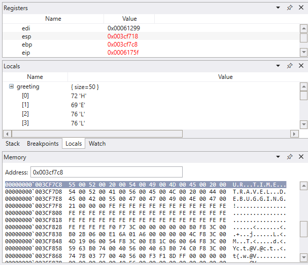

## Memory access timeline

After a memory location of interest has been identified, add a memory access timeline using that value. Click on **+ Add timeline** and fill in the starting address. We will look at 4 bytes, so adding that to the start address of 003cf7c8, we have 003cf7cb. The default is to look at all memory writes, but you can also look at just writes or code execution at that address.

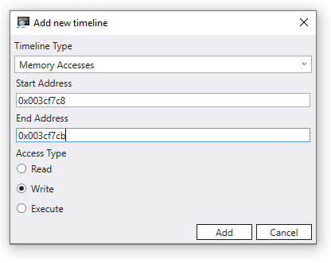

We can now traverse the timeline in reverse to examine at what point in this time travel trace this memory location was written to see what we can find. Clicking on this position in the timeline we see that locals value different values for the string being copied. The destination value appears to not be complete, as if the length of our string is not correct.

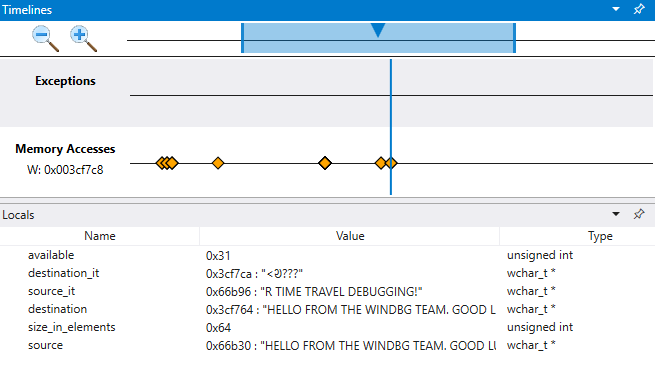

## Breakpoint timeline

Using breakpoints is a common approach to pause code execution at some event of interest. TTD allows you to set a breakpoint and travel back in time until that breakpoint is hit after the trace has been recorded. The ability to examine the process state after an issue has happened, to determine the best location for a breakpoint, enables additional debugging workflows unique to TTD.

To explore an alternative timeline debugging technique, click on the exception in the timeline and once again travel three steps back, using the **Step Into Back** command on the **Home** ribbon.  

In this very small sample it would be pretty easy to just look in the code, but if there are hundreds of lines of code and dozens of subroutines the techniques described here can be used to decrease the time necessary to locate the issue.

As mentioned earlier, the base pointer (esp) instead of pointing to an instruction, is pointing to our message text.

Use the ba command to set a breakpoint on memory access. We will set a w - write breakpoint to see when this area of memory is written to.

```dbgcmd
0:000> ba w4 003cf7c8
```

Although we will use a simple memory access breakpoint, breakpoints can be constructed to be more complex conditional statements. For more information, see [bp, bu, bm (Set Breakpoint)](bp--bu--bm--set-breakpoint-.md).

From the Home menu, select **Go Back** to travel back in time until the breakpoint is hit.

At this point we can examine the program stack to see what code is active.

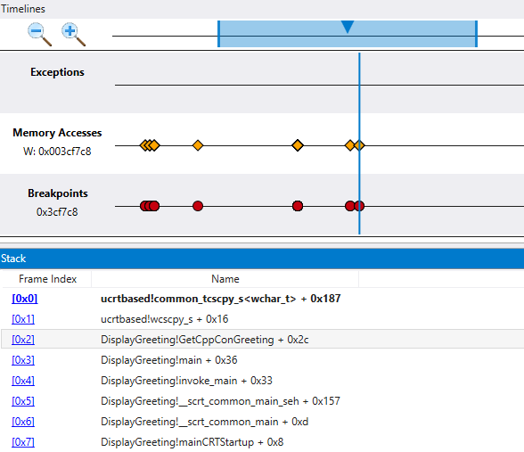

As it is very unlikely that the Microsoft provided wscpy_s() function would have a code bug like this, we look further in the stack. The stack shows that Greeting!main calls Greeting!GetCppConGreeting. In our very small code sample we could just open the code at this point and likely find the error pretty easily. But to illustrate the techniques that can be used with larger, more complex program, we will set add a function call timeline.

## Function call timeline

Click on **+ Add timeline** and fill in the `DisplayGreeting!GetCppConGreeting` for the function search string.

The Start and End location check boxes indicate that the start and end of a function call in the trace.

We can use the dx Command to display the function call object to see the associated TimeStart and TimeEnd fields which corresponds to Start Location and End Location of the function call.

```dbgcmd
dx @$cursession.TTD.Calls("DisplayGreeting!GetCppConGreeting")[0x0]
    EventType        : 0x0
    ThreadId         : 0x6600
    UniqueThreadId   : 0x2
    TimeStart        : 6D:BD [Time Travel]
    SystemTimeStart  : Thursday, October 31, 2019 23:36:05
    TimeEnd          : 6D:742 [Time Travel]
    SystemTimeEnd    : Thursday, October 31, 2019 23:36:05
    Function         : DisplayGreeting!GetCppConGreeting
    FunctionAddress  : 0x615a0
    ReturnAddress    : 0x61746
    Parameters  
```

Either the Start or End, or both the Start and End location boxes, must be checked.

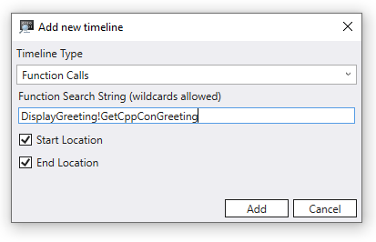

As our code is neither recursive or re-entrant, it is pretty easy to locate on the time line when the GetCppConGreeting method is called. The call to GetCppConGreeting also occurs at the same time as our breakpoint as well as the memory access event that we defined. So it looks like we have narrowed in on an area of code to look carefully at for the root cause of our application crash.

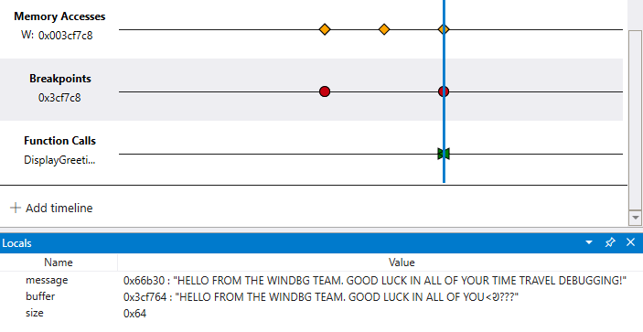

## Explore code execution by viewing multiple timelines

Although our code sample is small, the technique of using multiple timelines allows for visual exploration of a time travel trace. You can look across the trace file to ask questions, such as "when is an area of memory accessed before a breakpoint is hit?".

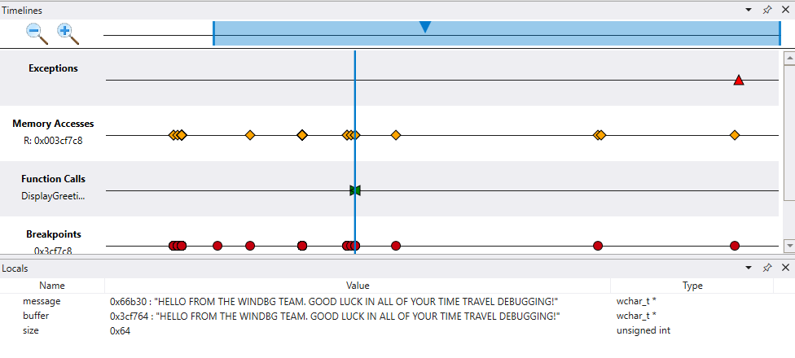

The ability to see additional correlations and find things you may not have expected, differentiates the timeline tool from interacting with the time travel trace using command line commands.

## Timeline Bookmarks

Bookmark important Time Travel positions in WinDbg instead of manually copy pasting the position to notepad. Bookmarks make it easier to view at a glance different positions in the trace relative to other events, and to annotate them.

You can provide a descriptive name for bookmarks.

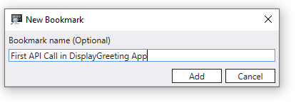

Access Bookmarks via the Timeline window available in *View > Timeline*. When you hover over a bookmark, it will display the bookmark name.

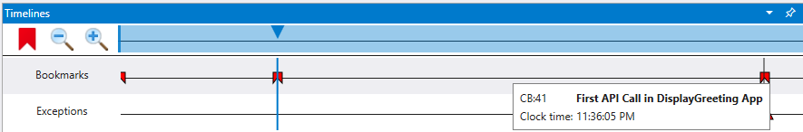

You can right click the bookmark to travel to that position, rename or delete the bookmark.

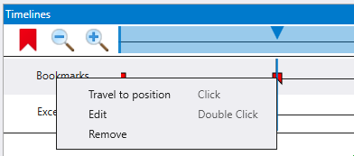

### See Also

[Debugging Using WinDbg Preview](debugging-using-windbg-preview.md)

[Time Travel Debugging Walkthrough](time-travel-debugging-walkthrough.md)
