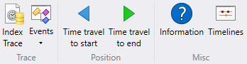

# WinDbg Preview - Time Travel Menu

This section describes how work with the time travel menu in WinDbg Preview.

For more information about time travel see [Time Travel Debugging - Overview](time-travel-debugging-overview.md).

## Trace

### Index Trace

Use the Index Trace option to force a re-index of a time travel trace.

### Events

Use the Events pull down to display either *Exceptions* or *Module load* events.

## Position

### Time travel to start

Use Time travel to start to move to the start of a time travel trace file.

### Time travel to end

Use Time travel to start to move to the end of a time travel trace file.

## Misc

### Information

Use Information to display information about the trace, such as size and number of threads.

### Timelines

Use the to Timelines option to access debugger timelines. For more information see [WinDbg Preview Timelines](windbg-timeline-preview.md).

## See Also

[Debugging Using WinDbg Preview](debugging-using-windbg-preview.md)
