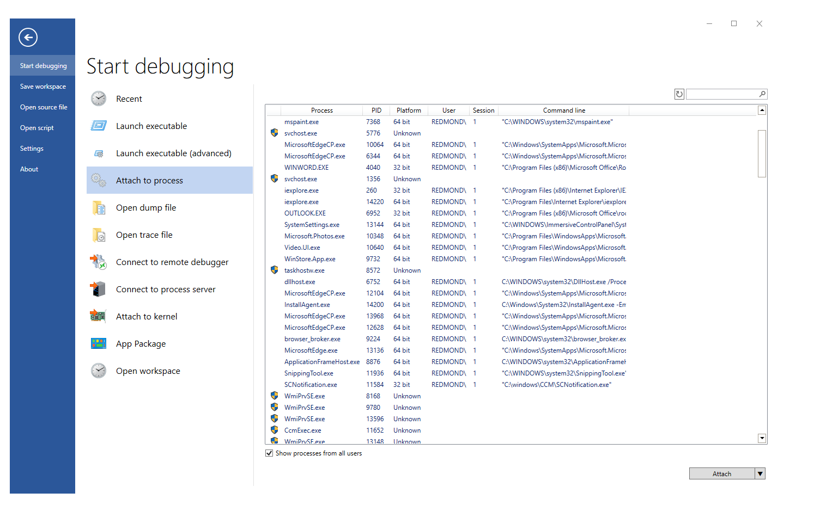

> [!NOTE]
> The information in this topic is preliminary. Updated information will be provided in a later release of the documentation. 
>

# WinDbg Preview - Start a user mode session  

This section describes how to start a user mode session with the WinDbg preview debugger.

Select *File*, *Start debugging*, and select either of these four options:

- *Launch Executable* - Starts an executable and attaches to it by browsing for the target.
- *Launch Executable (advanced)* - Starts an executable and attaches to it using a set of dialog boxes with advanced options.
- *Attach to a process* - Attaches to an existing process.
- *Launch App Package* - Launches and attaches to an app package.

All four options are described here.

## Launch Executable

Use this option to starts an executable and attach to it.

Browse to the desired executable in the provided file dialog and open it. 

## Launch Executable (advanced)

Use this option to start an executable and attach to it it using a set of text boxes with advanced options. 

Specify the following options:
- Path to the executable, such as *C:\Windows\notepad.exe*
- Optional arguments to provide to the executable when launched
- Optional start directory location

## Attach to a process

Use this option to attach to an existing process.

Select *Show process from all users* to show additional processes.

> [!NOTE]
> Items with a UAC shield will need the debugger to be elevated to attach.

Use the pull down dialog on the *Attach* button to select *non-invasive attach*.

## Launch App Package

Use this option to launch and attach to an app package. Use the search box to locate a specific app or background task. Use the Package Details button to display information about the package.

---

## See Also

[Debugging Using WinDbg Preview](debugging-using-windbg-preview.md)

