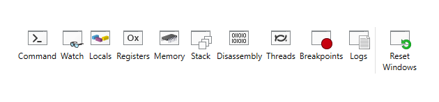
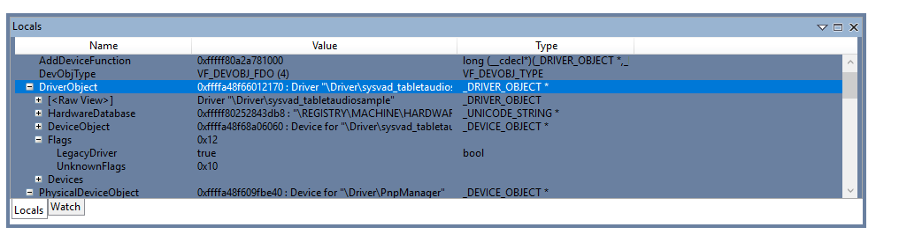

# WinDbg Preview - View Menu 

This section describes how work with the view menu in WinDbg Preview.

The view menu will open a new Window for each item, or bring focus to the existing Window, if one is already open.

## Command 
The command Window allows you to enter debugger commands. For more information about debugger commands, see [Debugger Commands](debugger-commands.md).

## Watch 

The watch Window allows you to watch local variables and registers. 

The locals and watch windows are both based off of the data model that is used by the dx command. This means the locals and watch windows will benefit from any NatVis or JavaScript extensions you have loaded, and support full LINQ queries, just like the dx command. For more information about the data model, see [WinDbg Preview - Data Model](windbg-data-model-preview.md).

## Locals
The locals window displays information about all of the local variables in the current scope. The locals window will highlight values that have changed during the previous code execution.

## Registers

Registers displays the contents of the processors registers when they are available. For more information about registers, see [Registers](registers.md) and [Viewing and Editing Registers in WinDbg](registers-window.md).

## Memory

Use the memory window to display memory locations. In addition to providing a memory address, you can use the  Pseudo-Register values such as $scopeip and $eventip to examine memory. Pre-append the @ symbol to use the pseudo-register values in the memory window, for example, `@$scopeip`. For more information, see [Pseudo-Register Syntax](pseudo-register-syntax.md)

## Stack 

Use the stack Window to view the current call stack. The stack window provides basic highlighting of the current frame. 

## Disassembly

The disassembly window highlights the current instruction and retains that position when you scroll. 

## Threads

The thread window highlights the current thread. 

## Breakpoints

Use the breakpoints window to view, enable and clear breakpoints.

## Logs

 This log is of the WinDbg Preview internals. It can be viewed to monitor long running processes and for troubleshooting the debugger itself. 
 
 You can continue to create a traditional debugger command log, using the .logopen command. For more information on that, see [Keeping a Log File in WinDbg](keeping-a-log-file-in-windbg.md).

## Reset Windows

Use this function to reset the debugger windows to their default positions. 

## See Also

[Debugging Using WinDbg Preview](debugging-using-windbg-preview.md)

 

 

