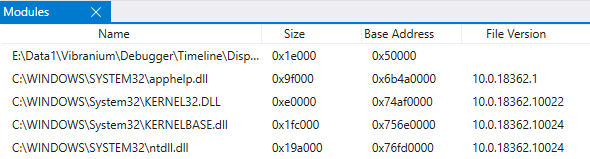

# WinDbg Preview - What's New


This topic provides information on what's new in the WinDbg Preview debugger.

## 1.2104.13002.0

### Smart number selection and search

A convenient productivity feature of WinDbgNext is the ability to detect patterns in the command window. To do this, select any text, and all other instances of that text highlighted. Because this highlighting is useful when looking at memory patterns, it now will also highlight equivalent numbers in other radixes,  no matter how the number is formatted in hex, decimal, or scientific notation. For more information about numbering schemes, see [n (Set Number Base)](n--set-number-base-.md)).

Example:

When selecting `0x000001e2fb3f6160`, all other instances are highlighted no matter the format.


This feature works with semi-temporary highlights as well. Ctrl + Double Click on a number to highlight all its instances. You can keep track of multiple important numbers throughout your command history this way (to clear the highlight, Ctrl + Double Click on the number again). Finally, this feature also works when searching numbers with Ctrl + F.

### Source Code Extended Access

The source path command (.srcpath, .lsrcpath (Set Source Path))[-srcpath---lsrcpath--set-source-path-.md] has been updated to include a new tag – *DebugInfoD*. For more information, see [Source Code Extended Access](source-code-extended-access.md).

### Host and guest states of WOW processes in the data model

When debugging a 32-bit WOW process from a 64-bit context, users can now access both the host and guest states within the data model.

32 bit guest state examples:

`dx @$curprocess.Environment`

`dx @$curthread.Environment`

`dx @$curthread.Stack`

64 bit host state examples:

`dx @$curprocess.NativeEnvironment`

`dx @$curthread.NativeEnvironment`

`dx @$curthread.NativeStack`


#### Javascript Debugging Improvements

Javascript loaded in the UI can now be directly debugged within the console using the .scriptdebug command. For more information, see [JavaScript Debugger Scripting - JavaScript Debugging](javascript-debugger-scripting.md#javascript-debugging).

### Accessibility improvements

With WinDbgNext we are committed to building a debugger that is inclusive to engineers with disabilities, we are continuously improving accessibility. The following improvements have been made.

- Command window links can now be clicked via the keyboard (Shift+Enter)
- Improved keyboard navigation of main menu
- Improved keyboard navigation of ribbon
- Increased contrast on UI elements

### New “Overwrite” data access type for Time Travel Debugger

Time Travel Debugger (TTD) now provides an “Overwrite” data access type. Memory queries such as `dx @$cursession.TTD.Memory()` now have an additional column showing the old values of writes.

### Other fixes, improvements, and updates

- Added feature to automatically detect and apply workaround for USB 3.1 hardware issue when both kernel debugging host and target are USB 3.1 controllers.
- Added a new UI shortcut: Ctrl + Shift + Click over a DML link will to copy it to the clipboard

## 1.0.2007.01003

**Timeline Bookmarks**

Bookmark important Time Travel positions in WinDbg instead of manually copy pasting the position to notepad. Bookmarks make it easier to view at a glance different positions in the trace relative to other events, and to annotate them. 

You can provide a descriptive name for bookmarks.


Access Bookmarks via the Timeline window available in *View > Timeline*. When you hover over a bookmark, it will display the bookmark name.


You can select and hold (or right-click) the bookmark to travel to that position, rename or delete the bookmark.


**Modules Window**

A new windows shows modules and their related information, it is available via the View ribbon.
It displays:

- The name of the module including the path location
- The size in bytes of the loaded module
- The base address that the module is loaded at
- The file version




**Thread names/descriptions available in live debugging**

Thread names that are set from SetThreadDescription are now available when doing live user-mode debugging. Thread names are available using the “~” command or the debugger data model.

```dbgconsole
0:000> ~
   0  Id: 53a0.5ffc Suspend: 1 Teb: 000000b1`db1ed000 Unfrozen "Hello world!"
   7  Id: 53a0.9114 Suspend: 1 Teb: 000000b1`db1ef000 Unfrozen
   8  Id: 53a0.2cc4 Suspend: 1 Teb: 000000b1`db1f1000 Unfrozen
   9  Id: 53a0.5c40 Suspend: 1 Teb: 000000b1`db1f3000 Unfrozen

0:000> dx @$curthread
@$curthread                 : ConsoleTestApp!ILT+25(mainCRTStartup) (00007ff7`fac7101e)  [Switch To]
    Id               : 0x5ffc
    Name             : Hello world!
    Stack
    Registers
    Environment
```

**Portable PDB support**

Portable PDB support has been added. The Portable PDB (Program Database) format describes an encoding of debugging information produced by compilers of Common Language Infrastructure (CLI) languages and consumed by debuggers and other tools. For more information, see [Portable PDB Symbols](symbols-portable-pdb.md).

**Other changes and bug fixes**

- WinDbg now supports AMD64 and Linux kernel dump debugging.
- Time travel recording enhancements and other fixes.

## 1.0.1912.11001

**TTD Timelines** - We've added a new window that displays a visual representation of important events in your trace: exceptions, breakpoints, function calls, and memory accesses. Timelines will automatically open and display exceptions (if present) and breakpoints. For more information, see [WinDbg Preview - Timeline](windbg-timeline-preview.md).

**Switched to default window chrome** - The custom window chrome we were using, while prettier, was causing some scaling and resizing issues for a notable number of people, so we’ve opted to remove it for the time being.

**File menu improved keyboard navigation** - The file menu is now much easier to navigate with just a keyboard.

**Other changes and bug fixes**

* The stack and locals window will now be disabled when your target is running and won’t show “Unspecified error” when there is no target.
* Added a “Services” column to the attach dialog to easily find which services are running.
* Fixed a bug that caused architecture detection to not work when launching applications with arguments.
* The disassembly window has improved disassembly when private symbols are loaded.
* jsprovider.dll is now loaded automatically, so we removed the “Load JSProvider” button from the scripting ribbon.

## 1.0.1908.30002

**Improvements to TTD Calls objects** - [Calls queries](./time-travel-debugging-calls-objects.md) now include parameter names, types, and values. When querying across traces for function calls you can get fully typed parameters and their values making it easy to filter down results by parameters.

**Support for Open Enclave** - WinDbg Preview can now debug Open Enclave (OE) applications for more information, see [Open Enclave debugging](open-enclave-debugging.md)).

**VS Code Extension** - To make it easier to develop for Open Enclave, we’ve released a basic VS Code extension to enable a quicker inner loop. Variables, Watch, and Call Stack windows all work as well as breakpoints and source windows, any deeper debugging will need to use the console window.
 
You can find the extension in the [VS Code Marketplace](https://aka.ms/CDBVSCode) and report any issues to our  [WinDbg Feedback GitHub](https://aka.ms/dexex). Note that while the extension may work for other scenarios, we’re only intending on fixing issues related to OE scenarios at this point.

**ELF Core Dumps** - As part of supporting Open Enclave, WinDbg can open ELF core dumps and binaries as well as DWARF symbols (DWARF 5 is not currently supported) from both Enclaves and Linux applications. When opening a core dump from a non-Windows application, basic windows and commands should all work properly, but most extensions and Windows-specific commands will not work. ELF and DWARF files will be downloaded from symbol servers following the [key conventions defined here](https://github.com/dotnet/symstore/blob/master/docs/specs/SSQP_Key_Conventions.md). Enclaves are the only supported scenario, but we’re open to feedback on opening other Linux core dumps.

**TTD File format change** - We’ve made a major update to the file format for TTD traces that breaks forward compatibility. Previous versions of WinDbg Preview will not be able to open traces recorded with this (and future) versions of WinDbg Preview, but this (and future) versions will be able to open both new and old traces.

**Other changes**

* TTD will now use the 64-bit engine for indexing and the appropriate debugger engine bitness for replays to minimize potential memory issues when indexing and SOS issues when replaying.
* Running 'dx' without any parameters will now show the root namespace for easier browsability.
* You can now modify the default symbol and source cache location via the settings menu.
* Improved support for recording AVX-512 (recording of AVX-512 will cause a larger than normal slow-down).
* We've enabled [offline licensing](/windows/uwp/publish/organizational-licensing#allowing-disconnected-offline-licensing).

## 1.0.1905.12001

**Improvements to SymSetDiaSession error mitigation** - Our fix last month to mitigate the error caused by applications injecting DbgHelp into our process was still not working in some scenarios. We've made improvements to it and will continue to monitor feedback on this error.

**Accent color customization** - A lot of scenarios need several instances of WinDbg open, and moving back and forth between them can be confusing and take some time to figure out which one is the “right” one. We’ve added the ability to change the blue accent color to help visually distinguish sessions and make swapping between them easier.

Just select the **View** ribbon and select an option for **Accent color** in the last section. When future sessions are launched from recent targets, the accent color will be persisted as part of the target’s workspace.

**Source tokenization improvements** - The source window now has basic support for tokenizing Rust source files and C++ SEH __try/__except/__finally/__leave.

**Coroutine improvements** - Improved support for coroutine local variables and certain optimized variables.

**Default symbol and source cache setting** - Added an option to the settings menu under **Debugging settings** to change the cache location for symbols. **Note** - There’s a known issue that making this blank will cause source loading to fail. We’ll be adding validation to prevent this from happening in a future release.

**-pv fixes** - Fixed a bug that may have prevented -pv (non-invasive attach) from working in some circumstances.

## 1.0.1904.18001

**Fix for SymSetDiaSession error** - We've had reports for a while of an error that prevents WinDbg Preview from being launched in some situations. There are a few external applications that attempt to inject a version of DbgHelp into our process before we load it. Some of them are using a version of DbgHelp with missing functionality, which causes this error when we attempt to use those features. We've added a fix for this and will be tracking if there are still scenarios in which it occurs.

**Font control** - We've added settings for controlling font and font size. There are two different settings, one for text windows (mono-spaced windows like disassembly, source, command, etc.) and one for tool windows (locals, stack, etc.). There's still a few areas that aren't affected by these options that we'll be updating in the future.

**Highlighting improvements** - Persistent highlighting of text in the command window will now also highlight text in the source and notes windows.

**Source loading improvements** - We've changed how loading source files works. Previously when opening a source file, engine operations like running additional commands weren't possible or were unpredictable. We've changed where the loading occurs to enable better parallelism and more reliable cancellation of source opening operations.

Other changes and bug fixes:

* Added "Go to disassembly" to the context menu of the source window.
* Added a checkbox to "Follow current instruction" in disassembly window.
* Fixed a bug that caused the command window to perform slowly when outputting lots of text.
* Changed page up and page down keys to perform similar to Visual Studio.
* When an ASM file is opened in the source window it will now have basic comment, string, and directive highlighting


## 1.0.1812.12001

This version includes these updates.

**Debugger data model C++ header** - There is a new C++ header, DbgModel.h, included as part of the Windows SDK for extending the debugger data model via C++. You can find more information in [Debugger Data Model C++ Overview](./data-model-cpp-overview.md). This release includes a new extension that adds some more "API style" features to the debugger data model that can be accessed through the 'dx' command, JavaScript, and the new DbgModel.h header. This extension extensions the data model to include knowledge about assembly and code execution through the [Debugger.Utility.Code](./dbgmodel-namespace-code.md) namespace, and the local file system through the [Debugger.Utility.FileSystem namespace](./dbgmodel-namespace-file-system.md).

**Synthetic types extension** With this new API extension, we have a new sample up on our GitHub repo here - https://github.com/Microsoft/WinDbg-Samples/tree/master/SyntheticTypes. This JavaScript extension reads basic C header files and defines synthetic type information for the structures and unions defined in the header. Through the dx command, memory can then be viewed structured as if you had a PDB with type information for those types.

Other changes and bug fixes:

- WinDbg Preview will now more intelligently handle bringing source windows or the disassembly window to the foreground when stepping.
- Re-arranged WinDbgNext's window title to have more important information at the start when kernel debugging.
- The alternating background contrast in the command window should be slightly more noticeable.

## 1.0.1810.2001

This version includes these updates.

- New Settings dialog that is accessed from the File menu or the Home ribbon. 
- Events and exceptions settings dialog. This menu changes how the debugger handles events and exceptions, the equivalent of the 'sx' commands or WinDbg's event filters dialog. Select **Settings** on the home ribbon, then hit "Events and Exceptions" on the left to manage those.
- Improved TTD indexer with better performance. This increases the performance of indexing TTD trace files, making the indexing process much faster (between 2x-10x) while making index files much smaller (~50% smaller). The perf improvements are most noticeable for traces over 4GB in size, or when using a machine with many CPU cores (8+). The new indexer makes it more feasible to debug very large traces (50GB+).
- New *debugArch* launch flag for specifying architecture. WinDbg Preview attempts to launch the debugger engine with the correct bitness to the target to better support debugging managed code. There are circumstances where it can't determine the right bitness or you may want to override what it decides. Use -debugArch x86|amd64 to control the architecture of debugger engine.

Other changes and bug fixes:

-  Fixed a bug that would cause black bars to appear on a full screen debugger with a floating window open.
-  Fixed a bug that would cause symbol options to be cleared unintentionally.
-  Command history is now preserved when launching from recent targets.
-  In the data model window, you can now edit values.
-  Un-indexed TTD traces will now be more clear that they're un-indexed.
-  Improved performance of the locals window
-  Added a ribbon button to save the command window logs to a file.
-  Added . SelectMany(<projection>) to the default set of LINQ methods.

## 1.0.1807.11002

This version includes these updates.

**Automatic saving and loading of breakpoints**. This is a first step to replace workspaces. We’re starting down that route by enabling the saving and loading of breakpoints. Launching something you’ve debugged previously from the “Recents” tab in the file menu will now load the breakpoints from that session. The plan is to expand this functionality to preserve more information across sessions. Hardware breakpoints (ba) and other various properties on breakpoints like thread and process specific contexts as well as conditions are not currently being saved.
 
Minor changes and bug fixes:

- Added command-line options -x, -xe, -xd, -xn, and -xi for controlling the handling of exceptions and events. These command-line options behave just like their command counter-parts.
- The notes window now supports bold, underline, and italics formatting.
- Fixed some zoom and scrolling issues.
- Selecting text in the command, memory, sources, or disassembly windows will now show a light highlight over other instances of the selected text.
- Fixed a bug where interrupting symbol loading would cause symbol loading to fail for the rest of the session.
- NatVis will now reload properly on restarting a session.

## 1.0.1805.17002

This version includes these updates.

**New disassembly window** - The disassembly window now includes:
- Scrolling up or down will continuously load more disassembly whenever possible.
- Syntax highlighting for numbers, code addresses, and opcodes.
- Selecting a code symbol will jump the disassembly window to that location.
- Hovering over numbers will show a tooltip that converts that number to other bases.
- Headers signifying the start of a function.

**Faster source window** - The source window has been updated to be faster and more resource efficient.

Minor changes and bug fixes:

- Fixed issues around symbol caching
- Fixed some cases where toggle initial break wasn’t usable when the target isn't broken in
- If you hit tab in the command window with nothing available, the cursor will now stay in the input field
- WinDbgNext will now auto-detect bitness when opening CAB files

## 1.0.1804.18003

This version includes these updates.

**Symbol status and cancellation improvements** - There are time where the debugger display *BUSY* loading symbols and it’s difficult to determine what it’s doing and why without !sym noisy enabled. We’ve updated WinDbg Preview to have some better communication around what it’s doing when loading symbols to help troubleshoot any issues.
In addition to easily seeing exactly what’s happening, we’ve made some changes that should make cancelling symbols more reliable and the Logs window will contain some of the details that’s normally output when !sym noisy is enabled. If you hit View -> Logs you’ll get the full noisy symbol loading output without having to turn it on and attempt to reload the symbols.

**Experimental notes window** - WinDbg Preview now has a window for taking notes. Just hit View -> “Notes” to open it. If you copy/paste into it, DML links will be preserved and still work as if it was the command window. You can also save and load notes files from the “Notes” ribbon when the window is open. 

**Experimental faster source window** - To help improve the performance of WinDbg Preview there us a  experimental new source window that is quite a bit more efficient. There’s still a few gaps around context menus and syntax highlighting, but we want to give everyone the option of trying it out before it’s finished to give us early feedback. Run $UseFastSourceWindow to use it. If you want to go back to the old one, run $UseMonacoSourceWindow. The setting will preserve across sessions, you will need to close and re-open source windows to get the new version.

**JSProvider API version 1.2** - For JavaScript extensions that declare support for API version 1.2:

- Any object with a .compareTo method which exits the script will have a custom comparator on it (comparison operators will work in the DX evaluator and elsewhere: e.g.: IModelObject::Compare)
- Any object with a .equals method which exits the script will have a custom equality operator on it (== and != will work in the DX evaluator and elsewhere: e.g.: IModelObject::IsEqualTo)
- Native or data model objects which enter the script will have .compareTo and .equals on them which allow access to any custom comparator or custom equality implementations.
 
Minor changes and bug fixes:

- .server will now list fully qualified domain name for easier use when there’s domain issues around short names.
- Ctrl+G now works in the source window.
- Added address bar to the disassembly window.
- WinDbg Preview will now handle _NT_SYMBOL_PATH in a more expected way.
- Added -server command-line option.
- TTD data model queries can now be displayed progressively, so if you interrupt it you’ll still see some results. This feature is still experimental and optional. Run `dx @$cursession.TTD.AsyncQueryEnabled = 1` to enable it.
- The ‘dps’ command now has links to the source files it refers to.

## 1.1801.19001.0

This version includes these updates.

**Text Highlighting** - You can now highlight all instances of selected text directly in the debugger. To use this feature, just select some text in the command window and then select “Highlight” in the command ribbon or hit CTRL+ALT+H. Using one of those on already highlighted text will remove the highlighting.

If you prefer using commands, you can use the “$hl” command:

`$hl ["someValueHere"]` - Highlight give text (or un-highlight if already highlighted)

`$hl clearAll` – Clear all highlighted entries

`$hl caseSensitive [1|0]` - Set highlight matching to case sensitive or case insensitive (default is case insensitive)

This release also includes some minor bug fixes.


## 1.1712.15003.0

This version includes these updates.

**TTD memory queries** - You can now query TTD for memory accesses similar to how you query for calls today. This allows you to find all of the reads, writes and execution which access a specific range of memory.

Read and write example: `dx @$cursession.TTD.Memory(startAddress, endAddress, "rw")`

Unique execution example: `dx @$cursession.TTD.Memory(startAddress, endAddress, "ec")`

**Settings changes** - WinDbg Preview will now automatically save settings between sessions, including your symbol path and source path.

**JavaScript Improvements**

- 64-bit numbers and numerics in JavaScript now contain a modulo method allowing a true 64-bit modulo operation.
- Objects defined in JavaScript can now implement a custom comparable or equatable notion which will work in dx using standard C++ operators or in LINQ operations. In order to utilize this, the script must declare in the initializeScript array that it supports a new version of the host API by inserting a record “new host.apiVersionSupport(1, 2)”. After you’ve done that you can use these functions in any ‘dx’ or Data Model Window LINQ query. If the method implements .compareTo(other), it is comparable (comparison operators work in dx and LINQ). If the method returns a negative value, such as “this < other”. If the method returns zero, “this == other”. If the method returns a positive value “this > other”. If the method implements .equals(other), it is equatable (== works in dx and LINQ). The method must return either true or false.

Minor changes and bug fixes:

- Fixed a bug where the stack and locals windows weren’t working during boot debugging
- Updated the output of LM to more accurately report ProductVersion and similar fields
- Enabled the “step out back” button during TTD sessions
- Added support for -lsrcpath
- The headers in the locals, watch, and model windows now don’t disappear when scrolling down
- When ALT+Tabbing back to WinDbg Preview, the command window will properly preserve cursor location
- Added CTRL+ALT+V shortcut for toggling verbose mode
- You can now disable auto-scrolling of the command window by selecting and holding (or right-clicking) the command window tab and choosing “turn off auto scrolling”
- You can now debug child processes through the launch executable advanced page.


## 1.0.14.0

This version includes these updates.

**Improved process server experience** -  A new notification in the File menu to show what process server you’re connected to and interacting with has been added. As part of these changes, when ending a debugging session, the process server connection will persist and can be disconnected in the File menu.

**New pre-set layout options in the View ribbon** - There is a new “Layouts” option in the “View” ribbon. There are currently three layouts: the default, one focused on disassembly, and one minimal. 

**Time Travel Debugging ribbon** - There is an enhanced Time Travel ribbon that will show up when debugging a time travel debugging trace.

**Metadata from JavaScript scripts** - JavaScript extensions can now return metadata for properties and other constructs. This means that the extension can provide help strings, indicate the display radix for values, and more. Metadata is provided by placing a metadata descriptor on an object via either presence of Symbol.metadataDescriptor or an explicit call to host.metadata.defineMetadata. Function returns, iterated values, and other value contexts can return metadata for their value via host.metadata.valueWithMetadata.

**JavaScript API updates** - Some potentially source level breaking changes were made to the APIs within the JavaScript provider (including new projected methods and properties on native objects). Existing extensions will not see any of the potentially breaking changes without indicating that they support a new version of the JsProvider API. Support for the new API version is indicated by placing a host.apiVersionSupport record in the array returned by initializeScript with a claim of supporting version 1.1. maybe? .. with a value indicating support for version 1.1.

Changes in API version 1.1 include:

- host.getModuleSymbol and host.getModuleType return null if they cannot find the symbol instead of throwing an exception.
- All native objects have the address property on them in addition to .targetLocation. If the object does not have an address, an exception will be thrown when accessing the property.
- All native objects have new .getObjectValue and .setObjectValue methods on them to access properties on the object which may conflict with names JavaScript places on the object (e.g.: ‘address’) .

**Additional JavaScript changes**

- JavaScript extensions can now add and remove properties on data model objects via Object.defineProperty and the delete operator. Adding or registering a JavaScript class as a parent model or type signature is still the strongly preferred way of manipulating the object model.
- JavaScript extensions can now modify global variables within modules in the debug target through a new host.setModuleSymbol API.
- All of the math functions which are on the 64-bit library type (e.g.: .add, .subtract, .multiply, .divide, etc…) are now present on JavaScript numbers as well.
- JavaScript functions and properties can now return values which are enums through custom marshaling. A function or property accessor can return host.typeSystem.marshalAs(value, type…) in order to evoke such custom marshaling.
- The breakpoint command in the script debugger can now break on function names in addition to line/column positions.
- Type objects in JavaScript extensions have access to their containing module through the .containingModule property.

Minor changes and bug fixes:

- Fixed formatting of conditional ribbon tabs to be less confusing.
- Re-worked DML to be stricter in parsing to improve performance.
- Various fixes with the performance and behavior of CTRL+F.
- Added a warning when running un-elevated prior to trying to use TTD.
- Added the option to override automatic target bitness detection.
- Disabled various file menu and ribbon options when they can’t be used (like “Go” when in a dump file).

Known issues:
- SOS will not work on x86 traces.

## 1.0.13.0

This version adds Time Travel Tracing. Time Travel Debugging, allows you to record a process, then replay it later both forwards and backwards. Time Travel Debugging (TTD) can help you debug issues easier by letting you "rewind" your debugger session, instead of having to reproduce the issue until you find the bug. For more information, see [Time Travel Debugging - Overview](time-travel-debugging-overview.md).

## 1.0.12.0

This version was the first release of WinDbg Preview. For general information on the features available in WinDbg Preview, [Debugging Using WinDbg Preview](debugging-using-windbg-preview.md).

## See Also

[WinDbg Preview – Installation](windbg-install-preview.md)

[WinDbg Preview – Command line startup options](windbg-command-line-preview.md)