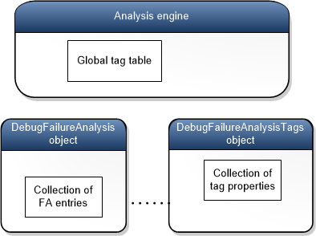

# Writing an Analysis Extension Plugin to Extend !analyze


You can extend the capabilities of the [**!analyze**](-analyze.md) debugger command by writing an analysis extension plugin. By providing an analysis extension plugin, you can participate in the analysis of a bug check or an exception in a way that is specific to your own component or application.

When you write an analysis extension plugin, you also write a metadata file that describes the situations for which you want your plugin to be called. When [**!analyze**](-analyze.md) runs, it locates, loads, and runs the appropriate analysis extension plugins.

To write an analysis extension plugin and make it available to [**!analyze**](-analyze.md), follow these steps.

-   Create a DLL that exports an [**\_EFN\_Analyze**](https://msdn.microsoft.com/library/windows/hardware/jj983432) function.
-   Create a metadata file that has the same name as your DLL and an extension of .alz. For example, if your DLL is named MyAnalyzer.dll, your metadata file must be named MyAnalyzer.alz. For information about how to create a metadata file, see [Metadata Files for Analysis Extensions](metadata-files-for-analysis-extensions.md). Place the metadata file in the same directory as your DLL.
-   In the debugger, use the [**.extpath**](-extpath--set-extension-path-.md) command to add your directory to the extension file path. For example, if your DLL and metadata file are in the folder named c:\\MyAnalyzer, enter the command **.extpath+ c:\\MyAnalyzer**.

When the [**!analyze**](-analyze.md) command runs in the debugger, the analysis engine looks in the extension file path for metadata files that have the .alz extension. The analysis engine reads the metadata files to determine which analysis extension plugins should be loaded. For example, suppose the analysis engine is running in response to Bug Check 0xA IRQL\_NOT\_LESS\_OR\_EQUAL, and it reads a metadata file named MyAnalyzer.alz that contains the following entries.

```text
PluginId       MyPlugin
DebuggeeClass  Kernel
BugCheckCode   0xA
BugCheckCode   0xE2
```

The entry `BugCheckCode  0x0A` specifies that this plugin wants to participate in the analysis of Bug Check 0xA, so the analysis engine loads MyAnalyzer.dll (which must be in the same directory as MyAnalyzer.alz) and calls its [**\_EFN\_Analyze**](https://msdn.microsoft.com/library/windows/hardware/jj983432) function.

**Note**  The last line of the metadata file must end with a newline character.

 

## <span id="Skeleton_Example"></span><span id="skeleton-example"></span><span id="SKELETON_EXAMPLE"></span>Skeleton Example


Here is a skeleton example that you can use as a starting point.

1.  Build a DLL named MyAnalyzer.dll that exports the [**\_EFN\_Analyze**](https://msdn.microsoft.com/library/windows/hardware/jj983432) function shown here.

    ```cpp
    #include <windows.h>
    #define KDEXT_64BIT
    #include <wdbgexts.h>
    #include <dbgeng.h>
    #include <extsfns.h>

    extern "C" __declspec(dllexport) HRESULT _EFN_Analyze(_In_ PDEBUG_CLIENT4 Client, 
       _In_ FA_EXTENSION_PLUGIN_PHASE CallPhase, _In_ PDEBUG_FAILURE_ANALYSIS2 pAnalysis)
    { 
       HRESULT hr = E_FAIL;

       PDEBUG_CONTROL pControl = NULL;
       hr = Client->QueryInterface(__uuidof(IDebugControl), (void**)&pControl);

       if(S_OK == hr && NULL != pControl)
       {
          IDebugFAEntryTags* pTags = NULL;
          pAnalysis->GetDebugFATagControl(&pTags);

          if(NULL != pTags)
          {
             if(FA_PLUGIN_INITILIZATION == CallPhase)
             { 
                pControl->Output(DEBUG_OUTPUT_NORMAL, "My analyzer: initialization\n");  
             }
             else if(FA_PLUGIN_STACK_ANALYSIS == CallPhase)
             {
                pControl->Output(DEBUG_OUTPUT_NORMAL, "My analyzer: stack analysis\n"); 
             }
             else if(FA_PLUGIN_PRE_BUCKETING == CallPhase)
             {
                pControl->Output(DEBUG_OUTPUT_NORMAL, "My analyzer: prebucketing\n");
             }
             else if(FA_PLUGIN_POST_BUCKETING == CallPhase)
             {
                pControl->Output(DEBUG_OUTPUT_NORMAL, "My analyzer: post bucketing\n");    
                FA_ENTRY_TYPE entryType = pTags->GetType(DEBUG_FLR_BUGCHECK_CODE);       
                pControl->Output(DEBUG_OUTPUT_NORMAL, "The data type for the DEBUG_FLR_BUGCHECK_CODE tag is 0x%x.\n\n", entryType);
             }
          }

          pControl->Release();
       }
       return hr;
    }
    ```

2.  Create a metadata file named MyAnalyzer.alz that has the following entries.

    ```text
    PluginId      MyPlugin
    DebuggeeClass Kernel
    BugCheckCode  0xE2
    ```

    **Note**  The last line of the metadata file must end with a newline character.

     

3.  Establish a kernel-mode debugging session between a host and target computer.

4.  On the host computer, put MyAnalyzer.dll and MyAnalyzer.alz in the folder c:\\MyAnalyzer.

5.  On the host computer, in the debugger, enter these commands.

    **.extpath+ c:\\MyAnalyzer**

    **.crash**

6.  The [**.crash**](-crash--force-system-crash-.md) command generates Bug Check 0xE2 MANUALLY\_INITIATED\_CRASH on the target computer, which causes a break in to the debugger on the host computer. The bug check analysis engine (running in the debugger on the host computer) reads MyAnalyzer.alz and sees that MyAnalyzer.dll is able to participate in analyzing bug check 0xE2. So the analysis engine loads MyAnalyzer.dll and calls its [**\_EFN\_Analyze**](https://msdn.microsoft.com/library/windows/hardware/jj983432) function.

    Verify that you see output similar to the following in the debugger.

    ```dbgcmd
    *                        Bugcheck Analysis                                    *
    *                                                                             *
    *******************************************************************************

    Use !analyze -v to get detailed debugging information.

    BugCheck E2, {0, 0, 0, 0}

    My analyzer: initialization
    My analyzer: stack analysis
    My analyzer: prebucketing
    My analyzer: post bucketing
    The data type for the DEBUG_FLR_BUGCHECK_CODE tag is 0x1.
    ```

The preceding debugger output shows that the analysis engine called the [**\_EFN\_Analyze**](https://msdn.microsoft.com/library/windows/hardware/jj983432) function four times: once for each phase of the analysis. The analysis engine passes the **\_EFN\_Analyze** function two interface pointers. *Client* is an [**IDebugClient4**](https://msdn.microsoft.com/library/windows/hardware/ff550494) interface, and *pAnalysis* is an [**IDebugFailureAnalysis2**](https://msdn.microsoft.com/library/windows/hardware/jj983405) interface. The code in the preceding skeleton example shows how to obtain two more interface pointers. `Client->QueryInterface` gets an [**IDebugControl**](https://msdn.microsoft.com/library/windows/hardware/ff550508) interface, and `pAnalysis->GetDebugFATagControl` gets an **IDebugFAEntryTags** interface.

## <span id="failure-analysis-entries-tags-and-data-types"></span><span id="FAILURE_ANALYSIS_ENTRIES_TAGS_AND_DATA_TYPES"></span>Failure Analysis Entries, Tags, and Data Types


The analysis engine creates a [**DebugFailureAnalysis**](https://msdn.microsoft.com/library/windows/hardware/jj983405) object to organize the data related to a particular code failure. A **DebugFailureAnalysis** object has a collection of [failure analysis entries](failure-analysis-entries.md) (FA entries), each of which is represented by an **FA\_ENTRY** structure. An analysis extension plugin uses the **IDebugFailureAnalysis2** interface to get access to this collection of FA entries. Each FA entry has a tag that identifies the kind of information that the entry contains. For example, an FA entry might have the tag **DEBUG\_FLR\_BUGCHECK\_CODE**, which tells us that the entry contains a bug check code. Tags are values in the **DEBUG\_FLR\_PARAM\_TYPE** enumeration (defined in extsfns.h), which is also called the **FA\_TAG** enumeration.

```cpp
typedef enum _DEBUG_FLR_PARAM_TYPE {
    ...
    DEBUG_FLR_BUGCHECK_CODE,
    ...
    DEBUG_FLR_BUILD_VERSION_STRING,
    ...
} DEBUG_FLR_PARAM_TYPE;

typedef DEBUG_FLR_PARAM_TYPE FA_TAG;
```

Most [FA entries](failure-analysis-entries.md) have an associated data block. The **DataSize** member of the **FA\_ENTRY** structure holds the size of the data block. Some FA entries do not have an associated data block; all the information is conveyed by the tag. In those cases, the **DataSize** member has a value of 0.

```cpp
typedef struct _FA_ENTRY
{
    FA_TAG Tag;
    USHORT FullSize;
    USHORT DataSize;
} FA_ENTRY, *PFA_ENTRY;
```

Each tag has a set of properties: for example, name, description, and data type. A [**DebugFailureAnalysis**](https://msdn.microsoft.com/library/windows/hardware/jj983405) object is associated with a [DebugFailureAnalysisTags](https://msdn.microsoft.com/library/windows/hardware/jj983404) object, which contains a collection of tag properties. The following diagram illustrates this association.



A [**DebugFailureAnalysis**](https://msdn.microsoft.com/library/windows/hardware/jj983405) object has a collection of [FA entries](failure-analysis-entries.md) that belong to a particular analysis session. The associated [DebugFailureAnalysisTags](https://msdn.microsoft.com/library/windows/hardware/jj983404) object has a collection of tag properties that includes only the tags used by that same analysis session. As the preceding diagram shows, the analysis engine has a global tag table that holds limited information about a large set of tags that are generally available for use by analysis sessions.

Typically most of the tags used by an analysis session are standard tags; that is, the tags are values in the [**FA\_TAG**](https://msdn.microsoft.com/library/windows/hardware/jj991810) enumeration. However, an analysis extension plug-in can create custom tags. An analysis extension plug-in can add an [FA entry](failure-analysis-entries.md) to a [**DebugFailureAnalysis**](https://msdn.microsoft.com/library/windows/hardware/jj983405) object and specify a custom tag for the entry. In that case, properties for the custom tag are added to the collection of tag properties in the associated [DebugFailureAnalysisTags](https://msdn.microsoft.com/library/windows/hardware/jj983404) object.

You can access a [DebugFailureAnalysisTags](https://msdn.microsoft.com/library/windows/hardware/jj983404) through an IDebugFAEntry tags interface. To get a pointer to an IDebugFAEntry interface, call the [**GetDebugFATagControl**](https://msdn.microsoft.com/library/windows/hardware/jj983414) method of the [**IDebugFailureAnalysis2**](https://msdn.microsoft.com/library/windows/hardware/jj983405) interface.

Each tag has a data type property that you can inspect to determine the data type of the data in a failure analysis entry. A data type is represented by a value in the **FA\_ENTRY\_TYPE** enumeration.

The following line of code gets the data type of the **DEBUG\_FLR\_BUILD\_VERSION\_STRING** tag. In this case, the data type is **DEBUG\_FA\_ENTRY\_ANSI\_STRING**. In the code, `pAnalysis` is a pointer to an [**IDebugFailureAnalysis2**](https://msdn.microsoft.com/library/windows/hardware/jj983405) interface.

```cpp
IDebugFAEntryTags* pTags = pAnalysis->GetDebugFATagControl(&pTags);

if(NULL != pTags)
{
   FA_ENTRY_TYPE entryType = pTags->GetType(DEBUG_FLR_BUILD_VERSION_STRING);
}
```

If a failure analysis entry has no data block, the data type of the associated tag is **DEBUG\_FA\_ENTRY\_NO\_TYPE**.

Recall that a [**DebugFailureAnalysis**](https://msdn.microsoft.com/library/windows/hardware/jj983405) object has a collection of [FA entries](failure-analysis-entries.md). To inspect all the FA entries in the collection, use the **NextEntry** method. The following example shows how to iterate through the entire collection of FA entries. Assume that *pAnalysis* is a pointer to an **IDebugFailureAnalysis2** interface. Notice that we get the first entry by passing **NULL** to **NextEntry**.

```cpp
PFA_ENTRY entry = pAnalysis->NextEntry(NULL);

while(NULL != entry)
{
   // Do something with the entry

   entry = pAnalysis->NextEntry(entry);
}
```

A tag can have a name and a description. In the following code, *pAnalysis* is a pointer to an [**IDebugFailureAnalysis**](https://msdn.microsoft.com/library/windows/hardware/jj983405) interface, *pControl* is a pointer to an [**IDebugControl**](https://msdn.microsoft.com/library/windows/hardware/ff550508) interface, and `pTags` is a pointer to an [IDebugFAEntryTags](https://msdn.microsoft.com/library/windows/hardware/jj983404) interface. The code shows how to use the **GetProperties** method to get the name and description of the tag associated with an [FA entry](failure-analysis-entries.md).

```cpp
#define MAX_NAME_LENGTH 64
#define MAX_DESCRIPTION_LENGTH 512

CHAR name[MAX_NAME_LENGTH] = {0};
ULONG nameSize = MAX_NAME_LENGTH;
CHAR desc[MAX_DESCRIPTION_LENGTH] = {0};
ULONG descSize = MAX_DESCRIPTION_LENGTH;
                  
PFA_ENTRY pEntry = pAnalysis->NextEntry(NULL); 
pTags->GetProperties(pEntry->Tag, name, &nameSize, desc, &descSize, NULL);
pControl->Output(DEBUG_OUTPUT_NORMAL, "The name is %s\n", name);
pControl->Output(DEBUG_OUTPUT_NORMAL, "The description is %s\n", desc);
```

## <span id="related_topics"></span>Related topics


[Writing Custom Analysis Debugger Extensions](writing-custom-analysis-debugger-extensions.md)

[**\_EFN\_Analyze**](https://msdn.microsoft.com/library/windows/hardware/jj983432)

[Metadata Files for Analysis Extension Plug-ins](metadata-files-for-analysis-extensions.md)

[**IDebugFailureAnalysis2**](https://msdn.microsoft.com/library/windows/hardware/jj983405)

[IDebugFAEntryTags](https://msdn.microsoft.com/library/windows/hardware/jj983404)

 

 


