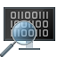

# WinDbg - Home Menu

This topic describes how to work with the home menu.

## Flow Control

Use the *Flow Control* buttons to break into a connected debugging target, resume code execution on the target and step in to and out of code.

## Reverse Flow Control

Use the *Reverse Flow Control* buttons to travel back in time. For more information, see [Time Travel Debugging - Overview](time-travel-debugging-overview.md).

## End

Use the *End* buttons to restart, detach and stop debugging.

## Preferences

Use *Preferences* buttons to toggle between source code and assembly views and to access the **Settings** menu.

## Help (Support)

Use *Help* buttons to do the following:
- Review Local Help - Offline
- Online Help - Most up to date

## GitHub Feedback

- If you find any bugs or have a feature request, you can follow the feedback button in the ribbon to go to the [GitHub page](https://aka.ms/windbg/feedback) where you can file a new issue.

## See Also

[WinDbg Features](../debugger/debugging-using-windbg-preview.md)
